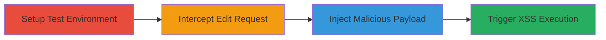

---
tags:
  - xss
  - stored-xss
  - gitlab
  - markdown
  - character-encoding-bypass
type: attack_chain
tools:
  - '[[tools/Burp-Suite]]'
tactics:
  - '[[Execution]]'
verified: false
platforms:
  - Web
submitted: true
complexity: medium
created_at: '2023-10-01T00:00:00Z'
procedures:
  - '[[procedures/Setup-GitLab-Test-Instance]]'
  - '[[procedures/Intercept-Wiki-Edit-Request]]'
  - '[[procedures/Inject-XSS-Payload-via-Non-Printable-Characters]]'
  - '[[procedures/Trigger-and-Verify-Stored-XSS]]'
step_count: 4
techniques:
  - '[[JavaScript]]'
updated_at: '2025-12-14T00:11:09.730Z'
description: >-
  A multi-step attack exploiting a stored XSS vulnerability in GitLab's Markdown
  parser by bypassing filters with non-printable characters, allowing persistent
  JavaScript execution in Project Wiki pages.
skill_level: intermediate
impact_level: high
id: 7640d1ac-7e89-4176-9f11-ff5ec6f530cf
validated: true
mitre_tactics:
  - '[[Execution]]'
mitre_techniques:
  - '[[JavaScript]]'
---
# Stored XSS in GitLab Markdown Parser via Character Encoding Bypass

Multi-stage attack chain demonstrating exploitation of a stored XSS vulnerability in GitLab 10.0's Markdown parser. The attack bypasses sanitization filters using URL-encoded non-printable characters (%01 and %03) to inject a malicious javascript: URL into a Project Wiki page. This leads to persistent JavaScript execution when any user views and interacts with the affected Markdown content, potentially enabling session hijacking, data theft, or further compromise across all Markdown parser usages in GitLab.

## Chain Metrics Dashboard

| Metric | Value |
|--------|-------|
| Chain Status | Unverified |
| Total Steps | 4 |
| Execution Time | ~10 minutes |
| Skill Level | Intermediate |
| Complexity | Medium |
| Impact Level | High |

## Attack Flow Visualization

## Prerequisites & Requirements

### Required Tools

- [[tools/Burp-Suite]]

### Target Environment

- GitLab 10.0.0 CE instance with Project Wiki enabled
- Web browser for viewing Wiki pages
- Network access to the GitLab server

### Initial Access Requirements

- Authenticated access to a GitLab project with Wiki editing permissions
- Local or controlled test environment to avoid production impact

## Detailed Attack Procedures

### Step 1: Setup Test Environment
procedure: [[procedures/Setup-GitLab-Test-Instance]]

**Objective**: Prepare a controlled GitLab 10.0 instance to safely test the Markdown parser vulnerability in the Project Wiki.

**Instructions**: Deploy a fresh GitLab 10.0.0 CE instance, create a project, and enable the Wiki feature. Navigate to the Project Wiki homepage and prepare to edit or create a new Markdown page.

**Expected Output**: A functional Wiki page ready for editing, confirming the environment uses the vulnerable Markdown parser.

**Success Indicators**:
- GitLab instance accessible and Wiki editable
- No prior sanitization issues detected in basic Markdown rendering

### Step 2: Intercept Wiki Edit Request
procedure: [[procedures/Intercept-Wiki-Edit-Request]]

**Objective**: Capture the HTTP POST request sent when saving changes to a Wiki page, positioning for payload modification.

**Instructions**: Configure [[tools/Burp-Suite]] as a web proxy. Enter generic text into the Wiki 'Content' field, then select 'Save Changes' to trigger the POST request to the /wikis endpoint. Intercept the request in Burp Suite for inspection and modification.

**Expected Output**: Intercepted POST request visible in Burp Suite, showing the 'content' parameter with the generic text.

**Success Indicators**:
- Proxy successfully intercepts the request
- Request targets the correct wikis endpoint with editable content parameter

### Step 3: Inject Malicious Payload
procedure: [[procedures/Inject-XSS-Payload-via-Non-Printable-Characters]]

**Objective**: Modify the intercepted request to include a URL-encoded XSS payload that bypasses the Markdown parser's filters using non-printable characters.

**Instructions**: In Burp Suite, replace the 'content' parameter with the crafted payload: %3Ca+href%3D%22%01java%03script%3Aconfirm%28document.domain%29%22%3EClick+to+execute%3Ca%3E%0D%0A. This encodes a hyperlink with a javascript: URL, where %01 and %03 evade sanitization. Forward the modified request to complete the save.

**Expected Output**: The Wiki page saves without errors, storing the payload in the Markdown content.

**Success Indicators**:
- Request forwards successfully
- Page updates without visible errors in GitLab logs or UI

### Step 4: Trigger and Verify XSS
procedure: [[procedures/Trigger-and-Verify-Stored-XSS]]

**Objective**: View the affected Wiki page to render the payload and execute the injected JavaScript upon interaction.

**Instructions**: Disable the Burp proxy, refresh or navigate to the updated Wiki page. Click the rendered hyperlink to trigger the javascript:confirm(document.domain), which displays a browser alert confirming the domain.

**Expected Output**: A clickable link appears on the page; clicking it executes the confirm dialog, proving arbitrary JavaScript runs in the viewer's context.

**Success Indicators**:
- Malicious link renders without sanitization
- JavaScript executes, showing the domain in a confirm popup
- Payload persists for all subsequent views

## Attack Chain Summary

### Key Achievements

1. Bypassed GitLab Markdown parser filters using non-printable characters for stored XSS injection.
2. Achieved persistent JavaScript execution in Project Wiki, affecting all users viewing the content.
3. Demonstrated impact on all GitLab 10.0 deployments relying on the vulnerable parser.

## Technique & Tactic Coverage

### MITRE ATT&CK Techniques

- [[JavaScript]]

### MITRE ATT&CK Tactics

- [[Execution]]

---

*Last updated: 2023-10-01T00:00:00Z*
