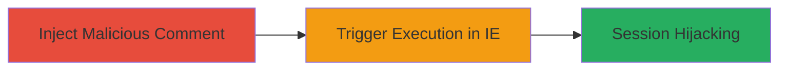

---
tags:
  - xss
  - stored-xss
  - gitlab
  - vbscript
  - internet-explorer
type: attack_chain
tools: []
tactics:
  - '[[Execution]]'
verified: false
platforms:
  - Web
submitted: true
complexity: low
created_at: '2023-10-01T00:00:00Z'
procedures:
  - '[[procedures/Submit-Malicious-Markdown-Comment-with-VBScript-Link]]'
  - '[[procedures/Trigger-VBScript-XSS-via-IE-Compatibility-Mode]]'
step_count: 2
techniques:
  - '[[JavaScript]]'
updated_at: '2025-12-14T03:16:37.359Z'
description: >-
  A stored XSS attack exploiting GitLab's Markdown renderer by injecting a
  vbscript: link in comments, triggering execution only in vulnerable Internet
  Explorer versions.
skill_level: low
impact_level: medium
id: 1637e77d-3e28-4b2a-8d11-9327d49fd3e3
validated: true
mitre_tactics:
  - '[[Execution]]'
mitre_techniques:
  - '[[JavaScript]]'
---
# Stored XSS in GitLab Markdown via VBScript Protocol for IE Exploitation

Multi-stage attack chain demonstrating a complete attack workflow.

## Chain Metrics Dashboard

| Metric | Value |
|--------|-------|
| Chain Status | Unverified |
| Total Steps | 2 |
| Execution Time | ~1 minutes |
| Skill Level | Low |
| Complexity | Low |
| Impact Level | Medium |

## Attack Flow Visualization

## Prerequisites & Requirements

### Required Tools

- None (relies on GitLab web interface and IE browser)

### Target Environment

- GitLab instance (self-hosted or SaaS)
- Web platform
- No specific services/ports beyond standard HTTPS (443)

### Initial Access Requirements

- Authenticated access to a GitLab project or issue to post comments
- Victim must use Internet Explorer 7-10 or IE11 in compatibility mode
- No prior network access beyond standard user privileges

## Detailed Attack Procedures

### Step 1: Inject Malicious Payload
procedure: [[procedures/Submit-Malicious-Markdown-Comment-with-VBScript-Link]]

**Objective**: Submit a comment containing a Markdown link with vbscript: protocol to store the payload for later execution.

**Instructions**: Log in to GitLab, navigate to a project or issue, and post a comment using Markdown syntax such as `[Click me](vbscript:alert(document.domain))`. This embeds the malicious link without sanitization.

**Expected Output**: The comment is saved and visible in the project/issue view.

**Success Indicators**:
- Comment posts successfully without errors
- Link renders as clickable text in the Markdown preview

### Step 2: Trigger Execution
procedure: [[procedures/Trigger-VBScript-XSS-via-IE-Compatibility-Mode]]

**Objective**: Have the victim load the page in a vulnerable IE version, enabling compatibility mode to execute the VBScript payload.

**Instructions**: Direct the victim to view the page with the comment. In IE, the browser detects incompatible content and prompts for compatibility mode; upon enabling, clicking the link executes the VBScript in the GitLab domain context, such as alerting the domain or stealing session data.

**Expected Output**: Alert box or script execution confirming domain access (e.g., alert('gitlab.com')).

**Success Indicators**:
- Victim enables compatibility mode
- Script executes on link click, demonstrating context takeover

## Attack Chain Summary

### Key Achievements

1. Successful injection of unsanitized vbscript: link in GitLab Markdown
2. Triggering of client-side script execution in vulnerable IE browsers
3. Potential for session hijacking or data exfiltration in the GitLab domain

## Technique & Tactic Coverage

### MITRE ATT&CK Techniques

- [[JavaScript]]

### MITRE ATT&CK Tactics

- [[Execution]]

---
*Last updated: 2023-10-01T00:00:00Z*
