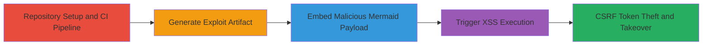

---
tags:
  - xss
  - stored-xss
  - mermaid
  - gitlab
  - csp-bypass
  - account-takeover
  - csrf-theft
type: attack_chain
tools: []
tactics:
  - '[[Execution]]'
  - '[[Collection]]'
verified: false
platforms:
  - Web
submitted: true
complexity: medium
created_at: '2023-10-01T00:00:00Z'
procedures:
  - '[[procedures/Create-GitLab-Repository-and-Setup-CI-Pipeline]]'
  - '[[procedures/Generate-Exploit-JavaScript-Artifact-via-CI]]'
  - '[[procedures/Embed-Malicious-Mermaid-Diagram-in-Markdown]]'
  - '[[procedures/Trigger-XSS-Execution-in-GitLab-UI]]'
step_count: 5
techniques:
  - '[[JavaScript]]'
  - '[[Drive-by Compromise]]'
updated_at: '2025-12-13T23:52:39.132Z'
description: >-
  A multi-stage attack exploiting a stored XSS in GitLab's Mermaid rendering
  combined with a CSP bypass using pipeline artifacts to execute arbitrary
  JavaScript and steal CSRF tokens for account takeover.
skill_level: intermediate
impact_level: high
id: 0c175b63-9439-453b-9547-b09611a3cb7a
validated: true
mitre_tactics:
  - '[[Execution]]'
  - '[[Collection]]'
mitre_techniques:
  - '[[JavaScript]]'
  - '[[Drive-by Compromise]]'
---
# Stored XSS in GitLab Mermaid Diagrams via Misconfigured Directives and CSP Bypass for Account Takeover

Multi-stage attack chain demonstrating a complete attack workflow exploiting GitLab's Mermaid rendering for stored XSS, bypassing sanitization with a string 'false' directive, and using pipeline artifacts to evade CSP for JavaScript execution leading to CSRF token theft and potential account takeover.

## Chain Metrics Dashboard

| Metric | Value |
|--------|-------|
| Chain Status | Unverified |
| Total Steps | 5 |
| Execution Time | ~10 minutes |
| Skill Level | Intermediate |
| Complexity | Medium |
| Impact Level | High |

## Attack Flow Visualization



## Prerequisites & Requirements

### Required Tools

- GitLab account with repository creation privileges
- Access to GitLab UI for commits and pipeline monitoring

### Target Environment

- GitLab.com or self-hosted GitLab instance (version vulnerable to Mermaid rendering flaw)
- Enabled CI/CD pipelines
- Markdown rendering support (e.g., README.md, issues)

### Initial Access Requirements

- Authenticated GitLab user session
- No elevated privileges needed beyond standard user access
- Network access to GitLab instance

## Detailed Attack Procedures

### Step 1: Create Repository
procedure: [[procedures/Create-GitLab-Repository-and-Setup-CI-Pipeline]]

**Objective**: Establish a project to host the exploit payload and trigger CI/CD for artifact generation.

**Instructions**: Use the GitLab web interface to create a new empty repository. Name it descriptively, e.g., 'test-mermaid-xss', and initialize with a README.md if needed, but keep it empty for now.

**Expected Output**: New repository created, visible in GitLab projects list.

**Success Indicators**:
- Repository dashboard accessible
- CI/CD pipelines section available

### Step 2: Generate Exploit Artifact
procedure: [[procedures/Generate-Exploit-JavaScript-Artifact-via-CI]]

**Objective**: Configure a CI pipeline to create a malicious JavaScript file as an artifact for later loading.

**Instructions**: Commit a .gitlab-ci.yml file defining a job that uses [[commands/echo-csrf-alert]] to generate exploit.js, which alerts the CSRF token. Trigger the pipeline via commit, then monitor and note the job ID from the artifacts download URL (e.g., /api/v4/projects/:id/jobs/:job_id/artifacts/exploit.js).

```yaml
# Example .gitlab-ci.yml snippet
job:
  script:
    - echo 'alert(parent.document.querySelector("meta[name=csrf-token]").outerHTML)' > exploit.js
  artifacts:
    paths:
      - exploit.js
```

**Expected Output**: Pipeline succeeds, artifact URL available with job ID.

**Success Indicators**:
- Pipeline status 'passed'
- Artifacts downloadable via API endpoint

### Step 3: Embed Malicious Mermaid Diagram
procedure: [[procedures/Embed-Malicious-Mermaid-Diagram-in-Markdown]]

**Objective**: Insert a stored XSS payload into a Markdown file using a Mermaid diagram that bypasses HTML sanitization via the 'flowchart.htmlLabels' directive set to string 'false'.

**Instructions**: Edit README.md to include a fenced Mermaid code block with the init directive %%{init: {"flowchart": {"htmlLabels": "false"}} }%% followed by a flowchart node containing an iframe with srcdoc loading the exploit.js from the artifacts endpoint, substituting your project ID and job ID.

```markdown

```mermaid
%%{init: {"flowchart": {"htmlLabels": "false"}} }%%
flowchart TD
    A([<iframe srcdoc='<script src="/api/v4/projects/123/jobs/456/artifacts/exploit.js"></script>'></iframe>'>])
```

```

**Expected Output**: Markdown file updated and committed.

**Success Indicators**:
- Commit successful
- Mermaid block renders in preview without errors

### Step 4: Trigger XSS Execution
procedure: [[procedures/Trigger-XSS-Execution-in-GitLab-UI]]

**Objective**: View the Markdown file to trigger the stored XSS, loading the iframe and executing the JavaScript to steal the CSRF token.

**Instructions**: Navigate to the project overview or README.md in the GitLab UI as an authenticated user. The Mermaid rendering will process the directive, bypass sanitization (treating string 'false' as truthy for rendering), inject the iframe, and load the same-origin script from artifacts, evading CSP 'self' policy.

**Expected Output**: Alert box displaying the CSRF token meta tag HTML.

**Success Indicators**:
- JavaScript alert fires with token
- Browser console shows script execution
- Potential for further exploitation like session hijacking

### Step 5: Exfiltration and Takeover

**Objective**: Use the stolen CSRF token for unauthorized actions, such as account takeover.

**Instructions**: With the token, craft requests to GitLab API endpoints (e.g., update user settings or create hooks) to escalate access. The CSP bypass allows full JS execution in the victim's context.

**Expected Output**: Successful API calls using the token.

**Success Indicators**:
- Unauthorized actions performed
- Account control gained

## Attack Chain Summary

### Key Achievements

1. Bypassed Mermaid HTML sanitization using string 'false' directive
2. Evaded CSP via same-origin pipeline artifacts served as executable JS
3. Achieved stored XSS for arbitrary code execution as viewer
4. Stolen CSRF token enables full account takeover without user interaction

## Technique & Tactic Coverage

### MITRE ATT&CK Techniques

- [[JavaScript]]
- [[Drive-by Compromise]]

### MITRE ATT&CK Tactics

- [[Execution]]
- [[Collection]]

---

*Last updated: 2023-10-01T00:00:00Z*
