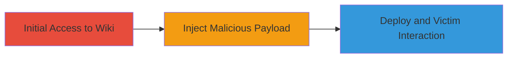

---
tags:
  - xss
  - stored-xss
  - gitlab
  - phishing
  - clickjacking
type: attack_chain
tools: []
tactics:
  - '[[Initial Access]]'
  - '[[Execution]]'
  - '[[Persistence]]'
commands: []
platforms:
  - Web
  - Linux
complexity: medium
procedures:
  - '[[procedures/Create-GitLab-Wiki-Page]]'
  - '[[procedures/Inject-Malicious-RDoc-Snippet]]'
  - '[[procedures/Deploy-and-Exploit-Stored-XSS]]'
step_count: 3
techniques:
  - '[[Exploit Public-Facing Application]]'
  - '[[JavaScript]]'
description: >-
  Exploitation of stored XSS in GitLab RDoc wiki pages to inject malicious HTML
  for phishing and potential account takeover
skill_level: intermediate
impact_level: high
id: 70c81200-f228-46c6-9b7b-7fbb8e81c068
created_at: '2025-12-14T00:11:16.543Z'
updated_at: '2025-12-14T00:11:16.543Z'
verified: false
validated: true
submitted: true
mitre_tactics:
  - '[[Initial Access]]'
  - '[[Execution]]'
  - '[[Persistence]]'
mitre_techniques:
  - '[[Exploit Public-Facing Application]]'
  - '[[JavaScript]]'
---
# Stored XSS in GitLab RDoc Wiki Pages for Phishing and Account Compromise

Multi-stage attack chain demonstrating the exploitation of a stored cross-site scripting (XSS) vulnerability in GitLab's RDoc wiki pages. This allows attackers to inject unsanitized HTML tags and attributes into image links, creating malicious elements like full-page overlays or phishing forms. The attack can lead to credential theft or account compromise by tricking users into interacting with fake login forms or executing arbitrary JavaScript.

## Chain Metrics Dashboard

| Metric | Value |
|--------|-------|
| Chain Status | Unverified |
| Total Steps | 3 |
| Execution Time | ~5 minutes |
| Skill Level | Intermediate |
| Complexity | Medium |
| Impact Level | High |

## Attack Flow Visualization

## Prerequisites & Requirements

### Required Tools

- None (web browser access to GitLab)

### Target Environment

- GitLab instance (e.g., GitLab.com or self-hosted)
- Web platform on Linux
- Required services: GitLab Shell 9.3.0, PostgreSQL, Redis
- Tech stack: Ruby 2.6.3, PostgreSQL 10.7, Redis 3.2.12, Git 2.21.0, Sidekiq 5.2.7

### Initial Access Requirements

- Valid GitLab account with wiki creation permissions in a project
- Network access to the GitLab instance

## Detailed Attack Procedures

### Step 1: Create Wiki Page
procedure: [[procedures/Create-GitLab-Wiki-Page]]

**Objective**: Gain access to the wiki feature in a GitLab project to prepare for payload injection.

**Instructions**: Navigate to a GitLab project via the web interface. Enable or access the wiki feature and create a new wiki page. This step establishes the foundation for storing malicious content.

**Expected Output**: A new editable wiki page in the GitLab project.

**Success Indicators**:
- Wiki page created successfully
- Editing interface accessible

### Step 2: Inject Malicious RDoc Snippet
procedure: [[procedures/Inject-Malicious-RDoc-Snippet]]

**Objective**: Insert unsanitized HTML tags and attributes using RDoc syntax to bypass sanitization.

**Instructions**: In the wiki editor, insert RDoc syntax such as '{}[a]' or form elements to inject arbitrary HTML attributes and tags. For example, craft payloads that create full-page overlays or phishing forms by exploiting image link syntax like {}[link]. This allows insertion of classes, targets, and elements without filtering.

**Expected Output**: Malicious snippet added to the wiki page content.

**Success Indicators**:
- Payload syntax accepted without errors
- Preview shows injected HTML elements

### Step 3: Deploy and Exploit Stored XSS
procedure: [[procedures/Deploy-and-Exploit-Stored-XSS]]

**Objective**: Save the malicious wiki page and induce victim interaction to trigger the XSS or clickjacking.

**Instructions**: Save the wiki page to store the malicious content. Share the page link with victims or wait for them to view it. Upon viewing, the injected HTML renders, potentially executing JavaScript via script gadgets or displaying phishing modals, leading to credential theft or account compromise.

**Expected Output**: Wiki page saved and accessible; XSS triggers on victim access.

**Success Indicators**:
- Page renders malicious elements
- Victim interactions lead to phishing or script execution

## Attack Chain Summary

### Key Achievements

1. Successful injection of unsanitized HTML in RDoc wiki pages
2. Creation of phishing forms or overlays for credential theft
3. Potential account takeover via executed JavaScript

## Technique & Tactic Coverage

### MITRE ATT&CK Techniques

- [[Exploit Public-Facing Application]]
- [[JavaScript]]

### MITRE ATT&CK Tactics

- [[Initial Access]]
- [[Execution]]
- [[Persistence]]

*Last updated: 2023-10-01*
