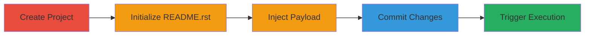

# Stored XSS in GitLab README.rst via reStructuredText Hyperlink Injection

A persistent XSS vulnerability in GitLab's handling of reStructuredText (RST) markup in project README files allows attackers to inject JavaScript payloads. By creating a project with a README.rst file containing a malicious hyperlink using the javascript: scheme, the payload executes when users click the link in the rendered view, potentially leading to session hijacking or data theft.

## Chain Metrics Dashboard

| Metric | Value |
|--------|-------|
| Chain Status | Unverified |
| Total Steps | 5 |
| Execution Time | ~5 minutes |
| Skill Level | Intermediate |
| Complexity | Medium |
| Impact Level | High |

## Attack Flow Visualization



## Prerequisites & Requirements

### Required Tools

- Web browser
- GitLab account with project creation privileges

### Target Environment

- GitLab instance (self-hosted or SaaS)
- Web platform access

### Initial Access Requirements

- Valid GitLab user credentials
- Ability to create and edit projects

## Detailed Attack Procedures

### Step 1: Create a New GitLab Project
procedure: [[procedures/Inject-XSS-Payload-into-GitLab-README-rst]]

**Objective**: Establish a new repository to host the malicious README file.

**Instructions**: Navigate to the GitLab dashboard and use the project creation interface to set up a new empty repository. Provide a project name and visibility settings as needed.

**Expected Output**: A new project repository is created, ready for file uploads.

**Success Indicators**:
- Project dashboard loads successfully
- Repository is empty and editable

### Step 2: Initialize the Project with a README File
procedure: [[procedures/Inject-XSS-Payload-into-GitLab-README-rst]]

**Objective**: Add an initial file to enable RST parsing setup.

**Instructions**: In the project, use the web interface to create a new file named README.md initially, add placeholder content, and commit it to initialize the repository.

**Expected Output**: Initial commit successful, project shows README on the main page.

**Success Indicators**:
- Commit history shows the initial file
- README renders on the project overview

### Step 3: Rename to README.rst for reStructuredText Parsing
procedure: [[procedures/Inject-XSS-Payload-into-GitLab-README-rst]]

**Objective**: Configure the file to trigger GitLab's RST parser, which is vulnerable to hyperlink injection.

**Instructions**: Edit the existing README file via the web editor, rename it to README.rst, and save the change without altering content yet.

**Expected Output**: File renamed and committed as README.rst, GitLab begins rendering it with RST markup.

**Success Indicators**:
- File extension changes to .rst in the repository tree
- Rendered view shows RST-formatted content

### Step 4: Inject the XSS Payload
procedure: [[procedures/Inject-XSS-Payload-into-GitLab-README-rst]]

**Objective**: Embed a JavaScript payload disguised as a hyperlink in the RST markup.

**Instructions**: Edit README.rst and insert the following payload:

````
``Security test link``__. __ javascript:alert(document.domain)
````

This creates a clickable link that executes the alert on click.

**Expected Output**: Payload committed, rendered README shows a link labeled "Security test link".

**Success Indicators**:
- No parsing errors in the editor
- Link appears clickable in the preview

### Step 5: Commit and Trigger the Payload
procedure: [[procedures/Inject-XSS-Payload-into-GitLab-README-rst]]

**Objective**: Finalize the injection and demonstrate execution by interacting with the rendered file.

**Instructions**: Commit the changes to the repository. View the project README page and click the injected link to trigger the JavaScript.

**Expected Output**: Alert box pops up displaying the document domain (e.g., gitlab.com), confirming XSS execution in the viewer's browser.

**Success Indicators**:
- Commit succeeds without errors
- JavaScript alert fires on link click
- No sanitization blocks the javascript: scheme

## Attack Chain Summary

### Key Achievements

1. Successful injection of persistent XSS payload into a GitLab README.rst file
2. Bypass of RST parser sanitization via hyperlink scheme
3. Demonstration of arbitrary JavaScript execution on victim interaction

## Technique & Tactic Coverage

### MITRE ATT&CK Techniques

- [[JavaScript]]

### MITRE ATT&CK Tactics

- [[Execution]]

---

*Last updated: 2024-10-01T12:00:00Z*
