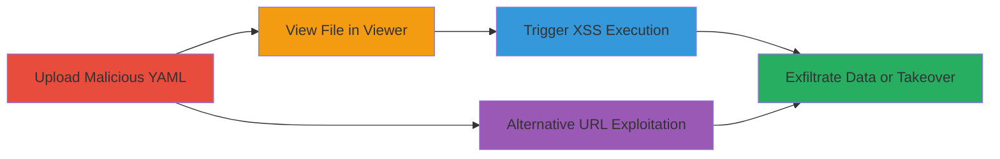

---
tags:
  - xss
  - stored-xss
  - gitlab
  - swagger-ui
  - dompurify
  - openapi
  - yaml
type: attack_chain
tools: []
tactics:
  - '[[Execution]]'
  - '[[Collection]]'
verified: false
platforms:
  - Web
  - GitLab
submitted: true
complexity: medium
created_at: '2023-10-01T00:00:00Z'
procedures:
  - '[[procedures/Upload-Malicious-OpenAPI-YAML-File]]'
  - '[[procedures/View-File-in-Repository-Blob-Viewer]]'
  - '[[procedures/Trigger-XSS-Payload]]'
  - '[[procedures/Exploit-via-URL-Parameter]]'
step_count: 4
techniques:
  - '[[JavaScript]]'
  - '[[Drive-by Compromise]]'
updated_at: '2025-12-13T23:52:25.124Z'
description: >-
  A multi-stage attack exploiting a stored XSS vulnerability in GitLab's
  repository file viewer when rendering OpenAPI YAML files using an outdated
  swagger-ui with vulnerable DOMPurify, leading to arbitrary JavaScript
  execution and potential account takeover.
skill_level: intermediate
impact_level: high
id: bf44ec2b-b7f3-40bc-9fe3-007d2b8c1046
validated: true
mitre_tactics:
  - '[[Execution]]'
  - '[[Collection]]'
mitre_techniques:
  - '[[JavaScript]]'
  - '[[Drive-by Compromise]]'
---
# Stored XSS in GitLab Repository File Viewer via Malicious OpenAPI YAML

Multi-stage attack chain demonstrating a complete attack workflow exploiting a stored XSS in GitLab's file viewer for OpenAPI YAML files.

## Chain Metrics Dashboard

| Metric | Value |
|--------|-------|
| Chain Status | Unverified |
| Total Steps | 4 |
| Execution Time | ~5 minutes |
| Skill Level | Intermediate |
| Complexity | Medium |
| Impact Level | High |

## Attack Flow Visualization

## Prerequisites & Requirements

### Required Tools

- GitLab account with repository creation permissions
- Browser for viewing files

### Target Environment

- GitLab instance (self-hosted or gitlab.com)
- Web browser accessing the repository file viewer
- No specific ports or services beyond standard HTTPS (443)

### Initial Access Requirements

- Valid GitLab user account
- Ability to create and push to a repository
- No prior elevated access needed; exploits viewer permissions

## Detailed Attack Procedures

### Step 1: Upload Malicious OpenAPI YAML File
procedure: [[procedures/Upload-Malicious-OpenAPI-YAML-File]]

**Objective**: Create and upload a YAML file containing a crafted XSS payload to a GitLab repository, embedding DOMPurify bypass techniques.

**Instructions**: Log in to GitLab, create a new repository, and upload a file named `openapi.yaml` or `swagger.yaml`. Craft the payload in the 'description' field using nested HTML elements like form, math, svg, or textarea to bypass DOMPurify sanitization. Include CSP evasion via data-remote=true and data-type=script on anchors, or load external JS from a GitLab job artifact URL.

**Expected Output**: File successfully committed to the repository, visible in the repo tree.

**Success Indicators**:
- File upload confirmation in GitLab UI
- Payload intact when viewing raw file source

### Step 2: View File in Repository Blob Viewer
procedure: [[procedures/View-File-in-Repository-Blob-Viewer]]

**Objective**: Navigate to the uploaded file in GitLab's blob viewer to trigger rendering via swagger-ui.

**Instructions**: Access the repository URL in a browser, e.g., https://gitlab.com/username/repo/-/blob/master/openapi.yaml. The viewer automatically renders the YAML using swagger-ui, processing the malicious payload.

**Expected Output**: Swagger UI loads the file, injecting the unsanitized HTML.

**Success Indicators**:
- Page renders without errors
- Malicious HTML elements appear in browser dev tools

### Step 3: Trigger XSS Payload
procedure: [[procedures/Trigger-XSS-Payload]]

**Objective**: Execute the injected JavaScript to achieve arbitrary code execution, stealing CSRF tokens or hijacking sessions.

**Instructions**: For the initial payload, click anywhere on the rendered page to bypass CSP restrictions. For the improved payload, it auto-executes via an iframe with srcdoc loading a script from a GitLab job artifact, e.g., https://gitlab.com/yvvdwf/_/-/jobs/552156057/artifacts/raw/alert.js. Monitor browser console for JS execution.

**Expected Output**: Alert or console log from the malicious script; potential form submission stealing tokens.

**Success Indicators**:
- JavaScript executes (e.g., alert pops up)
- Network requests to external JS or exfil endpoints

### Step 4: Exploit via URL Parameter
procedure: [[procedures/Exploit-via-URL-Parameter]]

**Objective**: Bypass direct upload by forcing any OpenAPI file to load the malicious YAML via a URL parameter.

**Instructions**: Append `?url=https://gitlab.com/kannthu/asdasdas123/-/raw/master/openapi.yaml` to an existing OpenAPI file URL in GitLab, e.g., https://gitlab.com/gitlab-org/build/omnibus-mirror/alertmanager/blob/master/api/v2/openapi.yaml?url=.... This loads and renders the remote malicious YAML.

**Expected Output**: Viewer renders the injected YAML, triggering XSS without uploading.

**Success Indicators**:
- Malicious content loads in the viewer
- XSS triggers as in Step 3

## Attack Chain Summary

### Key Achievements

1. Successful bypass of DOMPurify sanitization using nested HTML structures
2. CSP evasion enabling external JS loading from GitLab artifacts
3. Arbitrary JS execution leading to CSRF token theft, session hijacking, or account takeover for any file viewer
4. Alternative exploitation without repository write access

## Technique & Tactic Coverage

### MITRE ATT&CK Techniques

- [[JavaScript]]
- [[Drive-by Compromise]]

### MITRE ATT&CK Tactics

- [[Execution]]
- [[Collection]]

---
*Last updated: 2023-10-01T00:00:00Z*
