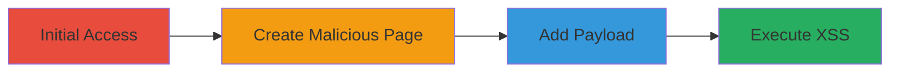

---
tags:
  - xss
  - stored-xss
  - gitlab
  - wiki
  - markdown
type: attack_chain
tools:
  - '[[tools/Docker]]'
  - '[[tools/Firefox]]'
  - '[[tools/GitLab]]'
tactics:
  - '[[Initial Access]]'
  - '[[Execution]]'
commands:
  - '[[commands/gitlab-env-info]]'
platforms:
  - Web
  - Linux
complexity: medium
procedures:
  - '[[procedures/Sign-In-and-Navigate-to-GitLab-Wiki]]'
  - '[[procedures/Create-New-Wiki-Page-with-Malicious-Slug]]'
  - '[[procedures/Add-Malicious-Markdown-Content]]'
  - '[[procedures/Trigger-and-Verify-XSS-Payload]]'
step_count: 4
techniques:
  - '[[Exploit Public-Facing Application]]'
  - '[[JavaScript]]'
description: >-
  Exploits a stored XSS vulnerability in GitLab Wiki pages by creating malicious
  links with javascript: URI schemes, leading to arbitrary JavaScript execution.
skill_level: intermediate
impact_level: high
id: 2bd1833a-1c18-4dcc-9f4e-14d65a66bdcf
created_at: '2025-12-11T06:10:40.093Z'
updated_at: '2025-12-11T06:10:40.093Z'
verified: false
validated: true
submitted: true
mitre_tactics:
  - '[[TA0001]]'
  - '[[TA0002]]'
mitre_techniques:
  - '[[T1190]]'
  - '[[T1059.007]]'
---
---
id: [UUID]
name: Stored XSS in GitLab Wiki via Hierarchical Markdown Links
type: attack_chain
description: Exploits a stored XSS vulnerability in GitLab Wiki pages by creating malicious links with javascript: URI schemes, leading to arbitrary JavaScript execution.
verified: false
submitted: false
step_count: 4
created_at: [TIMESTAMP]
updated_at: [TIMESTAMP]
procedures: ["Sign In and Navigate to GitLab Wiki", "Create New Wiki Page with Malicious Slug", "Add Malicious Markdown Content", "Trigger and Verify XSS Payload"]
techniques: ["[[Exploit Public-Facing Application]]", "[[JavaScript]]"]
tactics: ["[[Initial Access]]", "[[Execution]]"]
tags: ["xss", "stored-xss", "gitlab", "wiki", "markdown"]
platforms: ["Web", "Linux"]
tools: ["[[tools/Docker]]", "[[tools/Firefox]]", "[[tools/GitLab]]"]
---

# Stored XSS in GitLab Wiki via Hierarchical Markdown Links

Multi-stage attack chain demonstrating exploitation of a stored XSS vulnerability in GitLab Wiki pages through improper handling of Markdown links, allowing execution of arbitrary JavaScript on users viewing the page.

## Chain Metrics Dashboard

| Metric | Value |
|--------|-------|
| Chain Status | Unverified |
| Total Steps | 4 |
| Execution Time | ~5 minutes |
| Skill Level | Intermediate |
| Complexity | Medium |
| Impact Level | High |

## Attack Flow Visualization



## Prerequisites & Requirements

### Required Tools

- [[tools/Docker]]
- [[tools/Firefox]]
- [[tools/GitLab]]

### Target Environment

- Web-based GitLab Enterprise Edition 11.9.4-ee
- Required services/ports: HTTP/HTTPS access to GitLab instance
- Network access requirements: Access to GitLab project with wiki edit permissions

### Initial Access Requirements

- Credential requirements: Valid GitLab account with edit permissions on a project's wiki
- Network position: External or internal access to GitLab
- Prior access needed: Authenticated session

## Detailed Attack Procedures

### Step 1: Access GitLab and Wiki - [[procedures/Sign-In-and-Navigate-to-GitLab-Wiki]]

**Procedure**: [[procedures/Sign-In-and-Navigate-to-GitLab-Wiki]]

**Objective**: Authenticate and navigate to the wiki section of a project to prepare for creating malicious content.

**Expected Output**: Successful navigation to the wiki page editor.

**Success Indicators**:
- Logged in successfully
- Wiki section accessible with edit permissions

First, sign in to GitLab using valid credentials. Navigate to a project with wiki edit permissions, then open the wiki section.

### Step 2: Initiate Malicious Page Creation - [[procedures/Create-New-Wiki-Page-with-Malicious-Slug]]

**Procedure**: [[procedures/Create-New-Wiki-Page-with-Malicious-Slug]]

**Objective**: Create a new wiki page with a slug that enables dangerous URI schemes.

**Expected Output**: New wiki page created with 'javascript:' slug.

**Success Indicators**:
- Page creation confirmation
- Slug set to 'javascript:' without errors

Click 'New page', enter 'javascript:' as the page slug, and submit the form.

### Step 3: Insert XSS Payload - [[procedures/Add-Malicious-Markdown-Content]]

**Procedure**: [[procedures/Add-Malicious-Markdown-Content]]

**Objective**: Add Markdown content that reconstructs into a javascript: URI link.

**Expected Output**: Page saved with malicious link rendered.

**Success Indicators**:
- Content saved successfully
- Link appears as 'XSS' in the wiki page

Fill out the forms: Title: 'javascript:', Format: Markdown, Content: '[XSS](.alert(1);)'. Click 'Create page' to save.

### Step 4: Execute Payload - [[procedures/Trigger-and-Verify-XSS-Payload]]

**Procedure**: [[procedures/Trigger-and-Verify-XSS-Payload]]

**Objective**: Trigger the XSS by interacting with the malicious link to execute JavaScript.

**Expected Output**: Alert box with '1' or other payload execution.

**Success Indicators**:
- JavaScript alert triggers
- No errors in console, payload executes in browser context

Click the 'XSS' link in the created page to trigger the payload. Optionally, use [[commands/gitlab-env-info]] to verify environment:

```bash
sudo gitlab-rake gitlab:env:info
```

## Attack Chain Summary

### Key Achievements

1. Successful creation of stored XSS in public wiki
2. Execution of arbitrary JavaScript on viewers
3. Potential for session hijacking or further attacks

## Technique & Tactic Coverage

### MITRE ATT&CK Techniques

- [[Exploit Public-Facing Application]]
- [[JavaScript]]

### MITRE ATT&CK Tactics

- [[Initial Access]]
- [[Execution]]

---

*Last updated: [TIMESTAMP]*
