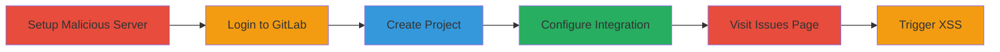

---
tags:
  - xss
  - gitlab
  - zentao
  - api-exploitation
type: attack_chain
tools:
  - '[[tools/Apache-Web-Server]]'
tactics:
  - '[[Initial Access]]'
  - '[[Execution]]'
commands: []
platforms:
  - Web
  - Self-hosted GitLab
complexity: medium
procedures:
  - '[[procedures/Configure-Malicious-ZenTao-Server]]'
  - '[[procedures/Setup-GitLab-ZenTao-Integration]]'
  - '[[procedures/Trigger-XSS-via-Issue-Details]]'
step_count: 6
techniques:
  - '[[Exploit Public-Facing Application]]'
  - '[[JavaScript]]'
description: >-
  Exploits a stored XSS vulnerability in GitLab's ZenTao integration to execute
  arbitrary JavaScript, potentially leading to account takeover on self-hosted
  instances.
skill_level: intermediate
impact_level: high
id: ad42d20a-3e7a-47a8-bd9e-577ca80fae1b
created_at: '2025-12-11T03:47:48.851Z'
updated_at: '2025-12-11T03:47:48.851Z'
verified: false
validated: true
submitted: true
mitre_tactics:
  - '[[TA0001]]'
  - '[[TA0002]]'
mitre_techniques:
  - '[[T1190]]'
  - '[[T1059.007]]'
---
# Stored XSS in GitLab ZenTao Integration via Malicious API Response

Multi-stage attack chain demonstrating exploitation of a stored XSS vulnerability in GitLab's ZenTao integration by configuring a malicious server and triggering malicious payloads in the issue details page, leading to arbitrary JavaScript execution and potential account takeover.

## Chain Metrics Dashboard

| Metric | Value |
|--------|-------|
| Chain Status | Unverified |
| Total Steps | 6 |
| Execution Time | ~10 minutes |
| Skill Level | Intermediate |
| Complexity | Medium |
| Impact Level | High |

## Attack Flow Visualization

## Prerequisites & Requirements

### Required Tools

- [[tools/Apache-Web-Server]]

### Target Environment

- Self-hosted GitLab instance with premium subscription
- Web browser access
- Ability to host a malicious web server

### Initial Access Requirements

- Valid user credentials on the target GitLab instance
- Network access to configure integrations and host malicious server

## Detailed Attack Procedures

### Step 1: Setup Malicious ZenTao Server - [[procedures/Configure-Malicious-ZenTao-Server]]

**Procedure**: [[procedures/Configure-Malicious-ZenTao-Server]]

**Objective**: Host a mock ZenTao API server that returns malicious JSON payloads with javascript: URLs and HTML-injected IDs to exploit the XSS vulnerability.

**Expected Output**: A running web server responding to API requests with malicious data.

**Success Indicators**:
- Server returns JSON with 'web_url': 'javascript:alert(document.domain)' and 'id': '' for /api.php/v1/issues/story-1
- Verify response with a test request to the server

### Step 2: Login to GitLab - [[procedures/Setup-GitLab-ZenTao-Integration]]

**Procedure**: [[procedures/Setup-GitLab-ZenTao-Integration]]

**Objective**: Access the self-hosted GitLab instance as a user with permissions to create projects and configure integrations.

**Expected Output**: Successful login and navigation to project creation.

**Success Indicators**:
- Logged in as user1 on premium GitLab instance
- Access to integration settings

### Step 3: Create New Project - [[procedures/Setup-GitLab-ZenTao-Integration]]

**Procedure**: [[procedures/Setup-GitLab-ZenTao-Integration]]

**Objective**: Create a new project in GitLab to enable the ZenTao integration.

**Expected Output**: A new project named 'project1' is created.

**Success Indicators**:
- Project creation confirmation
- Navigation to project settings available

### Step 4: Configure ZenTao Integration - [[procedures/Setup-GitLab-ZenTao-Integration]]

**Procedure**: [[procedures/Setup-GitLab-ZenTao-Integration]]

**Objective**: Set up the ZenTao integration pointing to the malicious server.

**Expected Output**: Integration configured with malicious server URL.

**Success Indicators**:
- Navigate to /-/integrations/zentao/edit
- Set server to https://joaxcar.com, leave API field empty, add username and password
- Save configuration successfully

### Step 5: Visit ZenTao Issues Page - [[procedures/Trigger-XSS-via-Issue-Details]]

**Procedure**: [[procedures/Trigger-XSS-via-Issue-Details]]

**Objective**: Navigate to the issues page to trigger GitLab's fetch from the malicious server, injecting the payload.

**Expected Output**: Page loads with data from malicious API.

**Success Indicators**:
- Go to /-/integrations/zentao/issues/story-1
- GitLab fetches and renders malicious JSON

### Step 6: Trigger XSS by Clicking Element - [[procedures/Trigger-XSS-via-Issue-Details]]

**Procedure**: [[procedures/Trigger-XSS-via-Issue-Details]]

**Objective**: Interact with the rendered page to execute the XSS payload.

**Expected Output**: Alert popup with document.domain, confirming XSS execution.

**Success Indicators**:
- Click the big white square (rendered from injected HTML)
- JavaScript executes: alert(document.domain)
- Potential for further exploitation like account takeover

## Attack Chain Summary

### Key Achievements

1. Successful injection of malicious payloads via API response
2. Stored XSS leading to arbitrary JavaScript execution
3. Potential account takeover on vulnerable self-hosted GitLab instances

## Technique & Tactic Coverage

### MITRE ATT&CK Techniques

- [[Exploit Public-Facing Application]]
- [[JavaScript]]

### MITRE ATT&CK Tactics

- [[Initial Access]]
- [[Execution]]

*Last updated: [TIMESTAMP]*
