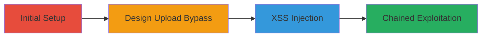

---
tags:
  - xss
  - ssrf
  - file-read
  - gitlab
type: attack_chain
tools:
  - '[[tools/Burp-Suite]]'
tactics:
  - '[[Initial Access]]'
  - '[[Execution]]'
  - '[[Collection]]'
commands: []
platforms:
  - Web
  - Linux
  - Cloud (GCP)
complexity: medium
procedures:
  - '[[procedures/Create-GitLab-Project-and-Issue]]'
  - '[[procedures/Upload-Malicious-Design-with-Filename-Injection]]'
  - '[[procedures/Inject-XSS-via-Markdown-Reference]]'
  - '[[procedures/Chain-XSS-to-File-Read-and-SSRF-via-Email]]'
step_count: 4
techniques:
  - '[[Exploit Public-Facing Application]]'
  - '[[JavaScript]]'
  - '[[Data from Local System]]'
description: >-
  Exploitation of stored XSS in GitLab's markdown rendering via malicious design
  uploads, chained to arbitrary file reads and SSRF through email notifications.
skill_level: intermediate
impact_level: high
id: df579525-39c6-4689-a0ed-f45b8484d1c1
created_at: '2025-12-11T03:47:56.739Z'
updated_at: '2025-12-11T03:47:56.739Z'
verified: false
validated: true
submitted: true
mitre_tactics:
  - '[[TA0001]]'
  - '[[TA0002]]'
  - '[[TA0009]]'
mitre_techniques:
  - '[[T1190]]'
  - '[[T1059.007]]'
  - '[[T1005]]'
---
# Stored XSS in GitLab via Design Upload Leading to Arbitrary File Read and SSRF

Multi-stage attack chain demonstrating exploitation of a stored XSS vulnerability in GitLab's markdown rendering through malicious design uploads, bypassing filename sanitization, injecting arbitrary attributes, and chaining to arbitrary file reads and SSRF via email notifications for credential leakage and internal access.

## Chain Metrics Dashboard

| Metric | Value |
|--------|-------|
| Chain Status | Unverified |
| Total Steps | 4 |
| Execution Time | ~15 minutes |
| Skill Level | Intermediate |
| Complexity | Medium |
| Impact Level | High |

## Attack Flow Visualization

## Prerequisites & Requirements

### Required Tools

- [[tools/Burp-Suite]]

### Target Environment

- GitLab instance (e.g., gitlab.com)
- Web browser
- Access to email notifications

### Initial Access Requirements

- Valid GitLab account
- Network access to GitLab

## Detailed Attack Procedures

## Step 1: Project and Issue Creation - [[procedures/Create-GitLab-Project-and-Issue]]

**Objective**: Set up the target environment by creating a new project and issue in GitLab to host the vulnerable design upload.

**Expected Output**: A new project and issue ready for design upload.

**Success Indicators**:
- Project created successfully
- Issue created within the project

Navigate to GitLab and create a new project. Then, within the project, create a new issue.

## Step 2: Malicious Design Upload - [[procedures/Upload-Malicious-Design-with-Filename-Injection]]

**Objective**: Bypass filename sanitization during design upload using a crafted Content-Disposition header to inject special characters for XSS.

**Expected Output**: Design uploaded with injected filename like bbb"class="gfm"a='.png.

**Success Indicators**:
- Request modified successfully in Burp Suite
- Design appears with crafted name after page refresh

Set up [[tools/Burp-Suite]] to intercept requests. Attempt to upload a design file to the issue, intercept the request, and modify the Content-Disposition header to: Content-Disposition: form-data; name="1"; filename*=ASCII-8BIT''bbb%22class%3D%22gfm%22a%3D%27.png. Refresh the page to confirm.

## Step 3: XSS Injection via Markdown - [[procedures/Inject-XSS-via-Markdown-Reference]]

**Objective**: Reference the malicious design in markdown to inject arbitrary HTML attributes and trigger XSS with CSP bypass.

**Expected Output**: Injected attributes visible in HTML markup, leading to JavaScript execution.

**Success Indicators**:
- Injected attribute (e.g., vakzz) appears in markup
- XSS payload triggers on page reload

Create a new issue using markdown: <a href='https://gitlab.com/vakzz-h1/design-xss/-/issues/2/designs/bbb%22class%3D%22gfm%22a%3D%27.png'> ' vakzz=here </a>. Inspect HTML for injection. Then, create another issue with payload: <a href='https://gitlab.com/vakzz-h1/design-xss/-/issues/2/designs/bbb%22class%3D%22gfm%22a%3D%27.png'> ' data-design="1" data-issue="1" data-reference-type="design" data-original="  " </a>. Save and reload to trigger XSS.

## Step 4: Chaining to File Read and SSRF - [[procedures/Chain-XSS-to-File-Read-and-SSRF-via-Email]]

**Objective**: Chain the XSS with email notifications to enable arbitrary file reads and SSRF, leaking sensitive data like credentials or internal metadata.

**Expected Output**: Leaked file contents or internal responses via injected <link> tags in email processing.

**Success Indicators**:
- Email notification triggers file read (e.g., /etc/passwd)
- SSRF accesses internal services (e.g., GCP metadata)

Use the XSS to inject <link rel='stylesheet'> tags in markdown that, when processed by premailer-rails in email notifications, load local files or internal URLs, enabling path traversal for file reads or SSRF to internal endpoints.

## Attack Chain Summary

### Key Achievements

1. Bypassed filename sanitization for stored XSS
2. Injected arbitrary JavaScript in GitLab markdown
3. Chained to arbitrary file reads and SSRF via emails

## Technique & Tactic Coverage

### MITRE ATT&CK Techniques

- [[Exploit Public-Facing Application]]
- [[JavaScript]]
- [[Data from Local System]]

### MITRE ATT&CK Tactics

- [[Initial Access]]
- [[Execution]]
- [[Collection]]

*Last updated: 2023-10-01*
