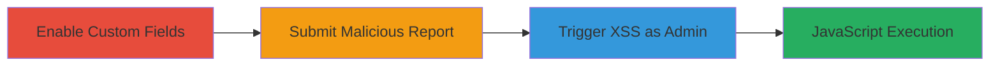

---
tags:
  - xss
  - stored-xss
  - hackerone
  - ie11
  - javascript
type: attack_chain
tools:
  - '[[tools/Internet-Explorer-11]]'
  - '[[tools/Ashampoo-Snap]]'
tactics:
  - '[[Execution]]'
verified: false
platforms:
  - Web
submitted: true
complexity: medium
created_at: '2023-10-01T00:00:00Z'
procedures:
  - '[[procedures/Enable-Hacker-Facing-Custom-Fields]]'
  - '[[procedures/Submit-Malicious-Report-with-XSS-Payload]]'
  - '[[procedures/Trigger-XSS-by-Editing-Custom-Field]]'
step_count: 3
techniques:
  - '[[JavaScript]]'
updated_at: '2025-12-13T23:56:03.954Z'
description: >-
  A multi-step attack exploiting a stored XSS vulnerability in HackerOne's
  custom fields feature, allowing arbitrary JavaScript execution in Internet
  Explorer 11 when admins edit reports.
skill_level: intermediate
impact_level: high
id: 38b11aef-5d28-4014-a1dc-872edf1237b3
validated: true
mitre_tactics:
  - '[[Execution]]'
mitre_techniques:
  - '[[JavaScript]]'
---
# Stored XSS in HackerOne Custom Fields via Malicious Report Submission

Multi-stage attack chain demonstrating a stored XSS vulnerability in HackerOne's custom fields, exploited by submitting a malicious report and triggering execution when an admin edits the field in Internet Explorer 11. This allows arbitrary JavaScript to run in the admin's browser, potentially leading to session hijacking or redirects to malicious sites.

## Chain Metrics Dashboard

| Metric | Value |
|--------|-------|
| Chain Status | Unverified |
| Total Steps | 3 |
| Execution Time | ~5 minutes |
| Skill Level | Intermediate |
| Complexity | Medium |
| Impact Level | High |

## Attack Flow Visualization

## Prerequisites & Requirements

### Required Tools

- [[tools/Internet-Explorer-11]]
- [[tools/Ashampoo-Snap]]

### Target Environment

- HackerOne platform (web application)
- Required services: Web browser access to hackerone.com
- Network access: Internet connectivity to hackerone.com

### Initial Access Requirements

- Hacker account on HackerOne with permission to submit reports to a program
- Program admin access (for triggering step, simulated or targeted)
- Internet Explorer 11 installed for exploitation

## Detailed Attack Procedures

### Step 1: Enable Hacker-Facing Custom Fields
procedure: [[procedures/Enable-Hacker-Facing-Custom-Fields]]

**Objective**: Configure the target program to allow hacker-facing custom fields, enabling storage of malicious input.

**Instructions**: Log in as a program owner or admin, navigate to the program's custom fields settings, and create a new text field visible to hackers.

**Expected Output**: A new custom text field named 'hello' appears in hacker-facing options.

**Success Indicators**:
- Custom field created and visible in program settings
- Field type set to 'text' and hacker-facing visibility enabled

### Step 2: Submit Malicious Report with XSS Payload
procedure: [[procedures/Submit-Malicious-Report-with-XSS-Payload]]

**Objective**: Inject a stored XSS payload into a report's additional information field to persist malicious JavaScript.

**Instructions**: As a hacker, create and submit a report to the program, embedding the payload in the additional information section.

**Expected Output**: Report submitted successfully, with payload stored in the custom field context.

**Success Indicators**:
- Report appears in the program's dashboard
- Payload is saved without immediate execution

### Step 3: Trigger XSS by Editing Custom Field
procedure: [[procedures/Trigger-XSS-by-Editing-Custom-Field]]

**Objective**: Cause the stored payload to execute JavaScript in the admin's browser by editing the custom field value.

**Instructions**: As the program admin, open the submitted report in Internet Explorer 11, edit the custom data field, and save changes to trigger the XSS.

**Expected Output**: Alert box displaying 'hackerone.com' or equivalent JavaScript execution.

**Success Indicators**:
- JavaScript alert fires in IE11
- No execution in modern browsers (IE11-specific)

## Attack Chain Summary

### Key Achievements

1. Enabled custom fields to accept user input without sanitization
2. Stored malicious XSS payload in a report
3. Executed arbitrary JavaScript in the admin's browser session

## Technique & Tactic Coverage

### MITRE ATT&CK Techniques

- [[JavaScript]]

### MITRE ATT&CK Tactics

- [[Execution]]

---
*Last updated: 2023-10-01T00:00:00Z*
