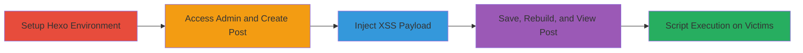

---
tags:
  - xss
  - stored-xss
  - hexo
  - node.js
  - web-vulnerability
type: attack_chain
tools:
  - '[[tools/hexo]]'
  - '[[tools/hexo-admin]]'
tactics:
  - '[[Execution]]'
  - '[[Collection]]'
verified: false
platforms:
  - Web
  - Node.js
submitted: true
complexity: medium
created_at: '2023-10-01T00:00:00Z'
procedures:
  - '[[procedures/Install-and-Setup-Hexo-with-Admin-Plugin]]'
  - '[[procedures/Access-Admin-Panel-and-Create-Post]]'
  - '[[procedures/Inject-XSS-Payload-into-Post-Content]]'
  - '[[procedures/Save-and-Publish-Post-to-Trigger-Stored-XSS]]'
step_count: 4
techniques:
  - '[[JavaScript]]'
updated_at: '2025-12-14T17:29:09.714Z'
description: >-
  A multi-stage attack exploiting a stored XSS vulnerability in the hexo-admin
  plugin to inject and persist malicious scripts in blog posts, executing on
  victim browsers.
skill_level: intermediate
impact_level: high
id: 5480b966-71ab-4a5a-bed6-891f8fc86f0b
validated: true
mitre_tactics:
  - '[[Execution]]'
  - '[[Collection]]'
mitre_techniques:
  - '[[JavaScript]]'
---
# Stored XSS in Hexo-Admin Plugin for Persistent Script Injection in Blog Posts

Multi-stage attack chain demonstrating exploitation of a stored XSS vulnerability in the hexo-admin plugin version 3.9.0, allowing attackers to inject malicious JavaScript into blog post content that persists and executes on any victim's browser viewing the post.

## Chain Metrics Dashboard

| Metric | Value |
|--------|-------|
| Chain Status | Unverified |
| Total Steps | 4 |
| Execution Time | ~10 minutes |
| Skill Level | Intermediate |
| Complexity | Medium |
| Impact Level | High |

## Attack Flow Visualization



## Prerequisites & Requirements

### Required Tools

- [[tools/hexo]]
- [[tools/hexo-admin]]

### Target Environment

- Node.js runtime
- Local development environment for Hexo static site generation
- Port 4000 open for local server

### Initial Access Requirements

- Administrative access to the Hexo blog instance (attacker must have write access to posts via admin panel)
- Local network access to run the server

## Detailed Attack Procedures

### Step 1: Setup Hexo Environment
procedure: [[procedures/Install-and-Setup-Hexo-with-Admin-Plugin]]

**Objective**: Install and configure the Hexo blog generator with the vulnerable hexo-admin plugin to prepare for post creation.

**Instructions**: Install Node.js prerequisites, then use npm to install Hexo and the hexo-admin plugin from GitHub. Navigate to the blog directory and start the development server with [[commands/hexo-server-deploy]]:

```bash
hexo server -d
```

**Expected Output**: Server starts at http://localhost:4000 with admin panel accessible.

**Success Indicators**:
- Hexo CLI commands available
- Local server running without errors

### Step 2: Access Admin and Create Post
procedure: [[procedures/Access-Admin-Panel-and-Create-Post]]

**Objective**: Gain access to the admin interface and initiate creation of a new blog post to target the vulnerable content field.

**Instructions**: Open a browser and navigate to http://localhost:4000/admin. In the admin panel, click on the posts section and create a new post titled 'Test XSS here'.

**Expected Output**: New post editor loads with title field populated.

**Success Indicators**:
- Admin panel loads successfully
- Post creation form appears

### Step 3: Inject XSS Payload
procedure: [[procedures/Inject-XSS-Payload-into-Post-Content]]

**Objective**: Insert a malicious JavaScript payload into the post content field to exploit the lack of sanitization.

**Instructions**: In the post content editor, append a payload such as `>` or `>` to the content. The payload should trigger immediately in the editor.

**Expected Output**: Alert popup executes in the browser during editing.

**Success Indicators**:
- Immediate XSS alert in editor
- Payload visible in content without escaping

### Step 4: Save, Publish, and Verify Execution
procedure: [[procedures/Save-and-Publish-Post-to-Trigger-Stored-XSS]]

**Objective**: Persist the injected script by saving the post, rebuilding the site, and confirming execution on the published page.

**Instructions**: Save the post in the admin panel, then run [[commands/hexo-clean]] followed by [[commands/hexo-generate]] and restart the server with [[commands/hexo-server-deploy]]:

```bash
hexo clean
hexo generate
hexo server -d
```

View the published post at the site's URL for 'Test XSS', where the alert should trigger on load.

**Expected Output**: Rebuilt site serves the post with executing XSS payload.

**Success Indicators**:
- Post saves without sanitization errors
- Alert pops on published post view
- Script persists across rebuilds

## Attack Chain Summary

### Key Achievements

1. Successful injection of unsanitized JavaScript into post content
2. Immediate execution in editor confirming vulnerability
3. Persistent storage and execution on published site for victim compromise

## Technique & Tactic Coverage

### MITRE ATT&CK Techniques

- [[JavaScript]]

### MITRE ATT&CK Tactics

- [[Execution]]
- [[Collection]]

---
*Last updated: 2023-10-01T00:00:00Z*
