# Stored XSS in Infogram API Leading to SSRF and AWS Metadata Leak

Multi-stage attack chain demonstrating exploitation of a stored XSS vulnerability in Infogram's API for creating infographics, allowing JavaScript injection that executes in the dashboard and chains into SSRF to access internal AWS metadata services.

## Chain Metrics Dashboard

| Metric | Value |
|--------|-------|
| Chain Status | Unverified |
| Total Steps | 7 |
| Execution Time | ~15 minutes |
| Skill Level | Intermediate |
| Complexity | Medium |
| Impact Level | High |

## Attack Flow Visualization

```mermaid
graph LR
    A[Login and API Setup] --> B[Payload Preparation]
    B --> C[XSS Injection via API]
    C --> D[Dashboard Trigger]
    D --> E[SSRF Payload Modification]
    E --> F[Metadata Leak in Preview]
    F --> G[Data Exfiltration]

    style A fill:#e74c3c
    style B fill:#f39c12
    style C fill:#f39c12
    style D fill:#3498db
    style E fill:#9b59b6
    style F fill:#e67e22
    style G fill:#27ae60
```

## Prerequisites & Requirements

### Required Tools

- [[tools/Infogram-Java-API-Library]]

### Target Environment

- Infogram web application (https://infogram.com)
- AWS-hosted backend services (EC2 instance metadata at 169.254.169.254)
- Required services/ports: HTTPS (443) for API and dashboard access
- Network access requirements: Internet access to Infogram; internal AWS network for SSRF

### Initial Access Requirements

- Valid Infogram account credentials
- Network position: External attacker with account
- Prior access needed: None beyond account creation

## Detailed Attack Procedures

### Step 1: Login to Infogram and Retrieve API Credentials
procedure: [[procedures/Login-to-Infogram-and-Retrieve-API-Credentials]]

**Objective**: Authenticate to Infogram and obtain API key and secret for subsequent API interactions.

**Instructions**: Access the Infogram web application, log in with valid credentials, navigate to API settings, and copy the API key and secret.

**Expected Output**: API Key and Secret values copied for use in Java code.

**Success Indicators**:
- Successful login to dashboard
- API credentials retrieved from https://infogram.com/app/#settings/api

### Step 2: Download and Setup Infogram Java API Library
procedure: [[procedures/Download-and-Setup-Infogram-Java-API-Library]]

**Objective**: Obtain and initialize the official Java library to interact with Infogram's REST API.

**Instructions**: Visit the developer documentation, download the Java library, and review API usage for creating infographics.

**Expected Output**: Java library imported into development environment.

**Success Indicators**:
- Library downloaded from https://developers.infogr.am/rest/
- Basic API initialization code prepared

### Step 3: Prepare Malicious XSS Payload for Infographic Content
procedure: [[procedures/Prepare-Malicious-XSS-Payload-for-Infographic-Content]]

**Objective**: Craft a JSON payload injecting JavaScript via an HTML img tag to trigger on error.

**Instructions**: In Java code, create a HashMap for parameters, set 'content' to a JSON array with an h1 element containing the XSS payload: '[{"type":"h1","text":"asd>\"'"}]'. Add other parameters like 'theme_id' to '7291', 'title' to 'title', 'publish' to 'true', and 'publish_mode' to 'public'.

**Expected Output**: Parameters map populated with malicious content.

**Success Indicators**:
- Payload string validated (e.g., no syntax errors in JSON)
- Parameters ready for API request

### Step 4: Create Infographic via API to Inject Stored XSS
procedure: [[procedures/Create-Infographic-via-API-to-Inject-Stored-XSS]]

**Objective**: Submit the malicious payload to the API endpoint to store the XSS in a new infographic.

**Instructions**: Initialize the InfogramAPI with key and secret, then use sendRequest('POST', 'infographics', parameters) to create the infographic. Handle the response to confirm success.

**Expected Output**: 201 response with infographic details.

**Success Indicators**:
- API response status 201
- Infographic ID returned in response body

### Step 5: Access Dashboard to Trigger XSS Execution
procedure: [[procedures/Access-Dashboard-to-Trigger-XSS-Execution]]

**Objective**: View the created infographic in the dashboard to execute the injected JavaScript.

**Instructions**: Navigate to https://infogram.com/app/#/library, locate the new infographic, and open it. The onerror alert should pop up displaying the document domain.

**Expected Output**: JavaScript alert box showing 'infogram.com' or similar domain.

**Success Indicators**:
- Alert executes on project view
- Confirms arbitrary JS execution

### Step 6: Modify Payload for SSRF to Target AWS Metadata
procedure: [[procedures/Modify-Payload-for-SSRF-to-Target-AWS-Metadata]]

**Objective**: Update the payload to include an iframe sourcing internal AWS metadata endpoint.

**Instructions**: Change the 'content' parameter to '[{"type":"h1","text":"asd>\"'<iframe src=http://169.254.169.254/latest/meta-data/></iframe>"}]'. Repeat the API creation process with this new payload.

**Expected Output**: New infographic created successfully (201).

**Success Indicators**:
- Payload updated without JSON errors
- Second infographic ID obtained

### Step 7: View Preview to Leak AWS Instance Metadata
procedure: [[procedures/View-Preview-to-Leak-AWS-Instance-Metadata]]

**Objective**: Trigger preview generation to make internal SSRF request and capture leaked data in images.

**Instructions**: Access the dashboard library, open the SSRF-infographic, and observe the preview image which renders the iframe src, disclosing AWS metadata like instance ID or credentials if permissions allow.

**Expected Output**: Preview image containing AWS metadata endpoint response (e.g., instance details).

**Success Indicators**:
- Internal data visible in preview
- Potential sensitive info leaked (e.g., IAM roles)

## Attack Chain Summary

### Key Achievements

1. Successful stored XSS injection via API, executing JS in authenticated dashboard views.
2. Chained exploitation to SSRF, accessing AWS link-local metadata service.
3. Leakage of internal instance data through publicly rendered preview images, enabling further reconnaissance or credential theft.

## Technique & Tactic Coverage

### MITRE ATT&CK Techniques

- [[JavaScript]] JavaScript (for XSS execution)
- [[T1210.001]] Exploitation of Remote Services (SSRF to internal AWS endpoint)

### MITRE ATT&CK Tactics

- [[Execution]] Execution (JS payload trigger)
- [[Collection]] Collection (metadata exfiltration via preview)

---

*Last updated: 2024-01-01T00:00:00Z*
