---
tags:
  - xss
  - stored-xss
  - javascript-uri
  - infogram
  - client-side-attack
type: attack_chain
tools:
  - '[[tools/Burp-Suite]]'
tactics:
  - '[[Execution]]'
  - '[[Collection]]'
verified: false
platforms:
  - Web
submitted: true
complexity: medium
created_at: '2023-10-01T00:00:00Z'
procedures:
  - '[[procedures/Create-Infogram-and-Intercept-Request]]'
  - '[[procedures/Inject-Malicious-JavaScript-URI]]'
  - '[[procedures/Publish-and-Trigger-Stored-XSS]]'
step_count: 7
techniques:
  - '[[JavaScript]]'
  - '[[Drive-by Compromise]]'
updated_at: '2025-12-14T03:16:30.596Z'
description: >-
  A multi-step attack exploiting insufficient validation of link protocols in
  Infogram's infographics media elements to inject and execute stored JavaScript
  payloads in viewers' browsers.
skill_level: intermediate
impact_level: high
id: 2af949ac-ea15-499d-ba4e-eba78a28244d
validated: true
mitre_tactics:
  - '[[Execution]]'
  - '[[Collection]]'
mitre_techniques:
  - '[[JavaScript]]'
  - '[[Drive-by Compromise]]'
---
# Stored XSS in Infogram Infographics via Malicious JavaScript URI Injection

Multi-stage attack chain demonstrating a complete workflow to exploit a stored XSS vulnerability in Infogram's infographics feature by injecting javascript: URIs into media links, leading to arbitrary JavaScript execution in the browsers of public viewers.

## Chain Metrics Dashboard

| Metric | Value |
|--------|-------|
| Chain Status | Unverified |
| Total Steps | 7 |
| Execution Time | ~10 minutes |
| Skill Level | Intermediate |
| Complexity | Medium |
| Impact Level | High |

## Attack Flow Visualization

```mermaid
graph LR
    A[Create Infographic] --> B[Add Media Link]
    B --> C[Intercept API Request]
    C --> D[Inject javascript: Payload]
    D --> E[Forward and Publish]
    E --> F[View Public Infographic]
    F --> G[Click Link to Execute XSS]

    style A fill:#e74c3c
    style B fill:#e74c3c
    style C fill:#f39c12
    style D fill:#f39c12
    style E fill:#3498db
    style F fill:#3498db
    style G fill:#27ae60
```

## Prerequisites & Requirements

### Required Tools

- [[tools/Burp-Suite]]

### Target Environment

- Infogram platform (web-based infographic creation service)
- Required services/ports: HTTPS (443) for API and web access
- Network access requirements: Internet connectivity to infogram.com

### Initial Access Requirements

- Free Infogram account (no special credentials needed beyond registration)
- Network position: Direct browser access
- Prior access needed: None, as it exploits public-facing features

## Detailed Attack Procedures

### Step 1: Create Infographic
procedure: [[procedures/Create-Infogram-and-Intercept-Request]]

**Objective**: Set up a new infographic project to prepare for media link insertion.

**Instructions**: Log in to your Infogram account and navigate to the dashboard to start a new project.

**Expected Output**: A blank infographic editor opens.

**Success Indicators**:
- New project created successfully
- Editor interface loads without errors

### Step 2: Add Benign Media Link
procedure: [[procedures/Create-Infogram-and-Intercept-Request]]

**Objective**: Insert a legitimate link to trigger the API update request for interception.

**Instructions**: In the editor, use the 'Add media' feature and enter a benign URL like `http://google.com/`.

**Expected Output**: The link is temporarily added to the infographic.

**Success Indicators**:
- UI confirms link insertion
- API request is prepared for interception

### Step 3: Configure Web Debugger
procedure: [[procedures/Create-Infogram-and-Intercept-Request]]

**Objective**: Set up interception to capture the outgoing API request.

**Instructions**: Launch [[tools/Burp-Suite]] and configure your browser to proxy traffic through it. Enable interception mode for HTTPS requests to infogram.com.

**Expected Output**: Proxy is active and ready to intercept.

**Success Indicators**:
- Browser traffic routes through the proxy
- No connection errors

### Step 4: Trigger API Update Request
procedure: [[procedures/Create-Infogram-and-Intercept-Request]]

**Objective**: Confirm the link insertion to send the update request.

**Instructions**: Click to finalize the media addition in the UI, which submits a POST to the Infogram API.

**Expected Output**: Request is intercepted in the debugger.

**Success Indicators**:
- Intercepted POST request to `/api/infographics/update/[project_id]`
- Request body contains the benign link parameter

### Step 5: Intercept and Modify Request
procedure: [[procedures/Inject-Malicious-JavaScript-URI]]

**Objective**: Replace the benign link with a malicious javascript: URI to inject XSS payload.

**Instructions**: In the intercepted request, locate the link parameter (e.g., 'http://google.com') and modify it to 'javascript:alert(document.domain)'. Forward the request.

**Expected Output**: Modified request is sent to the server, storing the payload.

**Success Indicators**:
- Server accepts the update (200 OK response)
- No validation errors

### Step 6: Publish Infographic
procedure: [[procedures/Publish-and-Trigger-Stored-XSS]]

**Objective**: Make the infographic public to expose the stored payload to viewers.

**Instructions**: In the editor, select the publish option to generate a public URL.

**Expected Output**: Public infographic URL is provided (e.g., https://infogram.com/...).

**Success Indicators**:
- Infographic is live and accessible without login
- Malicious link is embedded in the media element

### Step 7: View and Trigger XSS
procedure: [[procedures/Publish-and-Trigger-Stored-XSS]]

**Objective**: Visit the public page and interact to execute the injected JavaScript.

**Instructions**: Open the public URL in a browser, locate the media element, and click the injected link.

**Expected Output**: Alert box pops up showing the document domain, confirming XSS execution.

**Success Indicators**:
- JavaScript alert triggers
- Potential for cookie theft or session hijacking in real scenarios

## Attack Chain Summary

### Key Achievements

1. Successful injection of javascript: URI bypassing protocol validation
2. Storage and public exposure of the XSS payload
3. Execution of arbitrary JavaScript in victim browsers, enabling client-side attacks like session hijacking

## Technique & Tactic Coverage

### MITRE ATT&CK Techniques

- [[JavaScript]]
- [[Drive-by Compromise]]

### MITRE ATT&CK Tactics

- [[Execution]]
- [[Collection]]

---
*Last updated: 2023-10-01T00:00:00Z*
