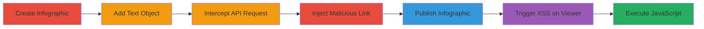

---
tags:
  - xss
  - stored-xss
  - javascript-url
  - infogram
  - web-vulnerability
type: attack_chain
tools:
  - '[[tools/Burp-Suite]]'
tactics:
  - '[[Initial Access]]'
  - '[[Execution]]'
  - '[[Collection]]'
verified: false
platforms:
  - Web
submitted: true
complexity: medium
created_at: '2023-10-01T00:00:00Z'
procedures:
  - '[[procedures/Inject-Malicious-JavaScript-Link-in-Infogram-Text-Object]]'
step_count: 7
techniques:
  - '[[JavaScript]]'
  - '[[Exploit Public-Facing Application]]'
updated_at: '2025-12-14T03:16:20.598Z'
description: >-
  A multi-step attack exploiting a stored XSS vulnerability in Infogram's
  infographic text objects by injecting javascript: URLs through an unvalidated
  API endpoint, leading to arbitrary JavaScript execution on viewers.
skill_level: intermediate
impact_level: high
id: c6b516a6-61a3-4abc-a169-39af32f49a07
validated: true
mitre_tactics:
  - '[[Initial Access]]'
  - '[[Execution]]'
  - '[[Collection]]'
mitre_techniques:
  - '[[JavaScript]]'
  - '[[Exploit Public-Facing Application]]'
---
# Stored XSS in Infogram Infographics via Malicious JavaScript URL Injection

Multi-stage attack chain demonstrating a complete stored XSS workflow in Infogram's infographic editor, where user-supplied links in text objects bypass server-side validation, allowing javascript: schemes to be stored and executed when viewed publicly.

## Chain Metrics Dashboard

| Metric | Value |
|--------|-------|
| Chain Status | Unverified |
| Total Steps | 7 |
| Execution Time | ~15 minutes |
| Skill Level | Intermediate |
| Complexity | Medium |
| Impact Level | High |

## Attack Flow Visualization

## Prerequisites & Requirements

### Required Tools

- [[tools/Burp-Suite]]

### Target Environment

- Web platform (Infogram application)
- Required services/ports: HTTPS (443)
- Network access requirements: Internet access to infogram.com

### Initial Access Requirements

- Valid Infogram account credentials
- Network position: Direct browser access
- Prior access needed: User-level login to create infographics

## Detailed Attack Procedures

### Step 1: Create an Infographic
procedure: [[procedures/Inject-Malicious-JavaScript-Link-in-Infogram-Text-Object]]

**Objective**: Establish a new infographic project to serve as the vector for the XSS payload.

**Instructions**: Log in to your Infogram account at https://infogram.com and navigate to the dashboard. Click "Create new" to start a blank infographic project. This sets up the canvas for adding exploitable elements.

**Expected Output**: A new infographic editor session opens with a project ID assigned (visible in the URL or API calls).

**Success Indicators**:
- Infographic editor loads successfully
- Project ID is generated

### Step 2: Add a Text Object and Prepare to Insert a Link
procedure: [[procedures/Inject-Malicious-JavaScript-Link-in-Infogram-Text-Object]]

**Objective**: Introduce a text element that can hold a hyperlink, priming it for payload injection.

**Instructions**: In the infographic editor, drag a text object from the sidebar onto the canvas. Double-click the text object to edit it, then highlight some text and use the link insertion tool (or Ctrl+K) to add a benign link like http://google.com. This triggers the initial API request pattern to be observed.

**Expected Output**: The link is temporarily added to the text, and an API call is prepared for interception.

**Success Indicators**:
- Text object is editable
- Link insertion dialog appears

### Step 3: Start Web Debugger and Enable Interception Mode
procedure: [[procedures/Inject-Malicious-JavaScript-Link-in-Infogram-Text-Object]]

**Objective**: Set up proxy interception to capture and modify the link-saving API request.

**Instructions**: Launch [[tools/Burp-Suite]] and configure your browser to proxy traffic through it (e.g., set proxy to 127.0.0.1:8080). In Burp, go to the Proxy tab, enable interception, and ensure it's set to intercept requests to infogram.com domains.

**Expected Output**: Browser traffic routes through Burp, ready to catch POST requests.

**Success Indicators**:
- Proxy is active and intercepting
- No errors in browser connectivity

### Step 4: Insert the Link in the Text Object
procedure: [[procedures/Inject-Malicious-JavaScript-Link-in-Infogram-Text-Object]]

**Objective**: Trigger the API request that saves the link, allowing it to be intercepted.

**Instructions**: In the text editor, confirm the link insertion (e.g., http://google.com). This sends a POST request to the Infogram API.

**Expected Output**: The request is intercepted in Burp before being forwarded.

**Success Indicators**:
- API request appears in Burp Proxy
- Request body contains the link parameter

### Step 5: Intercept and Modify the API Request
procedure: [[procedures/Inject-Malicious-JavaScript-Link-in-Infogram-Text-Object]]

**Objective**: Alter the link URL to a javascript: payload, bypassing validation.

**Instructions**: In Burp's intercept tab, locate the POST request to https://infogram.com/api/infographics/update/[project_id]. Edit the JSON payload: change the "url" or "link" parameter from "http://google.com" to "javascript:alert(document.domain)". Forward the modified request.

**Expected Output**: The server accepts the change without error, storing the malicious link.

**Success Indicators**:
- Request forwards successfully (200 OK response)
- No validation errors from server

### Step 6: Execute the Modified Request and Publish the Infographic
procedure: [[procedures/Inject-Malicious-JavaScript-Link-in-Infogram-Text-Object]]

**Objective**: Persist the payload and make the infographic publicly accessible to victims.

**Instructions**: After forwarding, save the infographic in the editor. Then, in the project settings, set visibility to "Public" and generate/share the public URL.

**Expected Output**: Infographic saves with the malicious link embedded; public URL is available.

**Success Indicators**:
- Infographic publishes without issues
- Public view loads the text object with the link

### Step 7: Visit the Public Infographic and Click the Text Object
procedure: [[procedures/Inject-Malicious-JavaScript-Link-in-Infogram-Text-Object]]

**Objective**: Demonstrate exploitation by triggering the XSS in a victim's browser context.

**Instructions**: Open the public infographic URL in a browser (ideally a test account). Click the linked text in the infographic to execute the javascript: URL.

**Expected Output**: An alert box pops up showing the domain (e.g., infogram.com), confirming XSS execution.

**Success Indicators**:
- JavaScript alert executes
- No CSP or sanitization blocks the payload

## Attack Chain Summary

### Key Achievements

1. Successful injection of a javascript: URL into a stored text link via API manipulation.
2. Bypassing server-side validation to persist the payload in a public infographic.
3. Arbitrary JavaScript execution on any viewer clicking the link, enabling session hijacking or data theft.

## Technique & Tactic Coverage

### MITRE ATT&CK Techniques

- [[JavaScript]]
- [[Exploit Public-Facing Application]]

### MITRE ATT&CK Tactics

- [[Initial Access]]
- [[Execution]]
- [[Collection]]

---
*Last updated: 2023-10-01T00:00:00Z*
