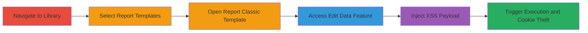

---
tags:
  - xss
  - stored-xss
  - javascript
  - cookie-theft
type: attack_chain
tools: []
tactics:
  - '[[Execution]]'
  - '[[Collection]]'
verified: false
platforms:
  - Web
submitted: true
complexity: medium
created_at: '2023-10-01T00:00:00Z'
procedures:
  - '[[procedures/Exploit-Stored-XSS-in-Infogram-Edit-Data]]'
step_count: 6
techniques:
  - '[[JavaScript]]'
updated_at: '2025-12-14T03:16:07.868Z'
description: >-
  A multi-step attack exploiting a stored XSS vulnerability in Infogram's Report
  Classic template to execute arbitrary JavaScript and steal user cookies.
skill_level: intermediate
impact_level: high
id: 27aaae59-c0f9-4ebb-9dc4-762a58439e6b
validated: true
mitre_tactics:
  - '[[Execution]]'
  - '[[Collection]]'
mitre_techniques:
  - '[[JavaScript]]'
---
---
id: 123e4567-e89b-12d3-a456-426614174000
name: Stored XSS in Infogram Report Classic Template for Cookie Theft
type: attack_chain
description: "A multi-step attack exploiting a stored XSS vulnerability in Infogram's Report Classic template to execute arbitrary JavaScript and steal user cookies."
verified: false
submitted: false
step_count: 6
created_at: 2023-10-01T00:00:00Z
updated_at: 2023-10-01T00:00:00Z
procedures: [[procedures/Exploit-Stored-XSS-in-Infogram-Edit-Data]]
techniques: [[JavaScript]]
tactics: [[Execution]], [[Collection]]
tags: xss, stored-xss, javascript, cookie-theft
platforms: Web
tools: []
---

# Stored XSS in Infogram Report Classic Template for Cookie Theft

Multi-stage attack chain demonstrating a complete attack workflow exploiting stored XSS in Infogram's data editing feature.

## Chain Metrics Dashboard

| Metric | Value |
|--------|-------|
| Chain Status | Unverified |
| Total Steps | 6 |
| Execution Time | ~5 minutes |
| Skill Level | Intermediate |
| Complexity | Medium |
| Impact Level | High |

## Attack Flow Visualization

## Prerequisites & Requirements

### Required Tools

- Web browser (e.g., Chrome, Firefox)

### Target Environment

- Web platform
- Access to Infogram at https://infogram.com
- No specific ports or services required beyond standard HTTPS

### Initial Access Requirements

- Valid user account or public access to Infogram library (vulnerability exploitable in template editing without authentication in some contexts)
- Network access to https://infogram.com
- No prior access needed beyond reaching the site

## Detailed Attack Procedures

### Step 1: Navigate to the Library Page
procedure: [[procedures/Exploit-Stored-XSS-in-Infogram-Edit-Data]]

**Objective**: Gain access to the Infogram library interface to begin template selection.

**Instructions**: Open a web browser and navigate to the Infogram library URL.

**Expected Output**: The library page loads, displaying available templates and options.

**Success Indicators**:
- Library page accessible at https://infogram.com/app/#/library
- Interface elements visible for further navigation

### Step 2: Choose Report Templates
procedure: [[procedures/Exploit-Stored-XSS-in-Infogram-Edit-Data]]

**Objective**: Locate and select the Report Templates section within the library.

**Instructions**: From the library interface, select the "Report Templates" option.

**Expected Output**: Report Templates category opens, listing available templates.

**Success Indicators**:
- Report Templates section displayed
- List of templates including Report Classic visible

### Step 3: Use Report Classic Template
procedure: [[procedures/Exploit-Stored-XSS-in-Infogram-Edit-Data]]

**Objective**: Open the vulnerable Report Classic template for editing.

**Instructions**: Select and open the Report Classic template from the list.

**Expected Output**: The Report Classic template loads in edit mode.

**Success Indicators**:
- Template interface active
- Edit options available

### Step 4: Click to Edit Data
procedure: [[procedures/Exploit-Stored-XSS-in-Infogram-Edit-Data]]

**Objective**: Access the data editing field where the XSS vulnerability exists.

**Instructions**: Locate and click the "edit_data" button or feature within the template.

**Expected Output**: Data editing interface appears, allowing input into fields.

**Success Indicators**:
- Edit data field focused and ready for input
- No immediate errors on click

### Step 5: Input XSS Payload
procedure: [[procedures/Exploit-Stored-XSS-in-Infogram-Edit-Data]]

**Objective**: Inject a malicious JavaScript payload into the unsanitized data field.

**Instructions**: Enter a stored XSS payload such as `` or `">` into the data editing field.

**Expected Output**: Payload accepted without validation errors.

**Success Indicators**:
- Payload entered successfully
- Field accepts HTML/JavaScript without escaping

### Step 6: Execute XSS
procedure: [[procedures/Exploit-Stored-XSS-in-Infogram-Edit-Data]]

**Objective**: Save or trigger the edit to execute the stored XSS and demonstrate cookie theft.

**Instructions**: Save the changes or perform the action that renders the data, triggering the payload execution.

**Expected Output**: JavaScript alert pops up displaying document cookies, confirming arbitrary code execution.

**Success Indicators**:
- Alert box appears with cookie contents
- Potential for further exploitation like exfiltrating data to an attacker-controlled server

## Attack Chain Summary

### Key Achievements

1. Successful navigation and access to the vulnerable template
2. Injection and storage of malicious XSS payload in the edit_data feature
3. Execution of arbitrary JavaScript leading to cookie theft and potential session hijacking

## Technique & Tactic Coverage

### MITRE ATT&CK Techniques

- [[JavaScript]]

### MITRE ATT&CK Tactics

- [[Execution]]
- [[Collection]]

---
*Last updated: 2023-10-01T00:00:00Z*
