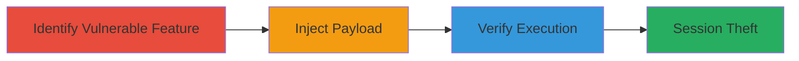

# Stored XSS in Infogram Templates for Session Hijacking

Multi-stage attack chain demonstrating a complete attack workflow exploiting stored Cross-Site Scripting (XSS) in Infogram's templates feature. An attacker with access to create or edit templates injects malicious JavaScript payloads that are stored without sanitization. When other authenticated users load or view these templates, the payload executes in their browser context, potentially stealing session cookies, hijacking sessions, or performing other client-side attacks like phishing or defacement.

## Chain Metrics Dashboard

| Metric | Value |
|--------|-------|
| Chain Status | Unverified |
| Total Steps | 3 |
| Execution Time | ~5 minutes |
| Skill Level | Intermediate |
| Complexity | Medium |
| Impact Level | High |

## Attack Flow Visualization

## Prerequisites & Requirements

### Required Tools

- Web browser (e.g., Chrome with developer tools)

### Target Environment

- Infogram platform (web application)
- Authenticated user account with template creation/editing permissions
- No specific ports or services beyond standard HTTPS (443)

### Initial Access Requirements

- Valid Infogram account credentials
- Network access to infogram.com
- No prior elevated access needed, but authenticated session required

## Detailed Attack Procedures

### Step 1: Identify Vulnerable Templates Feature
procedure: [[procedures/Identify-Infogram-Template-Vulnerability]]

**Objective**: Explore Infogram's template creation or editing functionality to identify areas where user input is reflected without proper sanitization, setting the stage for XSS injection.

**Instructions**: Log in to your Infogram account and navigate to the templates section. Examine input fields for template names, descriptions, or content areas. Use browser developer tools to inspect how user-supplied data is rendered in the HTML output when templates are saved and reloaded.

**Expected Output**: Confirmation of unsanitized input fields that allow HTML/JS insertion, such as template metadata or body fields.

**Success Indicators**:
- Input fields accept arbitrary text without escaping
- Reloaded templates display raw input in HTML context

### Step 2: Inject XSS Payload into Templates
procedure: [[procedures/Inject-XSS-Payload-in-Templates]]

**Objective**: Insert a malicious JavaScript payload into a template input field, which gets stored server-side without sanitization for later execution.

**Instructions**: In the template creation or editing interface, enter the payload `'>'` into an input field like the template title or description. Save the template and note its ID or URL for later viewing.

**Expected Output**: Template saves successfully without errors, and the payload is stored as-is in the backend.

**Success Indicators**:
- No validation errors on save
- Payload visible in raw form when inspecting the saved template's source

### Step 3: Verify XSS Execution
procedure: [[procedures/Verify-XSS-Execution-in-Templates]]

**Objective**: Load or view the affected template to trigger the stored payload, confirming arbitrary JavaScript execution in the viewer's browser.

**Instructions**: As an authenticated user (or share the template link), navigate to load or view the template. Observe the page load; the onerror handler in the injected img tag should execute, displaying a prompt dialog.

**Expected Output**: A browser prompt (alert or confirm) appears, indicating JavaScript execution. In a real attack, this could be replaced with code to steal document.cookie or redirect to a phishing site.

**Success Indicators**:
- JavaScript executes (e.g., prompt(0) triggers)
- No CSP or sanitization blocks the payload

## Attack Chain Summary

### Key Achievements

1. Identified unsanitized input in Infogram templates
2. Successfully stored and persisted malicious XSS payload
3. Demonstrated JavaScript execution leading to potential session theft

## Technique & Tactic Coverage

### MITRE ATT&CK Techniques

- [[JavaScript]]

### MITRE ATT&CK Tactics

- [[Execution]]
- [[Collection]]

---
*Last updated: 2023-10-01T12:00:00Z*
