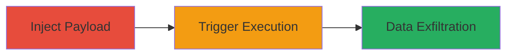

# Stored XSS in Infogram User Profile Language Parameter

Multi-stage attack chain demonstrating a complete stored XSS exploit on infogram.com, where malicious JavaScript is injected into the user profile's language field and executed when others view the profile.

## Chain Metrics Dashboard

| Metric | Value |
|--------|-------|
| Chain Status | Unverified |
| Total Steps | 2 |
| Execution Time | ~5 minutes |
| Skill Level | Intermediate |
| Complexity | Medium |
| Impact Level | High |

## Attack Flow Visualization



## Prerequisites & Requirements

### Required Tools

- None (uses standard HTTP client like curl)

### Target Environment

- Web platform (infogram.com)
- Required services/ports: HTTPS on port 443
- Network access requirements: Internet access to infogram.com API

### Initial Access Requirements

- Valid user account on infogram.com with profile editing permissions
- Authenticated session (e.g., API token or cookies for PUT requests)
- No prior access beyond account creation

## Detailed Attack Procedures

### Step 1: Inject Malicious Payload into Profile

procedure: [[procedures/Inject-XSS-Payload-into-Infogram-Profile]]

**Objective**: Store unsanitized JavaScript in the language parameter via the profile API, setting up the stored XSS.

**Instructions**: Authenticate to the Infogram API and send a PUT request to update the profile with the XSS payload in the language field. Use [[commands/update-infogram-profile-xss]] to inject the payload:

```bash
curl -X PUT https://infogram.com/api/users/me \
  -H "Content-Type: application/x-www-form-urlencoded" \
  -d "first_name=name&last_name=name&username=&confirm_password=password&language=></script>;"
```

**Expected Output**: HTTP 200 response indicating profile updated successfully, with the payload stored server-side.

**Success Indicators**:
- Profile update confirmation from API
- No error in response (e.g., 4xx/5xx codes)

### Step 2: Trigger XSS Execution on Profile View

**Objective**: Visit the public profile page to render and execute the stored payload in the victim's browser.

**Instructions**: Share or access the attacker's public profile URL (e.g., https://infogram.com/dd_ddt7). No specific command needed; simply load the page in a browser. The payload executes automatically upon rendering the language field.

**Expected Output**: JavaScript alert pops up showing the document domain (e.g., alert('infogram.com')), confirming execution. In a real attack, this could be replaced with code to steal cookies or session data.

**Success Indicators**:
- Alert or scripted action triggers on page load
- Browser console shows JavaScript execution errors or logs from payload

## Attack Chain Summary

### Key Achievements

1. Successful injection of stored XSS payload into user profile without sanitization.
2. Execution of arbitrary JavaScript on any visitor's browser viewing the profile.
3. Potential for data theft, such as session cookies or user information, leading to account compromise.

## Technique & Tactic Coverage

### MITRE ATT&CK Techniques

- [[JavaScript]]

### MITRE ATT&CK Tactics

- [[Execution]]
- [[Collection]]

---

*Last updated: 2023-10-01T00:00:00Z*
