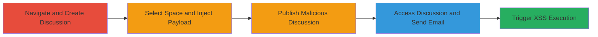

---
tags:
  - xss
  - stored-xss
  - javascript-injection
  - email-exploitation
type: attack_chain
tools: []
tactics:
  - '[[Execution]]'
verified: false
platforms:
  - Web
submitted: true
complexity: medium
created_at: '2023-10-01T00:00:00Z'
procedures:
  - '[[procedures/Exploit-Stored-XSS-in-Discussion-Title]]'
step_count: 6
techniques:
  - '[[JavaScript]]'
updated_at: '2025-12-14T03:16:37.372Z'
description: >-
  A multi-step attack exploiting a stored XSS vulnerability in the discussion
  title field of marketplace.informatica.com, allowing arbitrary JavaScript
  execution via email rendering.
skill_level: intermediate
impact_level: high
id: f040702b-edbd-4441-98fe-f7da30d8040f
validated: true
mitre_tactics:
  - '[[Execution]]'
mitre_techniques:
  - '[[JavaScript]]'
---
# Stored XSS in Informatica Marketplace Discussion Title Leading to Email Execution

Multi-stage attack chain demonstrating a complete attack workflow exploiting a stored XSS vulnerability in the discussion title field, leading to JavaScript execution in email contexts.

## Chain Metrics Dashboard

| Metric | Value |
|--------|-------|
| Chain Status | Unverified |
| Total Steps | 6 |
| Execution Time | ~5 minutes |
| Skill Level | Intermediate |
| Complexity | Medium |
| Impact Level | High |

## Attack Flow Visualization

## Prerequisites & Requirements

### Required Tools

- Web browser (e.g., Chrome, Firefox)

### Target Environment

- Web platform: marketplace.informatica.com
- Required services/ports: HTTPS (443)
- Network access requirements: Internet access to the target site

### Initial Access Requirements

- User account on marketplace.informatica.com with permission to create discussions
- No special credentials beyond standard user login
- No prior access needed beyond registration

## Detailed Attack Procedures

### Step 1: Navigate to Create a New Discussion
procedure: [[procedures/Exploit-Stored-XSS-in-Discussion-Title]]

**Objective**: Access the discussion creation interface to begin the injection process.

**Instructions**: Log in to marketplace.informatica.com, navigate to the 'Your Stuff' section, and select 'Create a Discussion/Ask a question' to open the creation form.

**Expected Output**: Discussion creation form loads with title and body fields.

**Success Indicators**:
- Form is accessible and editable
- No input restrictions visible on title field

### Step 2: Choose a Space for the Discussion
procedure: [[procedures/Exploit-Stored-XSS-in-Discussion-Title]]

**Objective**: Select a valid space to ensure the discussion can be published.

**Instructions**: From the available options, select any space (e.g., a community or product forum) to associate the discussion with.

**Expected Output**: Space selected, form proceeds to title input.

**Success Indicators**:
- Space dropdown populated and selectable
- No validation errors on space selection

### Step 3: Enter Malicious Payload in the Title
procedure: [[procedures/Exploit-Stored-XSS-in-Discussion-Title]]

**Objective**: Inject a JavaScript payload into the title field to exploit the lack of sanitization.

**Instructions**: In the title field, enter the payload `` to close any open tags and trigger JavaScript on error.

**Expected Output**: Payload entered without immediate rejection; form allows continuation.

**Success Indicators**:
- Payload text appears in the title field
- No client-side validation blocks the input

### Step 4: Publish the Discussion
procedure: [[procedures/Exploit-Stored-XSS-in-Discussion-Title]]

**Objective**: Save and publish the discussion to store the malicious payload.

**Instructions**: Fill in any required body text if needed, then click 'Post message' to submit and publish.

**Expected Output**: Discussion is created and visible in the selected space with the malicious title.

**Success Indicators**:
- Confirmation message or redirect to the published discussion
- Title displays the injected HTML/JS without escaping

### Step 5: View the Discussion and Select Email Action
procedure: [[procedures/Exploit-Stored-XSS-in-Discussion-Title]]

**Objective**: Access the published discussion from a victim perspective and initiate email sending.

**Instructions**: Log in as any user (or remain logged in), navigate to the published discussion, and under 'Actions', select 'Send as Email'.

**Expected Output**: Email composition or sending interface opens with the discussion content.

**Success Indicators**:
- Discussion loads with unescaped title
- 'Send as Email' option is available and functional

### Step 6: Observe the XSS Execution
procedure: [[procedures/Exploit-Stored-XSS-in-Discussion-Title]]

**Objective**: Trigger and verify the JavaScript execution in the email rendering context.

**Instructions**: Complete the email send action; the payload renders in the email body or preview, executing the onerror handler.

**Expected Output**: Alert box pops up displaying '1' when the email is rendered or viewed.

**Success Indicators**:
- JavaScript alert triggers
- No errors in console; payload executes as intended

## Attack Chain Summary

### Key Achievements

1. Successful injection and storage of XSS payload in discussion title
2. Persistence of the vulnerability across views and email exports
3. Arbitrary JavaScript execution impacting any viewing user, enabling session hijacking or data theft

## Technique & Tactic Coverage

### MITRE ATT&CK Techniques

- [[JavaScript]]

### MITRE ATT&CK Tactics

- [[Execution]]

---
*Last updated: 2023-10-01T00:00:00Z*
