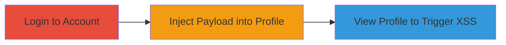

---
tags:
  - xss
  - stored-xss
  - javascript-injection
  - session-hijacking
type: attack_chain
tools: []
tactics:
  - '[[Execution]]'
  - '[[Collection]]'
verified: false
platforms:
  - Web
submitted: true
complexity: low
created_at: '2023-10-01T00:00:00Z'
procedures:
  - '[[procedures/Log-into-Informatica-Marketplace-Account]]'
  - '[[procedures/Inject-Malicious-Payload-into-Profile-Name-Fields]]'
  - '[[procedures/Trigger-XSS-by-Viewing-Profile-from-Another-Account]]'
step_count: 3
techniques:
  - '[[JavaScript]]'
  - '[[Drive-by Compromise]]'
updated_at: '2025-12-14T03:15:47.148Z'
description: >-
  A multi-step attack exploiting a stored XSS vulnerability in user profile name
  fields on marketplace.informatica.com, allowing arbitrary JavaScript execution
  when profiles are viewed by other users.
skill_level: intermediate
impact_level: high
id: 8c5d80e8-2b36-4132-87ca-07d2b6c88972
validated: true
mitre_tactics:
  - '[[Execution]]'
  - '[[Collection]]'
mitre_techniques:
  - '[[JavaScript]]'
  - '[[Drive-by Compromise]]'
---
# Stored-XSS-in-Informatica-Marketplace-Profile-Leading-to-Session-Hijacking

Multi-stage attack chain demonstrating a complete stored XSS workflow on marketplace.informatica.com, where unescaped user input in profile fields allows JavaScript injection, leading to client-side execution for potential data theft or session hijacking.

## Chain Metrics Dashboard

| Metric | Value |
|--------|-------|
| Chain Status | Unverified |
| Total Steps | 3 |
| Execution Time | ~5 minutes |
| Skill Level | Intermediate |
| Complexity | Low |
| Impact Level | High |

## Attack Flow Visualization

## Prerequisites & Requirements

### Required Tools

- Web browser (e.g., Chrome with developer tools)

### Target Environment

- Web platform
- Access to marketplace.informatica.com
- Authenticated user account

### Initial Access Requirements

- Valid credentials for at least two accounts (attacker's and victim's)
- Network access to the internet
- No prior access needed beyond registration

## Detailed Attack Procedures

### Step 1: Log into Account
procedure: [[procedures/Log-into-Informatica-Marketplace-Account]]

**Objective**: Authenticate to the target application to access profile editing features.

**Instructions**: Open a web browser and navigate to the login page of marketplace.informatica.com. Enter valid credentials for an account with profile editing permissions.

**Expected Output**: Successful redirection to the dashboard or profile page after authentication.

**Success Indicators**:
- User is logged in and can access personal profile settings.
- No authentication errors displayed.

### Step 2: Inject Malicious Payload into Profile Name Fields
procedure: [[procedures/Inject-Malicious-Payload-into-Profile-Name-Fields]]

**Objective**: Insert a JavaScript payload into the username and lastname fields to exploit the lack of input sanitization.

**Instructions**: Navigate to the user profile editing section. In the 'name' and 'lastname' fields, enter the payload `'-alert(document.domain)-'`. Save the profile changes. This payload breaks out of the JavaScript string concatenation due to unescaped quotes.

**Expected Output**: Profile updates successfully without errors, storing the payload in the backend.

**Success Indicators**:
- Profile saves and displays the injected text (though it may appear broken).
- No validation errors on input submission.

### Step 3: Trigger XSS by Viewing Profile from Another Account
procedure: [[procedures/Trigger-XSS-by-Viewing-Profile-from-Another-Account]]

**Objective**: Execute the injected JavaScript by loading the profile page from a different authenticated session.

**Instructions**: Log out and log in with a second account. Navigate to the profile URL `https://marketplace.informatica.com/people/%email%` (replacing %email% with the attacker's email). The page loads the profile, inserting the payload into JavaScript variable `pageNameDTM`, triggering execution.

**Expected Output**: An alert box pops up displaying the document domain, confirming JavaScript execution.

**Success Indicators**:
- Alert executes, showing the domain.
- Browser developer tools show JavaScript errors or execution in the console.

## Attack Chain Summary

### Key Achievements

1. Successful authentication and profile manipulation.
2. Payload injection bypassing partial regex sanitization.
3. Arbitrary JavaScript execution in victim browsers, enabling further attacks like cookie theft.

## Technique & Tactic Coverage

### MITRE ATT&CK Techniques

- [[JavaScript]]
- [[Drive-by Compromise]]

### MITRE ATT&CK Tactics

- [[Execution]]
- [[Collection]]

---
*Last updated: 2023-10-01T00:00:00Z*
