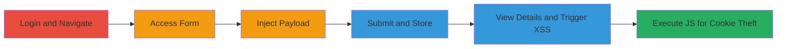

---
tags:
  - stored-xss
  - javascript
  - session-hijacking
  - cookie-theft
type: attack_chain
tools:
  - '[[tools/Google-Chrome]]'
  - '[[tools/Mozilla-Firefox]]'
tactics:
  - '[[Execution]]'
verified: false
platforms:
  - Web
submitted: true
complexity: medium
created_at: '2023-10-01T00:00:00Z'
procedures:
  - '[[procedures/Exploit-Stored-XSS-in-Training-Description]]'
step_count: 9
techniques:
  - '[[JavaScript]]'
updated_at: '2025-12-14T03:47:23.363Z'
description: >-
  A multi-step attack exploiting a stored XSS vulnerability in the Training
  Description field of Informatica University's external training form, allowing
  arbitrary JavaScript execution on viewers of training details.
skill_level: intermediate
impact_level: high
id: debcae38-8943-4aa4-af5c-bd5b1723f394
validated: true
mitre_tactics:
  - '[[Execution]]'
mitre_techniques:
  - '[[JavaScript]]'
---
# Stored XSS in Informatica University Training Description for Session Hijacking

Multi-stage attack chain demonstrating a complete stored XSS exploit workflow on informatica.csod.com, leading to JavaScript execution for potential session hijacking.

## Chain Metrics Dashboard

| Metric | Value |
|--------|-------|
| Chain Status | Unverified |
| Total Steps | 9 |
| Execution Time | ~5 minutes |
| Skill Level | Intermediate |
| Complexity | Medium |
| Impact Level | High |

## Attack Flow Visualization

## Prerequisites & Requirements

### Required Tools

- [[tools/Google-Chrome]]
- [[tools/Mozilla-Firefox]]

### Target Environment

- Web platform: informatica.csod.com
- Required services/ports: HTTPS (443)
- Network access requirements: Internet access to the site

### Initial Access Requirements

- Valid user account credentials for Informatica University
- Network position: External user
- Prior access needed: None, but authenticated session required

## Detailed Attack Procedures

### Step 1: Login to Account and Navigate to Informatica University

**Objective**: Authenticate and access the main university dashboard to begin the attack surface exploration.

**Instructions**: Open your browser and navigate to informatica.csod.com. Enter your credentials to log in, which redirects to the authenticated university homepage.

**Expected Output**: Successful login, displaying the main university page.

**Success Indicators**:
- Authenticated session established
- University dashboard visible

### Step 2: Access My Training or Universal Profile

**Objective**: Reach the user-specific section where training management features are available.

**Instructions**: From the upper right corner of the dashboard, click on 'My Training' or 'Universal Profile' to redirect to the personal training or profile area.

**Expected Output**: Redirect to the user's training or profile page.

**Success Indicators**:
- User-specific page loaded
- Navigation menu accessible

### Step 3: Navigate to Transcript Tab

**Objective**: Enter the transcript section to access external training addition options.

**Instructions**: On the Universal Profile bio page, select the 'Transcript' tab to view existing training records.

**Expected Output**: Transcript section displayed with training history.

**Success Indicators**:
- Transcript tab active
- List of trainings shown

### Step 4: Open Add External Training Form

**Objective**: Initiate the form for submitting a new external training entry, targeting the vulnerable field.

**Instructions**: In the upper right of the transcript page, click the options dropdown and select 'Add external training' to open the input form.

**Expected Output**: Form fields for training details appear.

**Success Indicators**:
- Form loaded
- Training Description field visible

### Step 5: Inject XSS Payload in Training Description

procedure: [[procedures/Exploit-Stored-XSS-in-Training-Description]]

**Objective**: Insert a malicious JavaScript payload into the unsanitized Training Description field to store XSS for later execution.

**Instructions**: Fill out other required fields normally (e.g., training name, date). In the Training Description field, enter the payload: `'>`. This breaks out of any HTML context and injects an onerror handler to execute JavaScript.

**Expected Output**: Payload entered without validation errors.

**Success Indicators**:
- Payload accepted in the field
- No immediate sanitization visible

### Step 6: Submit the Form

procedure: [[procedures/Exploit-Stored-XSS-in-Training-Description]]

**Objective**: Store the injected payload in the backend database for persistence.

**Instructions**: Complete any remaining fields and click 'Submit' to process the external training entry.

**Expected Output**: Redirect to the updated transcript page with the new entry listed.

**Success Indicators**:
- Form submission successful
- New training appears in transcript

### Step 7: Return to Transcript Page

**Objective**: Verify the stored entry is visible in the user's transcript.

**Instructions**: After submission, confirm the redirect shows the updated transcript including the new external training.

**Expected Output**: Transcript refreshed with the submitted training.

**Success Indicators**:
- Stored entry listed
- No errors on page load

### Step 8: View Training Details to Trigger XSS

procedure: [[procedures/Exploit-Stored-XSS-in-Training-Description]]

**Objective**: Render the stored description, causing the XSS payload to execute on the client side.

**Instructions**: On the right side of the transcript entry (near 'withdraw' label), open the dropdown and select 'View training details'. This fetches and displays the unsanitized description.

**Expected Output**: Details page loads, triggering the payload.

**Success Indicators**:
- Details modal or page opens
- JavaScript execution observed

### Step 9: Observe XSS Execution

**Objective**: Confirm arbitrary JavaScript runs, demonstrating potential for cookie theft or hijacking.

**Instructions**: Upon viewing details, the payload executes, popping an alert with document.cookie contents.

**Expected Output**: Alert box displays session cookies.

**Success Indicators**:
- Alert popup appears
- Cookies visible, indicating theft potential

## Attack Chain Summary

### Key Achievements

1. Successful injection and storage of XSS payload in a user-controlled field.
2. Triggered execution on detail view, affecting any viewer including admins.
3. Demonstrated client-side impact like cookie exfiltration for session hijacking.

## Technique & Tactic Coverage

### MITRE ATT&CK Techniques

- [[JavaScript]]

### MITRE ATT&CK Tactics

- [[Execution]]

---
*Last updated: 2023-10-01T00:00:00Z*
