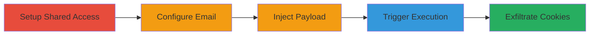

# Stored XSS in Insightly Email Notifications for Cookie Theft and Session Hijacking

A stored cross-site scripting (XSS) vulnerability in Insightly's email notification system allows attackers to inject malicious JavaScript into email subjects. When group members view the notification list at https://crm.na1.insightly.com/list/Email/, the payload executes, stealing cookies and enabling session hijacking for any affected user.

## Chain Metrics Dashboard

| Metric | Value |
|--------|-------|
| Chain Status | Unverified |
| Total Steps | 4 |
| Execution Time | ~10 minutes |
| Skill Level | Intermediate |
| Complexity | Medium |
| Impact Level | High |

## Attack Flow Visualization

## Prerequisites & Requirements

### Required Tools

- Web browser (e.g., Chrome with developer tools for payload testing)

### Target Environment

- Insightly CRM platform (https://crm.na1.insightly.com)
- Shared group access enabled
- Email service configured

### Initial Access Requirements

- Valid Insightly account credentials for two users
- Ability to create and invite to groups
- No special network access beyond standard web connectivity

## Detailed Attack Procedures

### Step 1: Setup Shared Group
procedure: [[procedures/Create-Shared-Group-in-Insightly]]

**Objective**: Establish a shared environment where notifications are visible to multiple users, setting up the vector for stored XSS propagation.

**Instructions**: Register two Insightly accounts and use the primary account to invite the secondary to a shared group. This enables shared notifications that will display the malicious email subject.

**Expected Output**: Confirmation of group invitation and acceptance by the second user.

**Success Indicators**:
- Second user added to the group
- Shared notifications active between accounts

### Step 2: Configure Email Service
procedure: [[procedures/Configure-Email-Service-in-Insightly]]

**Objective**: Enable email functionality within Insightly to allow creation of emails with injectable subjects.

**Instructions**: In the Insightly dashboard, navigate to settings and configure an email service (e.g., integrate with Gmail or Outlook) to permit sending and receiving emails through the platform.

**Expected Output**: Email service status shows as connected and ready for use.

**Success Indicators**:
- Email integration successful
- Ability to create new emails confirmed

### Step 3: Inject XSS Payload
procedure: [[procedures/Inject-XSS-Payload-in-Email-Subject]]

**Objective**: Insert a malicious JavaScript payload into the email subject field, which is stored and rendered unsanitized in notifications.

**Instructions**: Create a new email in Insightly and enter the payload `` as the subject. The payload uses an onerror handler to execute obfuscated JavaScript that exfiltrates document.cookie.

**Expected Output**: Email saved with the malicious subject; no immediate errors.

**Success Indicators**:
- Payload accepted in subject field without sanitization
- Email appears in the sender's notification list

### Step 4: Trigger XSS Execution
procedure: [[procedures/Trigger-XSS-via-Notification-View]]

**Objective**: View the notification list as the victim user to execute the stored payload and steal session cookies.

**Instructions**: Log in as the second (victim) user, navigate to https://crm.na1.insightly.com/list/Email/, or refresh the page. The unsanitized subject renders the img tag, triggering the onerror event and executing the JavaScript to send cookies to an attacker-controlled endpoint.

**Expected Output**: JavaScript execution in the browser console; cookies transmitted (e.g., via the obfuscated toString method).

**Success Indicators**:
- Malicious script runs in victim's browser
- Attacker receives stolen cookies
- Potential session hijacking possible with stolen data

## Attack Chain Summary

### Key Achievements

1. Successful injection of stored XSS payload in a shared CRM environment
2. Execution of arbitrary JavaScript leading to cookie theft
3. Demonstration of session hijacking risk for group members

## Technique & Tactic Coverage

### MITRE ATT&CK Techniques

- [[JavaScript]]
- [[Pass the Hash]]

### MITRE ATT&CK Tactics

- [[Execution]]
- [[Collection]]

---
*Last updated: 2023-10-01T00:00:00Z*
