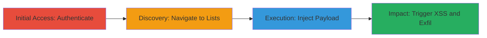

# Stored XSS in Instacart Shopping Lists for Session Hijacking

Multi-stage attack chain demonstrating a complete workflow for exploiting a stored cross-site scripting (XSS) vulnerability in the Instacart web application. The attack involves authenticating to the platform, navigating to the shopping lists feature, injecting a malicious JavaScript payload into a list name without sanitization, and triggering execution during preview, which displays an alert with the document domain and could steal session cookies or perform actions on behalf of users viewing the list.

## Chain Metrics Dashboard

| Metric | Value |
|--------|-------|
| Chain Status | Unverified |
| Total Steps | 4 |
| Execution Time | ~5 minutes |
| Skill Level | Intermediate |
| Complexity | Medium |
| Impact Level | High |

## Attack Flow Visualization

## Prerequisites & Requirements

### Required Tools

- Web browser (e.g., Chrome, Firefox)

### Target Environment

- Instacart web application (https://www.instacart.com)
- Valid user account credentials
- No special services or ports required beyond standard HTTPS (443)

### Initial Access Requirements

- Valid Instacart account credentials
- Direct network access to the internet
- No prior access needed beyond authentication

## Detailed Attack Procedures

### Step 1: Authenticate to Instacart
procedure: [[procedures/Authenticate-to-Instacart-Account]]

**Objective**: Gain authenticated access to the Instacart platform to interact with protected features like shopping lists.

**Instructions**: Open a web browser and navigate to the Instacart login page. Enter valid credentials to log in as a user.

**Expected Output**: Successful redirection to the dashboard or home page, with session cookies set.

**Success Indicators**:
- User is logged in and can access account-specific features
- No authentication errors

### Step 2: Navigate to Lists Section
procedure: [[procedures/Navigate-to-Instacart-Lists-Section]]

**Objective**: Access the shopping lists management interface where the vulnerable feature resides.

**Instructions**: From the authenticated session, click on the 'Lists and Recipes' option in the navigation menu, directing to the lists page.

**Expected Output**: Load of the lists management page at https://www.instacart.com/store/demo/lists.

**Success Indicators**:
- Lists page loads without errors
- 'Add List' button is visible and functional

### Step 3: Inject Malicious Payload into List Name
procedure: [[procedures/Inject-Malicious-Payload-into-List-Name]]

**Objective**: Create a new shopping list and embed a JavaScript payload in the name field to store the malicious script server-side.

**Instructions**: Click 'Add List', then enter the payload `'></script></title>` as the list name and save.

**Expected Output**: List created successfully, with the payload stored unsanitized.

**Success Indicators**:
- List appears in the user's lists without visible errors
- Payload is accepted without rejection

### Step 4: Trigger XSS via List Preview
procedure: [[procedures/Trigger-XSS-via-List-Preview]]

**Objective**: Access the preview URL to execute the stored payload, demonstrating arbitrary JavaScript execution in the victim's context.

**Instructions**: Navigate to the preview URL for the created list, such as https://www.instacart.com/lists/izy0w6Q?preview=true.

**Expected Output**: JavaScript alert pops up displaying 'www.instacart.com', confirming execution.

**Success Indicators**:
- Alert dialog appears with document domain
- Browser console shows script execution without errors

## Attack Chain Summary

### Key Achievements

1. Successful authentication and navigation to vulnerable feature
2. Injection of unsanitized JavaScript payload into stored list name
3. Execution of arbitrary code in authenticated user context, enabling potential data theft or actions on behalf of viewers
4. Demonstration of high-impact risk including session hijacking

## Technique & Tactic Coverage

### MITRE ATT&CK Techniques

- [[JavaScript]]
- [[Exploit Public-Facing Application]]

### MITRE ATT&CK Tactics

- [[Execution]]
- [[Collection]]

---
*Last updated: 2023-10-01T00:00:00Z*
