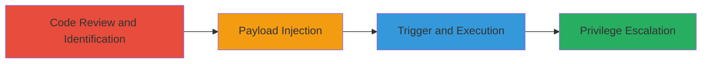

# Stored XSS in Jetpack Simple Payments via Unsanitized Post Meta

Multi-stage attack chain demonstrating exploitation of a stored XSS vulnerability in WordPress sites using Jetpack's premium Simple Payments module. Low-privilege users like contributors or authors can inject JavaScript into product post meta fields, which are output without sanitization in shortcode rendering, enabling script execution in viewers' browsers and potential account takeover or escalation.

## Chain Metrics Dashboard

| Metric | Value |
|--------|-------|
| Chain Status | Unverified |
| Total Steps | 3 |
| Execution Time | ~15 minutes |
| Skill Level | Intermediate |
| Complexity | Medium |
| Impact Level | High |

## Attack Flow Visualization

## Prerequisites & Requirements

### Required Tools

- WordPress admin access as contributor/author
- Browser developer tools for payload testing

### Target Environment

- WordPress site with Jetpack premium/professional plan enabled
- Simple Payments module active
- PHP-based web server

### Initial Access Requirements

- Low-privilege account (contributor or author role)
- Ability to create/edit custom post types (products)
- No premium plan required for testing if bypassing nonces via core WP bugs

## Detailed Attack Procedures

### Step 1: Code Review and Identification
procedure: [[procedures/Code-Review-to-Identify-Jetpack-Stored-XSS]]

**Objective**: Analyze Jetpack code to identify the stored XSS vulnerability in post meta handling and shortcode output.

**Instructions**: Review the product post type registration and shortcode rendering functions in Jetpack source code. Examine capabilities allowing edit access for low-privilege users and trace unsanitized output of 'spay_formatted_price' meta.

**Expected Output**: Confirmation of vulnerability in output_shortcode and format_price functions.

**Success Indicators**:
- Post type supports custom fields without sanitization
- Shortcode outputs meta directly into HTML

### Step 2: Payload Injection
procedure: [[procedures/Inject-XSS-Payload-into-Product-Post-Meta]]

**Objective**: Create a product post as a low-privilege user and inject a JavaScript payload into the 'spay_formatted_price' meta field.

**Instructions**: Log in as contributor, create a new product post, and use the custom fields interface or AJAX to set 'spay_formatted_price' to a payload like ``. Bypass any nonces using known WordPress core issues if needed.

**Expected Output**: Product post saved with injected meta value.

**Success Indicators**:
- Meta value stored without validation
- No errors on post creation

### Step 3: Trigger and Execution
procedure: [[procedures/Trigger-Stored-XSS-via-Shortcode-Rendering]]

**Objective**: Insert the shortcode into a post and view it to execute the stored payload in the browser.

**Instructions**: Edit a post to include `[simple-payment id="PRODUCT_POST_ID"]` shortcode, save, and view the post as any user. The shortcode renders the unsanitized price meta, executing the JavaScript.

**Expected Output**: JavaScript alert or payload execution in the viewer's browser.

**Success Indicators**:
- Payload executes on page load
- Potential cookie theft or escalation if payload is malicious

## Attack Chain Summary

### Key Achievements

1. Identified unsanitized post meta output in Jetpack shortcode
2. Injected and stored XSS payload as low-privilege user
3. Triggered execution leading to browser script control

## Technique & Tactic Coverage

### MITRE ATT&CK Techniques

- [[Exploit Public-Facing Application]]
- [[JavaScript]]

### MITRE ATT&CK Tactics

- [[Initial Access]]
- [[Execution]]

---
*Last updated: 2023-10-01T00:00:00Z*
