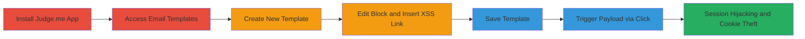

---
tags:
  - xss
  - stored-xss
  - shopify
  - judge-me
  - javascript
  - session-hijacking
type: attack_chain
tools:
  - '[[tools/Summernote-JS]]'
tactics:
  - '[[Execution]]'
  - '[[Collection]]'
commands: []
platforms:
  - Web
  - Shopify
complexity: medium
procedures:
  - '[[procedures/Install-and-Access-Judge-me-Email-Templates]]'
  - '[[procedures/Create-New-Email-Template]]'
  - '[[procedures/Edit-Template-Block]]'
  - '[[procedures/Insert-XSS-Payload-in-Link]]'
  - '[[procedures/Save-Template-with-Payload]]'
  - '[[procedures/Trigger-Stored-XSS-via-Link-Click]]'
step_count: 6
techniques:
  - '[[JavaScript]]'
description: >-
  A multi-step attack exploiting a stored XSS vulnerability in the Judge.me
  Shopify app's email templates feature, allowing injection of malicious
  JavaScript via link insertion to steal session cookies.
skill_level: intermediate
impact_level: high
id: eb1e0102-e895-42a8-b2a5-d873219d0e3e
created_at: '2025-12-13T23:55:20.639Z'
updated_at: '2025-12-13T23:55:20.639Z'
verified: false
validated: true
submitted: true
mitre_tactics:
  - '[[Execution]]'
  - '[[Collection]]'
mitre_techniques:
  - '[[JavaScript]]'
---
# Stored XSS in Judge.me Email Templates Leading to Session Hijacking

## Overview

This attack chain exploits a stored cross-site scripting (XSS) vulnerability in the Judge.me app integrated with Shopify. The vulnerability arises from improper sanitization in the email templates feature, specifically when inserting links using the Summernote JS library. An attacker with access to a Shopify store can inject malicious JavaScript into an email template, which persists after saving. When a victim (e.g., a store admin) interacts with the injected link, the payload executes in their browser context, potentially stealing session cookies and enabling account takeover or session hijacking.

The attack requires installation of the Judge.me app and access to the email templates section. No advanced tools are needed beyond a web browser, making it accessible for intermediate attackers targeting e-commerce platforms.

## Chain Metrics Dashboard

| Metric | Value |
|--------|-------|
| Chain Status | Unverified |
| Total Steps | 6 |
| Execution Time | ~5 minutes |
| Skill Level | Intermediate |
| Complexity | Medium |
| Impact Level | High |

## Attack Flow Visualization

## Prerequisites & Requirements

### Required Tools

- Web browser (e.g., Chrome or Firefox with developer tools for payload testing)
- [[tools/Summernote-JS]] (vulnerable library, no installation needed as it's embedded)

### Target Environment

- Shopify e-commerce platform with Judge.me app installed
- Access to Shopify admin dashboard
- No specific ports or services beyond standard HTTPS (port 443)

### Initial Access Requirements

- Valid Shopify store owner or admin credentials
- Network access to Shopify and Judge.me services
- No prior compromise needed, but app installation requires store permissions

## Detailed Attack Procedures

### Step 1: Install and Access Judge.me Email Templates
procedure: [[procedures/Install-and-Access-Judge-me-Email-Templates]]

**Objective**: Gain access to the vulnerable email templates feature by installing the Judge.me app and navigating to the relevant section.

**Instructions**: Log in to your Shopify admin dashboard, search for and install the Judge.me app from the Shopify App Store. Once installed, navigate to the app's dashboard and go to Requests > Email Templates.

**Expected Output**: Email templates interface loads, allowing template management.

**Success Indicators**:
- Judge.me app successfully installed and accessible
- Email Templates section visible in the app menu

### Step 2: Create New Email Template
procedure: [[procedures/Create-New-Email-Template]]

**Objective**: Set up a new email template to prepare for payload injection.

**Instructions**: In the Email Templates section, click the "New Template" button to start creating a custom email template.

**Expected Output**: A new template editor opens with blank or default blocks.

**Success Indicators**:
- New template creation interface appears
- Editor ready for content addition

### Step 3: Edit Template Block
procedure: [[procedures/Edit-Template-Block]]

**Objective**: Access the editable content block where the XSS payload will be inserted.

**Instructions**: Select and enter edit mode on a content block within the template editor, such as a text or body block.

**Expected Output**: The block becomes editable, revealing the Summernote JS WYSIWYG interface.

**Success Indicators**:
- Block in edit mode with formatting toolbar visible
- No immediate errors or sanitization blocks

### Step 4: Insert XSS Payload in Link
procedure: [[procedures/Insert-XSS-Payload-in-Link]]

**Objective**: Inject the malicious JavaScript payload disguised as a link to bypass basic filters.

**Instructions**: In the editor, highlight text (e.g., "Click Here"), right-click to insert a link, and set the URL to a JavaScript payload like `javascript:alert(document.cookie)`. This exploits the lack of sanitization in link handling.

**Expected Output**: The link is inserted without error, with the payload embedded in the template HTML.

**Success Indicators**:
- Link appears in the editor with the payload URL
- Preview shows clickable text without breaking the template

### Step 5: Save Template with Payload
procedure: [[procedures/Save-Template-with-Payload]]

**Objective**: Persist the injected payload in the stored template for later execution.

**Instructions**: Click the save button to store the template. The payload remains unsanitized due to the Summernote bug.

**Expected Output**: Template saves successfully, and the injected link is retained in the template data.

**Success Indicators**:
- Save confirmation message appears
- Template reloads with the malicious link intact

### Step 6: Trigger Stored XSS via Link Click
procedure: [[procedures/Trigger-Stored-XSS-via-Link-Click]]

**Objective**: Execute the payload to steal session data when a victim interacts with the template.

**Instructions**: In the template preview or when the email is rendered (e.g., by another admin viewing or sending), click the injected link text (e.g., "Click Here"). The JavaScript executes in the victim's browser.

**Expected Output**: Alert or console log shows stolen cookies; in a real attack, data exfiltrates to an attacker-controlled server.

**Success Indicators**:
- JavaScript payload executes (e.g., alert pops up)
- Browser console reveals access to document.cookie or session tokens

## Attack Chain Summary

### Key Achievements

1. Successful injection of persistent XSS payload into Shopify's Judge.me email templates
2. Bypassing sanitization via Summernote JS link insertion flaw
3. Execution leading to session hijacking and potential full account compromise

## Technique & Tactic Coverage

### MITRE ATT&CK Techniques

- [[JavaScript]]

### MITRE ATT&CK Tactics

- [[Execution]]
- [[Collection]]

---
*Last updated: 2023-10-01*
