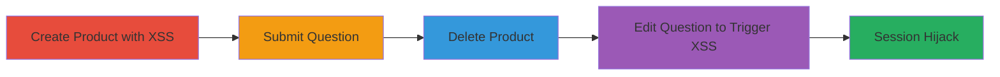

---
tags:
  - xss
  - stored-xss
  - shopify
  - judge-me
  - bypass
  - admin-takeover
  - session-hijacking
type: attack_chain
tools: []
tactics:
  - '[[Execution]]'
  - '[[Collection]]'
commands: []
platforms:
  - Web
  - Shopify
complexity: medium
procedures:
  - '[[procedures/Create-Malicious-Product-with-XSS-Payload]]'
  - '[[procedures/Submit-Question-on-Malicious-Product]]'
  - '[[procedures/Remove-Product-to-Trigger-Out-of-Stock]]'
  - '[[procedures/Trigger-XSS-by-Editing-Question-in-Admin]]'
step_count: 4
techniques:
  - '[[JavaScript]]'
description: >-
  A multi-step stored XSS attack exploiting insufficient sanitization in the
  Judge.me Shopify app's product name field, bypassing a prior fix, to execute
  JavaScript in the admin context and steal sessions.
skill_level: intermediate
impact_level: high
id: 7c1368e7-44ab-4d21-a3c0-b0822ab8d168
created_at: '2025-12-14T03:46:32.063Z'
updated_at: '2025-12-14T03:46:32.063Z'
verified: false
validated: true
submitted: true
mitre_tactics:
  - '[[Execution]]'
  - '[[Collection]]'
mitre_techniques:
  - '[[JavaScript]]'
---
# Stored XSS in Judge.me Product Name for Shopify Admin Session Hijacking (Bypass of Report #1416672)

Multi-stage attack chain demonstrating a complete attack workflow exploiting a stored XSS vulnerability in the Judge.me Shopify app.

## Chain Metrics Dashboard

| Metric | Value |
|--------|-------|
| Chain Status | Unverified |
| Total Steps | 4 |
| Execution Time | ~10 minutes |
| Skill Level | Intermediate |
| Complexity | Medium |
| Impact Level | High |

## Attack Flow Visualization

## Prerequisites & Requirements

### Required Tools

- Web browser with developer tools (e.g., Chrome DevTools for payload testing)

### Target Environment

- Shopify store with Judge.me Product Reviews app installed
- Attacker access to create products and submit questions (e.g., customer account)
- Admin access to the store for the final trigger (simulated or targeted)

### Initial Access Requirements

- Valid Shopify customer account for product creation and question submission
- No special privileges needed initially; escalates to admin context via XSS

## Detailed Attack Procedures

### Step 1: Create Malicious Product
procedure: [[procedures/Create-Malicious-Product-with-XSS-Payload]]

**Objective**: Inject a stored XSS payload into a product name to persist malicious JavaScript.

**Instructions**: Log in to the Shopify storefront as a customer, navigate to the product creation interface (if permitted) or use admin access to create a new product. Set the product name to the encoded XSS payload: `&#34;&#62;&#60;img src=x onerror=prompt(document.domain)&#62; &#60;img src=x onerror=prompt(document.domain)&#62;`. Save the product to store the payload.

**Expected Output**: Product created successfully with the malicious name visible in the storefront.

**Success Indicators**:
- Product appears in the store with the injected payload (verify by viewing source or testing alert in a non-admin context if possible)
- No immediate errors during creation

### Step 2: Submit Question on Product
procedure: [[procedures/Submit-Question-on-Malicious-Product]]

**Objective**: Associate the malicious product with a persistent question to carry the payload into the admin interface.

**Instructions**: On the product page in the storefront, use the Judge.me question submission form to post a question about the product. The product name payload is automatically associated and stored with the question.

**Expected Output**: Question submitted and visible in the Judge.me questions list.

**Success Indicators**:
- Question appears linked to the malicious product
- Payload remains intact in the backend association

### Step 3: Remove Product
procedure: [[procedures/Remove-Product-to-Trigger-Out-of-Stock]]

**Objective**: Make the product unavailable to force the admin edit interface to display the unsanitized name without product context protections.

**Instructions**: In the Shopify admin panel, navigate to Products and delete the malicious product or set its status to out of stock. This ensures the question persists but the product is marked unavailable.

**Expected Output**: Product removed from active store; question remains in Judge.me.

**Success Indicators**:
- Product no longer visible in storefront
- Question still listed in admin under Judge.me > Questions

### Step 4: Trigger XSS in Admin
procedure: [[procedures/Trigger-XSS-by-Editing-Question-in-Admin]]

**Objective**: Execute the stored XSS payload in the admin context to steal sessions or perform other malicious actions.

**Instructions**: Log in as a Shopify admin, go to Apps > Judge.me Product Reviews > Questions. Locate and edit the question associated with the deleted product. The unsanitized product name will render the payload, triggering JavaScript execution (e.g., `prompt(document.domain)` to demonstrate domain access).

**Expected Output**: JavaScript alert or payload execution in the admin browser, confirming XSS.

**Success Indicators**:
- Alert box or console error showing payload execution
- Potential for cookie theft via extended payload (e.g., exfiltrating admin session cookies)

## Attack Chain Summary

### Key Achievements

1. Bypassed previous XSS mitigation (report #1416672) by leveraging out-of-stock product state
2. Stored malicious payload in product name, persisting through question association
3. Achieved arbitrary JavaScript execution in high-privilege admin context
4. Enabled session hijacking for full account takeover

## Technique & Tactic Coverage

### MITRE ATT&CK Techniques

- [[JavaScript]]

### MITRE ATT&CK Tactics

- [[Execution]]
- [[Collection]]

---
*Last updated: 2023-10-01*
