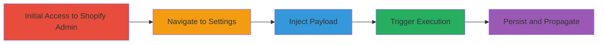

---
tags:
  - xss
  - stored-xss
  - shopify
  - judge-me
  - javascript
type: attack_chain
tools: []
tactics:
  - '[[Execution]]'
verified: false
platforms:
  - Web
submitted: true
complexity: medium
created_at: '2024-01-01T00:00:00Z'
procedures:
  - '[[procedures/Access-Judge-me-App-in-Shopify-Admin]]'
  - '[[procedures/Navigate-to-Widget-Form-Settings]]'
  - '[[procedures/Inject-XSS-Payload-into-Success-Message]]'
  - '[[procedures/Trigger-XSS-via-Form-Preview]]'
  - '[[procedures/Persist-XSS-by-Saving-Settings]]'
step_count: 5
techniques:
  - '[[JavaScript]]'
updated_at: '2025-12-14T03:47:12.951Z'
description: >-
  A multi-stage attack exploiting a stored XSS vulnerability in the Judge.me
  Shopify app's success message field, allowing arbitrary JavaScript execution
  in the browsers of users previewing the review form.
skill_level: intermediate
impact_level: high
id: 434a3cfe-56f0-4bc5-8002-781f205055f9
validated: true
mitre_tactics:
  - '[[Execution]]'
mitre_techniques:
  - '[[JavaScript]]'
---
# Stored XSS in Judge.me Widget Review Form Success Message

Multi-stage attack chain demonstrating a complete attack workflow exploiting a stored XSS vulnerability in the Judge.me Shopify app.

## Chain Metrics Dashboard

| Metric | Value |
|--------|-------|
| Chain Status | Unverified |
| Total Steps | 5 |
| Execution Time | ~5 minutes |
| Skill Level | Intermediate |
| Complexity | Medium |
| Impact Level | High |

## Attack Flow Visualization

## Prerequisites & Requirements

### Required Tools

- Web browser (e.g., Chrome with developer tools for payload testing)

### Target Environment

- Shopify admin account with access to installed apps
- Judge.me app installed and configured
- Web platform with JavaScript enabled

### Initial Access Requirements

- Valid Shopify admin credentials
- No special network access beyond standard internet connectivity
- Prior installation of Judge.me app in the Shopify store

## Detailed Attack Procedures

### Step 1: Access Judge.me App
procedure: [[procedures/Access-Judge-me-App-in-Shopify-Admin]]

**Objective**: Gain entry to the Judge.me app within the Shopify admin interface to begin configuration changes.

**Instructions**: Log in to the Shopify admin dashboard using valid credentials. Locate the Apps section in the left sidebar and select the Judge.me app to open its interface.

**Expected Output**: Judge.me app dashboard loads successfully.

**Success Indicators**:
- Shopify admin login successful
- Judge.me app interface accessible

### Step 2: Navigate to Widget Form Settings
procedure: [[procedures/Navigate-to-Widget-Form-Settings]]

**Objective**: Reach the specific settings page where the vulnerable success message field is located.

**Instructions**: Within the Judge.me app, click on 'Settings' in the main menu, then select 'Review Widget', and finally choose 'Widget Form' to access the form configuration options.

**Expected Output**: Widget Form settings page displays, including text fields for messages.

**Success Indicators**:
- Settings menu navigable
- Widget Form page loaded without errors

### Step 3: Inject XSS Payload
procedure: [[procedures/Inject-XSS-Payload-into-Success-Message]]

**Objective**: Insert a malicious JavaScript payload into the unsanitized success message field to store the XSS.

**Instructions**: In the success message text field, append or replace content with the payload: `'>`. Ensure the field accepts the input without immediate validation errors.

**Expected Output**: Payload entered into the field; no immediate script execution during input.

**Success Indicators**:
- Payload successfully typed or pasted
- Field content reflects the injected script

### Step 4: Trigger XSS Execution
procedure: [[procedures/Trigger-XSS-via-Form-Preview]]

**Objective**: Render the preview to execute the stored payload in the current browser session.

**Instructions**: Click the 'Preview' button on the Widget Form settings page to generate and display the review form preview, which renders the success message and triggers the onerror event.

**Expected Output**: Alert box pops up displaying the document domain (e.g., shopify.com or judge.me domain).

**Success Indicators**:
- JavaScript alert executes
- No browser errors; payload runs as intended

### Step 5: Persist the Vulnerability
procedure: [[procedures/Persist-XSS-by-Saving-Settings]]

**Objective**: Save the configuration to store the payload persistently, affecting future previews by any user.

**Instructions**: After previewing, click the 'Save' button to commit the changes to the app settings.

**Expected Output**: Settings saved confirmation; subsequent previews by any user (including admins) will execute the XSS.

**Success Indicators**:
- Save operation completes without errors
- Re-preview triggers the alert again

## Attack Chain Summary

### Key Achievements

1. Successful injection and execution of stored XSS in a Shopify app setting
2. Demonstration of arbitrary JavaScript execution in victim browsers
3. Persistence enabling impact on multiple users, including admins

## Technique & Tactic Coverage

### MITRE ATT&CK Techniques

- [[JavaScript]]

### MITRE ATT&CK Tactics

- [[Execution]]

---
*Last updated: 2024-01-01T00:00:00Z*
