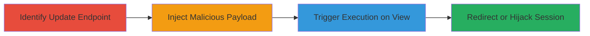

# Stored XSS in Khan Academy Document Projects Leading to User Redirection

Multi-stage attack chain demonstrating a complete stored XSS workflow in Khan Academy's document projects feature, where unsanitized user input allows JavaScript injection that executes on viewers' browsers.

## Chain Metrics Dashboard

| Metric | Value |
|--------|-------|
| Chain Status | Unverified |
| Total Steps | 3 |
| Execution Time | ~5 minutes |
| Skill Level | Intermediate |
| Complexity | Medium |
| Impact Level | High |

## Attack Flow Visualization

## Prerequisites & Requirements

### Required Tools

- Browser Developer Tools or [[tools/Burp-Suite]]
- Access to a Khan Academy account

### Target Environment

- Web platform
- Khan Academy website (https://www.khanacademy.org)
- No specific ports or services beyond standard HTTPS

### Initial Access Requirements

- Valid Khan Academy user account
- Network access to Khan Academy
- No prior privileged access needed

## Detailed Attack Procedures

### Step 1: Identify Update Endpoint
procedure: [[procedures/Identify-Khan-Academy-Project-Update-Endpoint]]

**Objective**: Locate the API endpoint responsible for updating document projects to understand where to inject payloads.

**Instructions**: Use browser developer tools to inspect network requests while creating or editing a document project. Look for PUT requests to project update endpoints.

**Expected Output**: Identification of the endpoint https://www.khanacademy.org/api/internal/scratchpads/ID.

**Success Indicators**:
- PUT request found handling project updates
- Request body confirmed to accept HTML content

### Step 2: Inject Malicious JavaScript
procedure: [[procedures/Inject-Malicious-JavaScript-into-Project-Update]]

**Objective**: Modify the project update request to include unsanitized JavaScript within HTML, storing the payload for later execution.

**Instructions**: Intercept the PUT request using developer tools or a proxy. Edit the request body to inject JavaScript in an  onload attribute, e.g., `` or a redirect script.

**Expected Output**: Successful 200 response from the API, with the project updated.

**Success Indicators**:
- Project saves without errors
- Payload embedded in project content

### Step 3: Trigger XSS by Viewing Tainted Project
procedure: [[procedures/Trigger-XSS-by-Viewing-Tainted-Project]]

**Objective**: Access the modified project to execute the injected script in the viewer's browser context.

**Instructions**: Navigate to the project URL, such as https://www.khanacademy.org/physics/woah/4740384569491456, in a browser. The script should execute automatically upon rendering.

**Expected Output**: Browser redirection to external site or alert popup confirming execution.

**Success Indicators**:
- Script runs (e.g., redirect occurs)
- No sanitization blocks the payload

## Attack Chain Summary

### Key Achievements

1. Discovered unsanitized HTML input in project updates
2. Injected and stored JavaScript payload via API
3. Demonstrated execution leading to potential phishing or data theft

## Technique & Tactic Coverage

### MITRE ATT&CK Techniques

- [[JavaScript]]

### MITRE ATT&CK Tactics

- [[Execution]]
- [[Collection]]

---
*Last updated: 2023-10-01T12:00:00Z*
