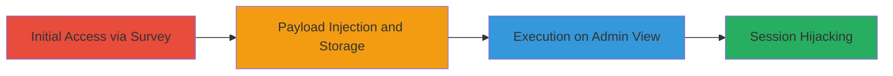

---
tags:
  - xss
  - stored-xss
  - web
  - javascript
  - session-hijacking
type: attack_chain
tools: []
tactics:
  - '[[Initial Access]]'
  - '[[Execution]]'
commands: []
platforms:
  - Web
complexity: medium
procedures:
  - '[[procedures/Inject-Malicious-Payload-in-Dissatisfaction-Reason-Field]]'
step_count: 1
techniques:
  - '[[Exploit Public-Facing Application]]'
  - '[[JavaScript]]'
description: >-
  A multi-stage attack exploiting a stored XSS vulnerability in the Lark
  Technologies satisfaction survey feature to inject and execute malicious
  JavaScript on admin viewers.
skill_level: intermediate
impact_level: high
id: 1802145a-f84b-4b59-ac0c-770c2fbcc203
created_at: '2025-12-13T23:52:24.776Z'
updated_at: '2025-12-13T23:52:24.776Z'
verified: false
validated: true
submitted: true
mitre_tactics:
  - '[[Initial Access]]'
  - '[[Execution]]'
mitre_techniques:
  - '[[Exploit Public-Facing Application]]'
  - '[[JavaScript]]'
---
# Stored XSS in Lark Satisfaction Surveys via Dissatisfaction Reason Field

## Overview

This attack chain demonstrates a stored cross-site scripting (XSS) vulnerability in the Lark Technologies satisfaction survey feature. After completing a help desk chat and selecting a poor rating, the 'Ask Reason for Dissatisfaction' field accepts unsanitized input, allowing attackers to inject malicious JavaScript. The payload is stored in the backend and executed in the context of other users, such as administrators or support staff, when they view the survey responses. Potential impacts include theft of session cookies, account hijacking, or phishing attacks on viewers.

## Chain Metrics Dashboard

| Metric | Value |
|--------|-------|
| Chain Status | Unverified |
| Total Steps | 1 |
| Execution Time | ~5 minutes |
| Skill Level | Intermediate |
| Complexity | Medium |
| Impact Level | High |

## Attack Flow Visualization

## Prerequisites & Requirements

### Required Tools

- Web browser (e.g., Chrome with Developer Tools)
- Optional: Proxy tool like Burp Suite for form interception

### Target Environment

- Lark Technologies web application
- Access to help desk chat feature
- No special privileges required for initial submission

### Initial Access Requirements

- Valid user account or guest access to initiate a help desk chat
- Ability to complete a chat session and reach the satisfaction survey
- Network access to the Lark web platform

## Detailed Attack Procedures

### Step 1: Payload Injection
procedure: [[procedures/Inject-Malicious-Payload-in-Dissatisfaction-Reason-Field]]

**Objective**: Submit a malicious JavaScript payload in the dissatisfaction reason field to store and trigger XSS on subsequent viewers.

**Instructions**: Initiate a help desk chat session, complete it, select a poor rating (e.g., 1-2 stars), and enter the payload in the reason field. Use a simple test payload like `` for verification, or a more advanced one like `` for exploitation.

**Expected Output**: The survey submission succeeds without errors, and the payload is stored. When an admin views the response, the JavaScript executes (e.g., alert pops up or data is exfiltrated).

**Success Indicators**:
- No validation errors on submission
- Payload execution confirmed by viewing the stored response in another session or notifying an admin
- Network traffic to attacker's domain if using exfiltration payload

## Attack Chain Summary

### Key Achievements

1. Successful injection of stored XSS payload without authentication bypass
2. Execution of arbitrary JavaScript in victim browsers, enabling session theft
3. Demonstration of high-impact client-side attacks on support staff

## Technique & Tactic Coverage

### MITRE ATT&CK Techniques

- [[Exploit Public-Facing Application]]
- [[JavaScript]]

### MITRE ATT&CK Tactics

- [[Initial Access]]
- [[Execution]]

---
*Last updated: 2023-10-01*
