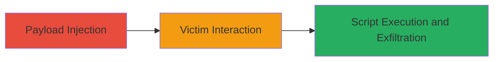

---
tags:
  - xss
  - stored-xss
  - web
  - session-hijacking
type: attack_chain
tools: []
tactics:
  - '[[Execution]]'
  - '[[Collection]]'
verified: false
platforms:
  - Web
submitted: true
complexity: medium
created_at: '2023-10-01T00:00:00Z'
procedures:
  - '[[procedures/Inject-Stored-XSS-Payload-in-City-Field]]'
  - '[[procedures/Trigger-XSS-for-Session-Theft]]'
step_count: 2
techniques:
  - '[[JavaScript]]'
updated_at: '2025-12-14T03:47:18.499Z'
description: >-
  A stored XSS vulnerability in the Lark Suite internal helpdesk allows
  injection of malicious scripts via the user's city field, enabling session
  hijacking and unauthorized access.
skill_level: intermediate
impact_level: high
id: ff070f74-a360-4232-9b67-2dafe9115dd5
validated: true
mitre_tactics:
  - '[[Execution]]'
  - '[[Collection]]'
mitre_techniques:
  - '[[JavaScript]]'
---
# Stored XSS in Lark Suite Helpdesk via User's City Field

Multi-stage attack chain demonstrating exploitation of a stored XSS vulnerability in the internal Lark Suite helpdesk system to inject scripts via the user's city field and steal session cookies.

## Chain Metrics Dashboard

| Metric | Value |
|--------|-------|
| Chain Status | Unverified |
| Total Steps | 2 |
| Execution Time | ~5 minutes |
| Skill Level | Intermediate |
| Complexity | Medium |
| Impact Level | High |

## Attack Flow Visualization

## Prerequisites & Requirements

### Required Tools

- Browser developer tools for payload crafting

### Target Environment

- Web platform
- Lark Suite helpdesk service
- Access to user profile update functionality

### Initial Access Requirements

- Authenticated access to the Lark Suite helpdesk as a user
- No special privileges required

## Detailed Attack Procedures

### Step 1: Payload Injection
procedure: [[procedures/Inject-Stored-XSS-Payload-in-City-Field]]

**Objective**: Inject a malicious JavaScript payload into the user's city field to store it persistently in the helpdesk system.

**Instructions**: Access the user profile or helpdesk form in Lark Suite and submit a payload like `` or a more advanced one for cookie theft in the city field. Use browser tools to encode if necessary.

**Expected Output**: The payload is saved without sanitization and stored in the database.

**Success Indicators**:
- Payload appears in the city field upon retrieval
- No immediate error or sanitization observed

### Step 2: Trigger XSS for Session Theft
procedure: [[procedures/Trigger-XSS-for-Session-Theft]]

**Objective**: Have a victim (e.g., helpdesk user) view the affected profile, triggering the script to execute and exfiltrate session data.

**Instructions**: Share or wait for the helpdesk user to access the profile containing the injected city field. The script executes in the victim's browser context, potentially sending cookies to an attacker-controlled server.

**Expected Output**: Script runs, alert pops or data is exfiltrated (e.g., via fetch to attacker's endpoint).

**Success Indicators**:
- Victim's browser executes the payload
- Attacker receives stolen session cookies

## Attack Chain Summary

### Key Achievements

1. Persistent script injection via unsanitized city field
2. Execution in helpdesk users' browsers for unauthorized access
3. Potential full compromise of internal helpdesk sessions

## Technique & Tactic Coverage

### MITRE ATT&CK Techniques

- [[JavaScript]]

### MITRE ATT&CK Tactics

- [[Execution]]
- [[Collection]]

---
*Last updated: 2023-10-01T00:00:00Z*
