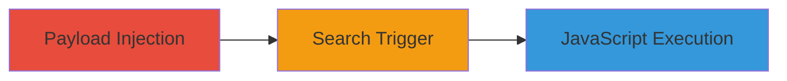

# Stored XSS in LearnBoost Network Panel via ZIP Code Injection

Multi-stage attack chain demonstrating a complete stored XSS workflow in the LearnBoost application.

## Chain Metrics Dashboard

| Metric | Value |
|--------|-------|
| Chain Status | Unverified |
| Total Steps | 2 |
| Execution Time | ~5 minutes |
| Skill Level | Intermediate |
| Complexity | Medium |
| Impact Level | High |

## Attack Flow Visualization

## Prerequisites & Requirements

### Required Tools

- [[tools/Mozilla-Firefox]]

### Target Environment

- Web application: https://www.learnboost.com
- Access to network panel for school entry
- No special privileges required; open to registered users

### Initial Access Requirements

- Valid user account on LearnBoost
- Network access to the web application
- No prior access needed beyond registration

## Detailed Attack Procedures

### Step 1: Payload Injection
procedure: [[procedures/Inject-Malicious-Payload-into-ZIP-Code-Field]]

**Objective**: Inject a malicious JavaScript payload into the ZIP code field associated with a school name to store it unsanitized in the database.

**Instructions**: Navigate to the Network panel in LearnBoost settings. Enter a school name starting with a common search prefix like 'fro' and input the payload `1">` as the ZIP code. Submit to store the data without validation.

**Expected Output**: The payload is saved alongside the school name in the backend.

**Success Indicators**:
- Payload accepted without error
- School entry appears in the network list

### Step 2: Trigger Execution
procedure: [[procedures/Trigger-Stored-XSS-via-Search]]

**Objective**: Execute the stored payload by searching for the associated school name, leading to arbitrary JavaScript execution in the victim's browser.

**Instructions**: Visit https://www.learnboost.com/settings/network/search and enter 'fro' in the search field. The results will display the injected ZIP code, triggering the onerror event and executing the alert.

**Expected Output**: JavaScript alert pops up showing the document domain, confirming execution.

**Success Indicators**:
- Alert dialog appears on search
- Potential for further payload to steal sessions or data

## Attack Chain Summary

### Key Achievements

1. Successful storage of unsanitized JavaScript in ZIP code fields
2. Triggering of XSS via common search terms, affecting multiple users
3. Demonstration of high-impact risks like session hijacking

## Technique & Tactic Coverage

### MITRE ATT&CK Techniques

- [[JavaScript]]

### MITRE ATT&CK Tactics

- [[Execution]]

---
*Last updated: 2023-10-01T00:00:00Z*
