---
tags:
  - xss
  - stored-xss
  - javascript
  - session-hijacking
type: attack_chain
tools: []
tactics:
  - '[[Execution]]'
  - '[[Collection]]'
verified: false
platforms:
  - Web
submitted: true
complexity: medium
procedures:
  - '[[procedures/Exploit-Stored-XSS-in-Lemlist-Campaigns]]'
step_count: 8
techniques:
  - '[[JavaScript]]'
  - '[[Exploit Public-Facing Application]]'
description: >-
  A multi-step attack exploiting stored XSS vulnerabilities in lemlist campaign
  fields to execute arbitrary JavaScript and steal user sessions.
skill_level: intermediate
impact_level: high
id: 22907753-80aa-4aff-97dd-074913349ca5
created_at: '2025-12-13T23:52:21.034Z'
updated_at: '2025-12-13T23:52:21.034Z'
validated: true
mitre_tactics:
  - '[[Execution]]'
  - '[[Collection]]'
mitre_techniques:
  - '[[JavaScript]]'
  - '[[Exploit Public-Facing Application]]'
---
# Stored XSS in Lemlist Campaigns Leading to Session Hijacking

Multi-stage attack chain demonstrating a complete attack workflow exploiting stored Cross-Site Scripting (XSS) in the lemlist web application.

## Chain Metrics Dashboard

| Metric | Value |
|--------|-------|
| Chain Status | Unverified |
| Total Steps | 8 |
| Execution Time | ~5 minutes |
| Skill Level | Intermediate |
| Complexity | Medium |
| Impact Level | High |

## Attack Flow Visualization

```mermaid
graph LR
    A[Access Application] --> B[Create or Edit Campaign]
    B --> C[Navigate to Buddies-to-Be Tab]
    C --> D[Add Buddy Entry]
    D --> E[Inject XSS Payload]
    E --> F[Save Campaign]
    F --> G[View Campaign to Trigger]
    G --> H[Execute JavaScript for Theft]

    style A fill:#e74c3c
    style B fill:#f39c12
    style C fill:#f39c12
    style D fill:#f39c12
    style E fill:#3498db
    style F fill:#3498db
    style G fill:#27ae60
    style H fill:#27ae60
```

## Prerequisites & Requirements

### Required Tools

- Web browser (e.g., Chrome Developer Tools for payload testing)

### Target Environment

- Web platform
- lemlist application (app.lemlist.com)
- Authenticated user account

### Initial Access Requirements

- Valid credentials for lemlist account
- Direct access to the web interface
- No prior network compromise needed

## Detailed Attack Procedures

### Step 1: Access the Application
procedure: [[procedures/Exploit-Stored-XSS-in-Lemlist-Campaigns]]

**Objective**: Gain entry to the lemlist web application.

**Instructions**: Open a web browser and navigate to the login page of app.lemlist.com. Enter valid credentials to authenticate.

**Expected Output**: Successful login to the dashboard.

**Success Indicators**:
- User is redirected to the main interface
- Campaign section is accessible

### Step 2: Create or Edit Campaigns
procedure: [[procedures/Exploit-Stored-XSS-in-Lemlist-Campaigns]]

**Objective**: Prepare the campaign interface for payload injection.

**Instructions**: From the dashboard, navigate to the campaigns section. Either create a new campaign or select an existing one to edit.

**Expected Output**: Campaign creation or edit form loads.

**Success Indicators**:
- Form fields for campaign details are visible
- No errors in loading the page

### Step 3: Visit the Buddies-to-Be Tab
procedure: [[procedures/Exploit-Stored-XSS-in-Lemlist-Campaigns]]

**Objective**: Access the vulnerable tab where input fields can be manipulated.

**Instructions**: Within the campaign editor, switch to the 'Buddies-to-Be' tab.

**Expected Output**: Tab content loads, showing options to add buddies.

**Success Indicators**:
- 'Add one' button is present
- Input fields for buddy details appear

### Step 4: Click 'Add one' Button
procedure: [[procedures/Exploit-Stored-XSS-in-Lemlist-Campaigns]]

**Objective**: Initiate a new buddy entry to expose vulnerable fields.

**Instructions**: Click the 'Add one' button at the top right of the tab.

**Expected Output**: New input fields for buddy information open.

**Success Indicators**:
- Fields like 'Icebreaker' and 'companyName' are editable
- Form is ready for input

### Step 5: Fill in the Input Fields
procedure: [[procedures/Exploit-Stored-XSS-in-Lemlist-Campaigns]]

**Objective**: Provide basic data to make the entry valid before injection.

**Instructions**: Enter legitimate data into required fields, such as name or email, to avoid validation errors.

**Expected Output**: Fields accept input without issues.

**Success Indicators**:
- No immediate errors on form submission preview
- Payload can be appended

### Step 6: Inject Payload into Icebreaker and companyName Fields
procedure: [[procedures/Exploit-Stored-XSS-in-Lemlist-Campaigns]]

**Objective**: Insert the malicious XSS payload to store executable script.

**Instructions**: Append the payload `'><svg src=x onload=confirm(document.domain);>` to the end of the 'Icebreaker' and 'companyName' fields. This payload closes any open tags and injects an SVG element that executes JavaScript on load.

**Expected Output**: Payload is entered without sanitization errors.

**Success Indicators**:
- Text field shows the appended script
- Form remains submittable

### Step 7: Click Create to Save
procedure: [[procedures/Exploit-Stored-XSS-in-Lemlist-Campaigns]]

**Objective**: Persist the payload in the application's storage.

**Instructions**: Submit the form by clicking the 'create' button.

**Expected Output**: Campaign saves successfully, with payload stored.

**Success Indicators**:
- Confirmation message for saved campaign
- No rejection of input

### Step 8: View the Campaign to Trigger XSS
procedure: [[procedures/Exploit-Stored-XSS-in-Lemlist-Campaigns]]

**Objective**: Render the stored payload to execute JavaScript in the viewer's context.

**Instructions**: Navigate back to the campaign list or refresh the view where the buddies are displayed. The payload executes, showing a confirm dialog with the domain.

**Expected Output**: JavaScript alert or confirm box appears, confirming execution.

**Success Indicators**:
- Confirm dialog displays the domain (e.g., app.lemlist.com)
- Potential for cookie theft if payload modified (e.g., to send document.cookie to attacker server)

## Attack Chain Summary

### Key Achievements

1. Successful storage of XSS payload in multiple fields without sanitization
2. Arbitrary JavaScript execution upon campaign viewing by any authenticated user
3. Potential for session hijacking and account compromise via stolen cookies

## Technique & Tactic Coverage

### MITRE ATT&CK Techniques

- [[JavaScript]]
- [[Exploit Public-Facing Application]]

### MITRE ATT&CK Tactics

- [[Execution]]
- [[Collection]]

---
*Last updated: 2023-10-01*
