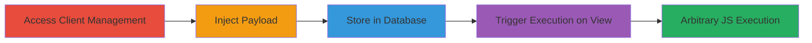

---
tags:
  - xss
  - stored-xss
  - wordpress
  - mainwp
  - client-management
type: attack_chain
tools: []
tactics:
  - '[[Execution]]'
verified: false
platforms:
  - Web
  - WordPress
submitted: true
complexity: medium
created_at: '2023-10-01T00:00:00Z'
procedures:
  - '[[procedures/Exploit-Stored-XSS-in-MainWP-Contact-Name]]'
step_count: 4
techniques:
  - '[[JavaScript]]'
updated_at: '2025-12-13T23:52:49.209Z'
description: >-
  A stored XSS vulnerability in the MainWP WordPress plugin's Client Management
  feature allows injection of malicious JavaScript into the Contact Name field,
  leading to arbitrary code execution for admins viewing the client profile.
skill_level: intermediate
impact_level: high
id: 2fa70672-bd76-4c9e-b7b6-bbbed9511378
validated: true
mitre_tactics:
  - '[[Execution]]'
mitre_techniques:
  - '[[JavaScript]]'
---
# Stored XSS in MainWP Client Management Contact Name Field

Multi-stage attack chain demonstrating exploitation of a stored XSS vulnerability in the MainWP WordPress plugin, allowing arbitrary JavaScript execution to steal sessions or perform unauthorized actions on the dashboard and connected sites.

## Chain Metrics Dashboard

| Metric | Value |
|--------|-------|
| Chain Status | Unverified |
| Total Steps | 4 |
| Execution Time | ~5 minutes |
| Skill Level | Intermediate |
| Complexity | Medium |
| Impact Level | High |

## Attack Flow Visualization

## Prerequisites & Requirements

### Required Tools

- Web browser (e.g., Chrome with developer tools)

### Target Environment

- MainWP WordPress plugin installed and active
- Admin access to the MainWP Dashboard
- Client Management feature enabled

### Initial Access Requirements

- Valid admin credentials for the MainWP installation
- Direct access to the web interface (no network restrictions)
- No prior access needed beyond login

## Detailed Attack Procedures

### Step 1: Access and Test Client Management Feature
procedure: [[procedures/Exploit-Stored-XSS-in-MainWP-Contact-Name]]

**Objective**: Identify the vulnerable 'Add Contact' functionality in the Client Management section.

**Instructions**: Log in to the MainWP Dashboard as an admin. Navigate to the Client Management area and select a client to edit, or create a new client. Examine the 'Add Contact' form, focusing on the Contact Name field for input validation issues.

**Expected Output**: Form fields load without errors, allowing input into the Contact Name field.

**Success Indicators**:
- Access to Client Management granted
- 'Add Contact' form visible

### Step 2: Inject Malicious Payload
procedure: [[procedures/Exploit-Stored-XSS-in-MainWP-Contact-Name]]

**Objective**: Insert a JavaScript payload into the unsanitized Contact Name field to store malicious code.

**Instructions**: In the Contact Name field, enter the payload: `</TITLE>`. This closes any open HTML tags and injects a script tag that will execute on render.

**Expected Output**: Payload accepted without sanitization errors.

**Success Indicators**:
- Payload entered successfully
- No immediate validation blocks the input

### Step 3: Save Changes to Store Payload
procedure: [[procedures/Exploit-Stored-XSS-in-MainWP-Contact-Name]]

**Objective**: Persist the injected payload in the database by submitting the form.

**Instructions**: Complete any required fields in the contact form and submit/save the changes for the client.

**Expected Output**: Form submits successfully, and a confirmation message appears without errors.

**Success Indicators**:
- Client details saved
- No sanitization or validation errors on submit

### Step 4: Reload Client Detail Page to Trigger Execution
procedure: [[procedures/Exploit-Stored-XSS-in-MainWP-Contact-Name]]

**Objective**: Render the stored payload back into the DOM, causing JavaScript execution for any viewing admin.

**Instructions**: Reload or navigate back to the client's detail page. The Contact Name will be displayed, executing the payload.

**Expected Output**: JavaScript alert pops up with "XSS By Rishail 2025", confirming execution.

**Success Indicators**:
- Alert dialog appears
- Browser console shows script execution (inspect element to verify DOM injection)

## Attack Chain Summary

### Key Achievements

1. Successful injection and storage of malicious JavaScript in the Contact Name field
2. Arbitrary code execution on admin browsers viewing the client profile
3. Potential for session theft, unauthorized client/plugin additions, and compromise of connected WordPress sites

## Technique & Tactic Coverage

### MITRE ATT&CK Techniques

- [[JavaScript]]

### MITRE ATT&CK Tactics

- [[Execution]]

---
*Last updated: 2023-10-01T00:00:00Z*
