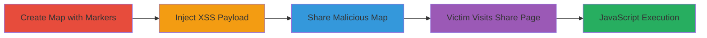

---
tags:
  - xss
  - stored-xss
  - mapbox
  - javascript-execution
type: attack_chain
tools:
  - '[[tools/Meyerweb-Dencoder-URL-Encoder]]'
tactics:
  - '[[Execution]]'
verified: false
platforms:
  - Web
submitted: true
complexity: medium
created_at: '2023-10-01T00:00:00Z'
procedures:
  - '[[procedures/Create-Mapbox-Classic-Map-with-Markers]]'
  - '[[procedures/Inject-XSS-Payload-into-Mapbox-Marker-Titles]]'
  - '[[procedures/Share-Malicious-Mapbox-Map-and-Access-Share-Page]]'
  - '[[procedures/Trigger-XSS-Execution-via-Victim-Interaction]]'
step_count: 4
techniques:
  - '[[JavaScript]]'
updated_at: '2025-12-14T03:15:47.387Z'
description: >-
  A multi-step attack exploiting a stored XSS vulnerability in Mapbox's v3 and
  v4 classic maps share page, allowing injection of JavaScript payloads into map
  marker titles that execute in victims' browsers upon visiting the share URL.
skill_level: intermediate
impact_level: high
id: 4367fccf-84bb-44d5-a1d3-b3f515708ca0
validated: true
mitre_tactics:
  - '[[Execution]]'
mitre_techniques:
  - '[[JavaScript]]'
---
# Stored XSS in Mapbox Classic Maps Share Page for Arbitrary JavaScript Execution

Multi-stage attack chain demonstrating exploitation of a stored cross-site scripting (XSS) vulnerability in the share page of Mapbox's v3 and v4 classic maps hosted on *.tiles.mapbox.com. Discovered by researcher Hussain Adnan in June 2015, the flaw allows injection of XSS payloads into map marker titles via the online classic map editor. The vulnerable stripHTML function in share.js decodes HTML entities, enabling arbitrary JavaScript execution when victims visit the malicious map's share URL or an embedded iframe. This does not affect mapbox.js, Mapbox GL JS, or mobile SDKs, but can lead to session hijacking, data theft, or further attacks in the victim's browser context.

## Chain Metrics Dashboard

| Metric | Value |
|--------|-------|
| Chain Status | Unverified |
| Total Steps | 4 |
| Execution Time | ~5 minutes |
| Skill Level | Intermediate |
| Complexity | Medium |
| Impact Level | High |

## Attack Flow Visualization

## Prerequisites & Requirements

### Required Tools

- [[tools/Meyerweb-Dencoder-URL-Encoder]]

### Target Environment

- Web platform with access to Mapbox online classic map editor
- No specific ports required; operates over HTTPS
- Attacker needs a Mapbox account for map creation

### Initial Access Requirements

- Valid Mapbox account credentials
- Internet access to *.tiles.mapbox.com
- No prior network position needed; public-facing service

## Detailed Attack Procedures

### Step 1: Create Map and Add Markers
procedure: [[procedures/Create-Mapbox-Classic-Map-with-Markers]]

**Objective**: Build a basic map in the Mapbox online editor and add markers to prepare for payload injection.

**Instructions**: Access the Mapbox online classic map editor and create a new map, then add initial markers without payloads.

**Expected Output**: A saved map with editable markers.

**Success Indicators**:
- Map created successfully in the editor
- Markers added and visible in the map preview

### Step 2: Inject XSS Payload into Map Marker Titles
procedure: [[procedures/Inject-XSS-Payload-into-Mapbox-Marker-Titles]]

**Objective**: Insert a malicious XSS payload into marker titles that evades sanitization and decodes to executable JavaScript.

**Instructions**: Use the URL encoder to prepare the payload '<img src=x onerror=alert(1) "', then add it to a marker title in the editor.

**Expected Output**: Payload saved in the marker title without immediate execution in the editor.

**Success Indicators**:
- Payload accepted in the title field
- No errors during map save

### Step 3: Share the Map and Access the Share Page
procedure: [[procedures/Share-Malicious-Mapbox-Map-and-Access-Share-Page]]

**Objective**: Generate a share URL for the malicious map and verify payload presence on the share page.

**Instructions**: Save and share the map to obtain a URL like https://a.tiles.mapbox.com/v4/[map-id]/page.html?access_token=..., then load the share page to check for payload rendering.

**Expected Output**: Share URL generated; payload visible in DOM on share page.

**Success Indicators**:
- Share URL accessible
- Marker titles list renders on /v3/embed/share.js or /v4/embed/share.js

### Step 4: Trigger XSS Execution via Victim Interaction
procedure: [[procedures/Trigger-XSS-Execution-via-Victim-Interaction]]

**Objective**: Lure a victim to visit the share URL or embed it in an iframe, causing JavaScript execution in their browser.

**Instructions**: Distribute the share URL via phishing or embedding; upon load, the payload executes alert(1) or arbitrary code.

**Expected Output**: JavaScript alert or custom code runs in victim's browser.

**Success Indicators**:
- Victim loads the page
- Payload executes, e.g., alert dialog appears

## Attack Chain Summary

### Key Achievements

1. Successful injection of stored XSS payload into Mapbox map markers
2. Evasion of sanitization via HTML entity decoding in stripHTML function
3. Arbitrary JavaScript execution in victim browsers via share pages
4. Potential for session hijacking or data exfiltration

## Technique & Tactic Coverage

### MITRE ATT&CK Techniques

- [[JavaScript]]

### MITRE ATT&CK Tactics

- [[Execution]]

---

*Last updated: 2023-10-01T00:00:00Z*
