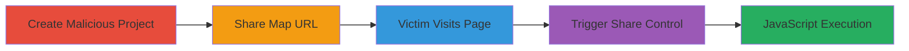

---
tags:
  - xss
  - stored-xss
  - mapbox
  - javascript
  - web-vulnerability
type: attack_chain
tools: []
tactics:
  - '[[Initial Access]]'
  - '[[Execution]]'
verified: false
platforms:
  - Web
submitted: true
complexity: medium
created_at: '2023-10-01T00:00:00Z'
procedures:
  - '[[procedures/Create-Malicious-Map-Project-in-Classic-Editor]]'
  - '[[procedures/Share-Malicious-Map-to-Obtain-URL]]'
  - '[[procedures/Lure-Victim-to-Share-Page]]'
  - '[[procedures/Trigger-XSS-via-Share-Control-Click]]'
step_count: 4
techniques:
  - '[[JavaScript]]'
  - '[[Exploit Public-Facing Application]]'
updated_at: '2025-12-14T03:16:08.177Z'
description: >-
  A multi-stage attack exploiting a stored XSS vulnerability in Mapbox's
  L.mapbox.shareControl by injecting malicious JavaScript into a map title,
  leading to arbitrary code execution in a victim's browser upon interaction
  with the share page.
skill_level: intermediate
impact_level: high
id: 6405d43a-c828-4d39-a8e4-f9731b0fc01d
validated: true
mitre_tactics:
  - '[[Initial Access]]'
  - '[[Execution]]'
mitre_techniques:
  - '[[JavaScript]]'
  - '[[Exploit Public-Facing Application]]'
---
# Stored XSS in Mapbox Share Control via Malicious Map Title

Multi-stage attack chain demonstrating a complete stored XSS exploitation workflow in Mapbox's classic map editor and share functionality.

## Chain Metrics Dashboard

| Metric | Value |
|--------|-------|
| Chain Status | Unverified |
| Total Steps | 4 |
| Execution Time | ~5 minutes |
| Skill Level | Intermediate |
| Complexity | Medium |
| Impact Level | High |

## Attack Flow Visualization

## Prerequisites & Requirements

### Required Tools

- Web browser (e.g., Chrome or Firefox with developer tools)

### Target Environment

- Access to Mapbox classic map editor
- Target service: api.mapbox.com share pages
- No specific ports required; web-based access

### Initial Access Requirements

- Valid Mapbox account for creating projects
- Ability to share maps publicly
- Social engineering to direct victim to URL

## Detailed Attack Procedures

### Step 1: Create Malicious Project
procedure: [[procedures/Create-Malicious-Map-Project-in-Classic-Editor]]

**Objective**: Inject a malicious JavaScript payload into the map title to store the XSS payload.

**Instructions**: Log into the Mapbox classic map editor, create a new project, and set the title to a payload like `` or a more complex one such as `'><iframe onload=alert(97)>`. Save the project to persist the unsanitized title.

**Expected Output**: Project created with the malicious title stored on Mapbox servers.

**Success Indicators**:
- Project saves without error
- Title appears as entered in the editor preview

### Step 2: Share Map and Obtain URL
procedure: [[procedures/Share-Malicious-Map-to-Obtain-URL]]

**Objective**: Generate a public share URL for the malicious map, hosting it on api.mapbox.com.

**Instructions**: In the map editor, navigate to the share option and click to generate the share URL. Copy the URL, which will point to the share page on api.mapbox.com containing the malicious title.

**Expected Output**: A shareable URL like `https://api.mapbox.com/...`.

**Success Indicators**:
- URL generated successfully
- URL loads the map with the injected title visible

### Step 3: Lure Victim to Share Page
procedure: [[procedures/Lure-Victim-to-Share-Page]]

**Objective**: Direct the victim to visit the share page, exposing them to the stored payload.

**Instructions**: Use social engineering (e.g., email or messaging) to trick the victim into visiting the share URL. The malicious title is displayed on the page load, but execution requires further interaction.

**Expected Output**: Victim's browser loads the api.mapbox.com share page with the map and title rendered.

**Success Indicators**:
- Victim confirms visiting the URL
- Page loads without errors in victim's browser

### Step 4: Trigger XSS Execution
procedure: [[procedures/Trigger-XSS-via-Share-Control-Click]]

**Objective**: Cause the victim to interact with the share control, executing the stored JavaScript payload.

**Instructions**: Instruct or trick the victim to click the share control button (arrow under the zoom control), which opens a modal dialog. The unsanitized title is inserted into the modal, triggering the XSS payload like `alert(1)` or `confirm(2)`.

**Expected Output**: Arbitrary JavaScript executes in the victim's browser, such as a popup alert or confirmation dialog.

**Success Indicators**:
- Payload executes (e.g., alert box appears)
- Browser console shows JavaScript errors or execution logs

## Attack Chain Summary

### Key Achievements

1. Successful storage of XSS payload in map title without sanitization
2. Generation of a shareable URL that propagates the payload
3. Victim interaction leading to JavaScript execution
4. Potential for session theft or further attacks via executed code

## Technique & Tactic Coverage

### MITRE ATT&CK Techniques

- [[JavaScript]]
- [[Exploit Public-Facing Application]]

### MITRE ATT&CK Tactics

- [[Initial Access]]
- [[Execution]]

---

*Last updated: 2023-10-01T00:00:00Z*
