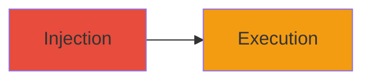

# Stored XSS in Mixmax Contact Names for Script Execution

Multi-stage attack chain demonstrating a complete attack workflow for exploiting a stored XSS vulnerability in contact names on compose.mixmax.com.

## Chain Metrics Dashboard

| Metric | Value |
|--------|-------|
| Chain Status | Unverified |
| Total Steps | 1 |
| Execution Time | ~5 minutes |
| Skill Level | Intermediate |
| Complexity | Low |
| Impact Level | High |

## Attack Flow Visualization

## Prerequisites & Requirements

### Required Tools

- Web browser (e.g., Chrome with developer tools)

### Target Environment

- Web platform: compose.mixmax.com
- Required services/ports: HTTPS (443)
- Network access requirements: Internet access to Mixmax service

### Initial Access Requirements

- Credential requirements: Valid Mixmax user account with ability to add contacts
- Network position: External attacker with account
- Prior access needed: None, but authenticated session required

## Detailed Attack Procedures

### Step 1: Inject and Trigger Stored XSS
procedure: [[procedures/Inject-Malicious-Script-into-Mixmax-Contact-Name]]

**Objective**: Inject a malicious script into a contact name, store it, and execute it in the victim's browser when the contact is viewed.

**Instructions**: Authenticate to compose.mixmax.com, navigate to add a new contact, and input a payload like `` in the name field. Save the contact. Then, have a victim (or self) view the contacts list to trigger execution.

**Expected Output**: Alert box or script execution in the browser console when the contact is rendered.

**Success Indicators**:
- Contact saves without error
- Script executes on view (e.g., alert pops or network request made)

## Attack Chain Summary

### Key Achievements

1. Successful injection of XSS payload into stored contact data
2. Execution of arbitrary JavaScript in viewing users' browsers
3. Potential for data theft or session hijacking

## Technique & Tactic Coverage

### MITRE ATT&CK Techniques

- [[JavaScript]]

### MITRE ATT&CK Tactics

- [[Execution]]

---
*Last updated: 2023-10-01T00:00:00Z*
