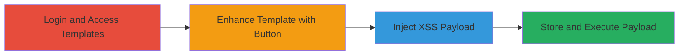

---
tags:
  - xss
  - stored-xss
  - mixmax
  - web
type: attack_chain
tools: []
tactics:
  - '[[Execution]]'
  - '[[Collection]]'
verified: false
platforms:
  - Web
submitted: true
complexity: medium
created_at: '2023-10-01T00:00:00Z'
procedures:
  - '[[procedures/Exploit-Stored-XSS-in-Mixmax-Call-for-Action]]'
step_count: 4
techniques:
  - '[[JavaScript]]'
updated_at: '2025-12-14T03:15:47.054Z'
description: >-
  A multi-step attack exploiting a stored XSS vulnerability in Mixmax's template
  editor to inject and execute malicious JavaScript when templates are used by
  admins or team managers.
skill_level: intermediate
impact_level: high
id: 27fefefe-74e3-4a10-824c-c0c06ab85b86
validated: true
mitre_tactics:
  - '[[Execution]]'
  - '[[Collection]]'
mitre_techniques:
  - '[[JavaScript]]'
---
# Stored XSS in Mixmax Template Editor via Call for Action Button

Multi-stage attack chain demonstrating a complete attack workflow exploiting stored XSS in Mixmax's template editor.

## Chain Metrics Dashboard

| Metric | Value |
|--------|-------|
| Chain Status | Unverified |
| Total Steps | 4 |
| Execution Time | ~5 minutes |
| Skill Level | Intermediate |
| Complexity | Medium |
| Impact Level | High |

## Attack Flow Visualization

## Prerequisites & Requirements

### Required Tools

- Web browser (e.g., Chrome)

### Target Environment

- Mixmax web application
- Authenticated user account with access to template editor

### Initial Access Requirements

- Valid Mixmax credentials (user-level access sufficient)
- No special network position required; standard internet access

## Detailed Attack Procedures

### Step 1: Login and Access Templates
procedure: [[procedures/Exploit-Stored-XSS-in-Mixmax-Call-for-Action]]

**Objective**: Gain access to the Mixmax platform and navigate to the template section to prepare for payload injection.

**Instructions**: Open a web browser and log in to the Mixmax application using valid credentials. Once authenticated, navigate to the templates area in the dashboard.

**Expected Output**: Successful login and visibility of the templates section.

**Success Indicators**:
- Dashboard loads without errors
- Templates menu is accessible

### Step 2: Enhance Template with Call for Action Button
procedure: [[procedures/Exploit-Stored-XSS-in-Mixmax-Call-for-Action]]

**Objective**: Use the enhance feature to add a malicious call for action button to the template.

**Instructions**: In the template editor, click on the 'enhance' option and select the 'call for action' button feature to insert a new button element.

**Expected Output**: The button addition interface appears in the editor.

**Success Indicators**:
- Enhance menu opens
- Button insertion option selected

### Step 3: Inject XSS Payload
procedure: [[procedures/Exploit-Stored-XSS-in-Mixmax-Call-for-Action]]

**Objective**: Inject a JavaScript URI payload into the URL field of the button to create the stored XSS.

**Instructions**: Enter arbitrary text (e.g., "Click Me") in the button text field. In the URL field, input the XSS payload `javascript:alert(document.cookie)`.

**Expected Output**: Payload accepted without validation errors.

**Success Indicators**:
- URL field populated with javascript: scheme
- No immediate sanitization rejection

### Step 4: Store and Execute Payload
procedure: [[procedures/Exploit-Stored-XSS-in-Mixmax-Call-for-Action]]

**Objective**: Save the template to store the payload, then trigger execution when an admin or team manager uses and clicks the button.

**Instructions**: Insert the button into the template and save it. Share or wait for the template to be used by a target user (e.g., team manager). When they open the template and click the button, the payload executes.

**Expected Output**: Alert box displaying document cookies or other malicious action (e.g., cookie exfiltration to attacker-controlled server).

**Success Indicators**:
- Template saves successfully
- Payload executes on button click, showing alert or network request

## Attack Chain Summary

### Key Achievements

1. Successful injection of stored XSS payload in Mixmax template
2. Persistence of payload across template usage by privileged users
3. Execution leading to potential cookie theft or session hijacking

## Technique & Tactic Coverage

### MITRE ATT&CK Techniques

- [[JavaScript]]

### MITRE ATT&CK Tactics

- [[Execution]]
- [[Collection]]

---

*Last updated: 2023-10-01T00:00:00Z*
