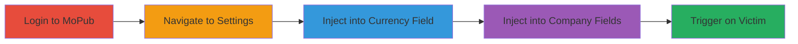

# Stored XSS in MoPub Account Settings for Session Hijacking

Multi-stage attack chain demonstrating exploitation of stored XSS in MoPub's account settings to achieve session hijacking.

## Chain Metrics Dashboard

| Metric | Value |
|--------|-------|
| Chain Status | Unverified |
| Total Steps | 5 |
| Execution Time | ~10 minutes |
| Skill Level | Intermediate |
| Complexity | Medium |
| Impact Level | High |

## Attack Flow Visualization

## Prerequisites & Requirements

### Required Tools

- Web browser (e.g., Chrome with developer tools)

### Target Environment

- Web platform
- MoPub service accessible
- Valid user credentials for the target company account

### Initial Access Requirements

- Attacker must have valid login credentials to a MoPub account within the target company
- Network access to https://app.mopub.com
- No prior admin privileges needed, but impacts admins and members

## Detailed Attack Procedures

### Step 1: Login to MoPub
procedure: [[procedures/Login-to-MoPub-Application]]

**Objective**: Gain authenticated access to the MoPub application to reach vulnerable settings.

**Instructions**: Open a web browser and navigate to the login page. Enter valid credentials for a company account.

**Expected Output**: Successful authentication and redirection to the dashboard.

**Success Indicators**:
- Dashboard loads without errors
- User session is active

### Step 2: Navigate to Account Settings
procedure: [[procedures/Navigate-to-Account-Settings]]

**Objective**: Access the vulnerable input fields in account settings.

**Instructions**: From the dashboard, click on the account menu and select 'Account Settings' to load the page with input fields.

**Expected Output**: Account settings page displays with editable fields like currency and company information exposed.

**Success Indicators**:
- Input fields are visible and editable
- No immediate sanitization errors

### Step 3: Inject Malicious Script into Currency Field
procedure: [[procedures/Inject-Malicious-Script-into-Currency-Field]]

**Objective**: Store a malicious JavaScript payload in the currency field for later execution.

**Instructions**: In the currency input field, enter a payload such as `` or a more advanced one like ``. Save the changes.

**Expected Output**: Payload is saved without error and persists in the field.

**Success Indicators**:
- Payload appears in the field upon reload
- No server-side rejection

### Step 4: Inject Malicious Script into Company Information Fields
procedure: [[procedures/Inject-Malicious-Script-into-Company-Information-Fields]]

**Objective**: Inject payloads into multiple company information fields to broaden execution surfaces.

**Instructions**: In various company info inputs (e.g., name, address), enter similar payloads like ``. Save and verify persistence across fields.

**Expected Output**: Payloads stored and rendered in affected areas like reports tab and email dropdowns.

**Success Indicators**:
- Payloads visible in multiple UI elements
- No filtering applied

### Step 5: Trigger XSS on Victim Side
procedure: [[procedures/Trigger-XSS-Payload-on-Victim-Side]]

**Objective**: Execute the stored payload to hijack the victim's session.

**Instructions**: Have the victim (e.g., admin or member) navigate to affected pages like reports tab, account settings, or edit user settings. The payload executes automatically upon rendering.

**Expected Output**: Malicious script runs, potentially sending session cookies to attacker-controlled server.

**Success Indicators**:
- Victim's browser executes script (e.g., alert pops or network request to attacker)
- Attacker receives stolen session data

## Attack Chain Summary

### Key Achievements

1. Successful injection of stored XSS payloads in multiple fields
2. Persistence across company-wide views including reports and settings
3. Achievement of session hijacking enabling account takeover between users

## Technique & Tactic Coverage

### MITRE ATT&CK Techniques

- [[JavaScript]]

### MITRE ATT&CK Tactics

- [[Execution]]
- [[Collection]]

---
*Last updated: 2023-10-01T12:00:00Z*
