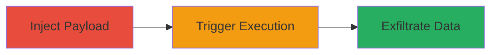

---
tags:
  - xss
  - stored-xss
  - javascript
  - session-hijack
type: attack_chain
tools: []
tactics:
  - '[[Execution]]'
commands: []
platforms:
  - Web
complexity: medium
procedures:
  - '[[procedures/Inject-Stored-XSS-Payload-in-Account-Settings]]'
  - '[[procedures/Trigger-XSS-Execution-in-Bank-Tab]]'
  - '[[procedures/Exfiltrate-Session-Data-via-XSS]]'
step_count: 3
techniques:
  - '[[JavaScript]]'
description: >-
  A stored cross-site scripting attack in Moneybird's account settings fields
  that executes malicious JavaScript in the Bank tab, enabling session hijacking
  and client-side data theft.
skill_level: intermediate
impact_level: high
id: 301721b1-33e7-4908-b8e7-28523c4e8021
created_at: '2025-12-14T03:16:25.397Z'
updated_at: '2025-12-14T03:16:25.397Z'
verified: false
validated: true
submitted: true
mitre_tactics:
  - '[[Execution]]'
mitre_techniques:
  - '[[JavaScript]]'
---
# Stored XSS in Moneybird Account Settings Executing in Bank Tab

Multi-stage attack chain demonstrating a complete stored XSS workflow in the Moneybird financial application.

## Chain Metrics Dashboard

| Metric | Value |
|--------|-------|
| Chain Status | Unverified |
| Total Steps | 3 |
| Execution Time | ~5 minutes |
| Skill Level | Intermediate |
| Complexity | Medium |
| Impact Level | High |

## Attack Flow Visualization

## Prerequisites & Requirements

### Required Tools

- Browser developer tools for payload testing
- JavaScript payload generator (e.g., manual crafting)

### Target Environment

- Web application: Moneybird platform
- Required services/ports: HTTPS (443)
- Network access requirements: Valid user account with access to account settings

### Initial Access Requirements

- Credential requirements: Authenticated user session in Moneybird
- Network position: Direct access to the web interface
- Prior access needed: Ability to edit account settings fields

## Detailed Attack Procedures

### Step 1: Inject Stored XSS Payload
procedure: [[procedures/Inject-Stored-XSS-Payload-in-Account-Settings]]

**Objective**: Introduce malicious JavaScript into account settings fields that lack proper sanitization, storing it for later execution.

**Instructions**: Navigate to the account settings page in Moneybird. Locate editable fields such as company name or description. Craft a payload like `` or a more advanced one for data exfiltration, e.g., ``. Submit the form to store the payload.

**Expected Output**: The payload is saved without escaping and persists in the backend.

**Success Indicators**:
- Payload appears unescaped when viewing the settings
- No immediate errors on submission

### Step 2: Trigger XSS Execution in Bank Tab
procedure: [[procedures/Trigger-XSS-Execution-in-Bank-Tab]]

**Objective**: Cause the stored payload to render and execute in the Bank tab, targeting users who access banking features.

**Instructions**: As another user (or the same if self-XSS), navigate to the Bank tab in the Moneybird dashboard. The injected script from account settings will load and execute due to improper context handling in the Bank tab's UI.

**Expected Output**: JavaScript alert or network request to attacker server confirming execution.

**Success Indicators**:
- Malicious script runs in the browser console
- DOM shows injected elements

### Step 3: Exfiltrate Session Data via XSS
procedure: [[procedures/Exfiltrate-Session-Data-via-XSS]]

**Objective**: Use the executed script to steal sensitive data like session cookies or financial details displayed in the Bank tab.

**Instructions**: Ensure the payload includes code to capture `document.cookie` or scrape Bank tab elements (e.g., account balances). The script sends this data to an attacker-controlled endpoint via fetch or img src.

**Expected Output**: Data received on attacker's server, such as stolen cookies.

**Success Indicators**:
- Incoming requests to exfiltration endpoint
- Captured session tokens enable hijacking

## Attack Chain Summary

### Key Achievements

1. Successful payload injection into unsanitized fields
2. Execution of JavaScript in a sensitive financial context (Bank tab)
3. Potential for session hijacking and data theft

## Technique & Tactic Coverage

### MITRE ATT&CK Techniques

- [[JavaScript]]

### MITRE ATT&CK Tactics

- [[Execution]]

---
*Last updated: 2023-10-01*
