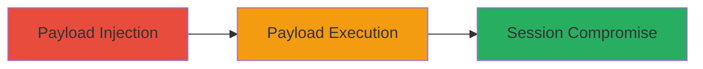

# Stored XSS in Moneybird Add Project Feature Leading to Session Compromise

## Overview

This attack chain demonstrates a stored cross-site scripting (XSS) vulnerability in the Moneybird application's 'add project' feature. An authenticated user injects a malicious JavaScript payload into the project creation form, which is stored in the backend without proper sanitization. The payload is then rendered and executed in the browsers of the injecting user and other administration panel users, potentially leading to session hijacking, data theft, or further exploitation within the admin interface. The vulnerability was reported via HackerOne (Report #996237) and rated as medium severity due to its potential to compromise user sessions in a shared administration environment.

## Chain Metrics Dashboard

| Metric | Value |
|--------|-------|
| Chain Status | Unverified |
| Total Steps | 2 |
| Execution Time | ~5 minutes |
| Skill Level | Intermediate |
| Complexity | Medium |
| Impact Level | Medium |

## Attack Flow Visualization

## Prerequisites & Requirements

### Required Tools

- Web browser with developer tools (e.g., Chrome DevTools)
- Access to Moneybird account with project creation permissions

### Target Environment

- Moneybird web application
- Authenticated session in the administration panel
- No specific ports or services beyond standard HTTPS (443)

### Initial Access Requirements

- Valid Moneybird user credentials
- Network access to the Moneybird web interface
- No prior elevated access needed; exploits authenticated user context

## Detailed Attack Procedures

### Step 1: Payload Injection
procedure: [[procedures/Inject-and-Execute-Stored-XSS-in-Moneybird-Add-Project]]

**Objective**: Inject a malicious JavaScript payload into the 'add project' feature to store it persistently in the backend.

**Instructions**: Log in to the Moneybird administration panel. Navigate to the 'add project' section and input a payload such as `` in a vulnerable field like the project name or description. Submit the form to persist the payload.

**Expected Output**: The project is created successfully, and the payload is stored without visible errors.

**Success Indicators**:
- Project added to the list without sanitization errors
- Payload visible in the stored project data (inspect via browser tools)

### Step 2: Payload Execution
procedure: [[procedures/Inject-and-Execute-Stored-XSS-in-Moneybird-Add-Project]]

**Objective**: Trigger the execution of the stored payload in the browser context to confirm the XSS and demonstrate impact.

**Instructions**: Refresh the administration panel or navigate to the projects list where the injected project is rendered. The payload should execute automatically upon rendering.

**Expected Output**: JavaScript alert or console log executes, confirming arbitrary code execution in the authenticated context.

**Success Indicators**:
- Malicious script runs (e.g., alert popup appears)
- Ability to replace alert with more malicious code like session token exfiltration

## Attack Chain Summary

### Key Achievements

1. Successful storage of unsanitized JavaScript in the project database
2. Execution of arbitrary code in the context of authenticated users
3. Potential for session compromise or data theft in the administration panel

## Technique & Tactic Coverage

### MITRE ATT&CK Techniques

- [[JavaScript]]

### MITRE ATT&CK Tactics

- [[Execution]]

---
*Last updated: 2023-10-01T00:00:00Z*
