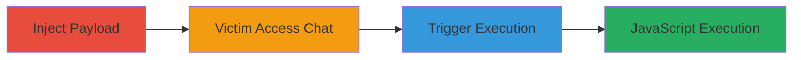

---
tags:
  - xss
  - stored-xss
  - nextcloud
  - chat-module
type: attack_chain
tools: []
tactics:
  - '[[Execution]]'
verified: false
platforms:
  - Web
submitted: true
complexity: medium
procedures:
  - '[[procedures/Inject-XSS-Payload-into-User-Full-Name]]'
  - '[[procedures/Access-Chat-Module-as-Victim]]'
  - '[[procedures/Trigger-XSS-by-Viewing-Attacker-Info]]'
step_count: 3
techniques:
  - '[[JavaScript]]'
description: >-
  A multi-step attack exploiting a stored XSS vulnerability in the Nextcloud
  chat module by injecting a script into the attacker's full name, which
  executes when a victim views the profile information.
skill_level: intermediate
impact_level: high
id: 50fff1eb-fce1-4b37-996f-0f8aebfe1556
created_at: '2025-12-14T03:15:47.194Z'
updated_at: '2025-12-14T03:15:47.194Z'
validated: true
mitre_tactics:
  - '[[Execution]]'
mitre_techniques:
  - '[[JavaScript]]'
---
# Stored XSS in Nextcloud Chat Module via Malicious Full Name Injection

Multi-stage attack chain demonstrating a complete stored XSS exploit in Nextcloud's chat module, allowing arbitrary JavaScript execution in a victim's browser.

## Chain Metrics Dashboard

| Metric | Value |
|--------|-------|
| Chain Status | Unverified |
| Total Steps | 3 |
| Execution Time | ~5 minutes |
| Skill Level | Intermediate |
| Complexity | Medium |
| Impact Level | High |

## Attack Flow Visualization

## Prerequisites & Requirements

### Required Tools

- Web browser (e.g., Chrome, Firefox)
- Valid Nextcloud credentials for attacker and victim accounts

### Target Environment

- Nextcloud Server 9.0.51
- JavaScript XMPP Chat 3.0.0 app installed
- Ubuntu 14.04 LTS (or compatible OS)
- Web interface access

### Initial Access Requirements

- Attacker account (non-admin)
- Victim account (admin or non-admin)
- Network access to Nextcloud instance

## Detailed Attack Procedures

### Step 1: Inject XSS Payload
procedure: [[procedures/Inject-XSS-Payload-into-User-Full-Name]]

**Objective**: Modify the attacker's full name to include a malicious XSS payload that will be stored and rendered unsanitized in the chat interface.

**Instructions**: Log in as the attacker and update the profile full name field with the payload. No specific command-line tools are needed; use the web interface.

**Expected Output**: Profile updated successfully without errors.

**Success Indicators**:
- Full name change confirmed in user settings
- No immediate errors or sanitization blocks

### Step 2: Access Chat Module as Victim
procedure: [[procedures/Access-Chat-Module-as-Victim]]

**Objective**: Have the victim log in and navigate to the chat functionality to set up for payload triggering.

**Instructions**: Log in as the victim user and access the chat module via the Nextcloud dashboard.

**Expected Output**: Chat interface loads without issues.

**Success Indicators**:
- Victim successfully logged in
- Chat module accessible and functional

### Step 3: Trigger XSS Execution
procedure: [[procedures/Trigger-XSS-by-Viewing-Attacker-Info]]

**Objective**: View the attacker's profile information in the chat, causing the injected payload to execute in the victim's browser.

**Instructions**: In the chat module, select the attacker user and click 'Show information' to display the profile.

**Expected Output**: Alert popup or JavaScript execution confirming domain access (e.g., alert(document.domain) showing 'nextcloud.example.com').

**Success Indicators**:
- JavaScript alert triggers
- Potential for further client-side attacks like cookie theft

## Attack Chain Summary

### Key Achievements

1. Successful injection of stored XSS payload into user full name
2. Triggering of arbitrary JavaScript in victim's authenticated session
3. Demonstration of domain-context execution enabling session hijacking or data theft

## Technique & Tactic Coverage

### MITRE ATT&CK Techniques

- [[JavaScript]]

### MITRE ATT&CK Tactics

- [[Execution]]

---
*Last updated: 2023-10-01*
