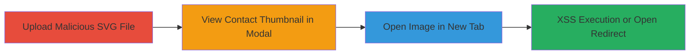

---
tags:
  - xss
  - stored-xss
  - nextcloud
  - svg-upload
  - file-upload-vulnerability
  - open-redirect
type: attack_chain
tools: []
tactics:
  - '[[Initial Access]]'
  - '[[Execution]]'
verified: false
platforms:
  - Web
submitted: true
complexity: low
created_at: '2023-10-01T00:00:00Z'
procedures:
  - '[[procedures/Upload-Malicious-SVG-to-Nextcloud-Contact]]'
  - '[[procedures/Open-Contact-Image-in-Modal]]'
  - '[[procedures/Trigger-XSS-by-Opening-Image-in-New-Tab]]'
step_count: 3
techniques:
  - '[[Exploit Public-Facing Application]]'
  - '[[JavaScript]]'
updated_at: '2025-12-14T00:11:16.077Z'
description: >-
  Exploits a stored XSS vulnerability in Nextcloud's contacts app by uploading
  an SVG file with embedded JavaScript, disguised using a .png extension,
  leading to arbitrary code execution when victims view the contact image in a
  new browser tab.
skill_level: low
impact_level: low
id: 99ff3abb-1b0b-46ec-b461-34d478924d93
validated: true
mitre_tactics:
  - '[[Initial Access]]'
  - '[[Execution]]'
mitre_techniques:
  - '[[Exploit Public-Facing Application]]'
  - '[[JavaScript]]'
---
# Stored XSS in Nextcloud Contacts via Malicious SVG Upload Disguised as PNG

Multi-stage attack chain demonstrating a complete attack workflow.

## Chain Metrics Dashboard

| Metric | Value |
|--------|-------|
| Chain Status | Unverified |
| Total Steps | 3 |
| Execution Time | ~5 minutes |
| Skill Level | Low |
| Complexity | Low |
| Impact Level | Low |

## Attack Flow Visualization

## Prerequisites & Requirements

### Required Tools

- None (manual browser actions)

### Target Environment

- Nextcloud instance with Contacts app enabled
- Web browser (Chrome/Chromium for optimal exploitation)
- Attacker access to upload contacts (authenticated user)

### Initial Access Requirements

- Valid Nextcloud user credentials
- Network access to the Nextcloud instance
- No prior access needed beyond authentication

## Detailed Attack Procedures

### Step 1: Prepare and Upload Malicious File
procedure: [[procedures/Upload-Malicious-SVG-to-Nextcloud-Contact]]

**Objective**: Upload an SVG file containing malicious JavaScript to a contact's image field, disguised with a .png extension to bypass validation.

**Instructions**: Create or obtain an SVG file (e.g., 'redirectxss.svg.png') with embedded JavaScript payload for XSS or redirect. In the Nextcloud Contacts app, create or edit a contact and upload the file to the image field.

**Expected Output**: File uploaded successfully without errors, visible as a contact thumbnail.

**Success Indicators**:
- File accepted and thumbnail displays in contact view
- No upload validation errors

### Step 2: Interact with Contact Image Thumbnail
procedure: [[procedures/Open-Contact-Image-in-Modal]]

**Objective**: Trigger the image modal view by clicking the thumbnail, setting up for payload delivery.

**Instructions**: Navigate to the contact details in the Nextcloud Contacts interface and click the uploaded image thumbnail to open it in a modal popup.

**Expected Output**: Modal window opens displaying the image.

**Success Indicators**:
- Modal loads without errors
- Image appears in the modal view

### Step 3: Open Image in New Tab to Execute Payload
procedure: [[procedures/Trigger-XSS-by-Opening-Image-in-New-Tab]]

**Objective**: Cause the browser to render the SVG content directly, executing the embedded JavaScript for XSS or redirect.

**Instructions**: In the modal, right-click the image or use browser options to open the image URL in a new tab. The browser (Chrome/Chromium) will interpret and render the SVG, executing the payload.

**Expected Output**: JavaScript executes in the new tab, potentially alerting, redirecting, or stealing session data.

**Success Indicators**:
- Arbitrary JS runs (e.g., alert popup or redirect to attacker site)
- Victim's browser session compromised

## Attack Chain Summary

### Key Achievements

1. Bypassed file upload validation using .png extension on SVG
2. Achieved stored XSS execution via contact image rendering
3. Enabled low-severity impacts like session hijacking or phishing redirects

## Technique & Tactic Coverage

### MITRE ATT&CK Techniques

- [[Exploit Public-Facing Application]]
- [[JavaScript]]

### MITRE ATT&CK Tactics

- [[Initial Access]]
- [[Execution]]

---

*Last updated: 2023-10-01T00:00:00Z*
